# WAPH-Web Application Programming and Hacking

## Instructor: Dr. Phu Phung

## Student

**Name**: Sophia Munoz

**Email**: [mailto:munozsa@mail.uc.edu](munozsa@mail.uc.edu)


# Hackathon 1 - Cross-Site Scripting Attacks and Defenses

## The Lab's Overview

For Hackathon 1, there were two tasks. Task 1 focused on cross-site scripting attacks at increasing levels of difficulty. They required injecting code to get an alert\(). Task 2 focused on the implementation of input validation and XSS defense methods in previous Labs 1 and 2.

Outcomes I learned from this hackathon were the various hacking methods to bypass filters and protections placed client-side and server-side. This allowed for a better understanding on vulnerabilities when programming a web application and promoted the best ways to protect and defend your web apps from hackers.

Hackathon1 Folder: [https://github.com/munozsophia/waph-munozsa/tree/main/hackathons/hackathon1](https://github.com/munozsophia/waph-munozsa/tree/main/hackathons/hackathon1).

### Task 1: Attacks

The section covers the cross-site scripting injections used to hack into 7 Levels of webpages.

#### a. Level 0

Below is the XSS code injected into the input form:

`<script>alert("Level 0-Hacked by Sophia Munoz")</script>`

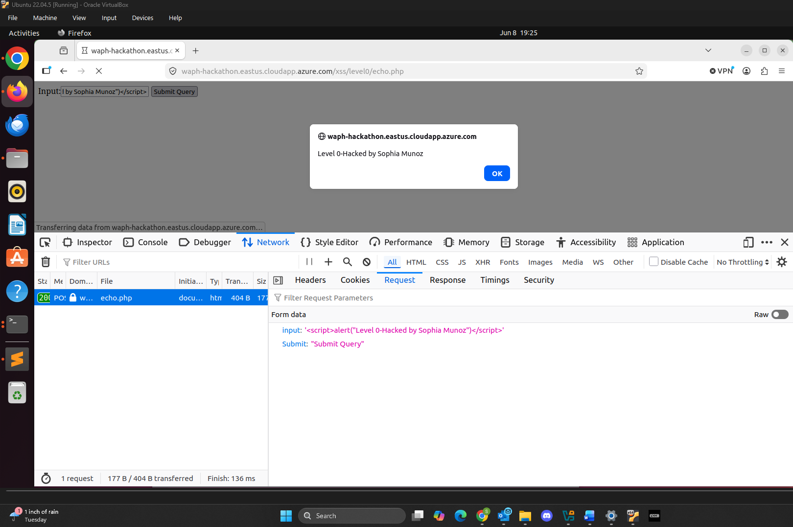
*Level 0 Injected XSS and Payload Attack*

https://github.com/user-attachments/assets/98203200-d23c-42d8-a2f7-5a6c7873b0f5

#### b. Level 1

Below is the XSS code injected into the URL:

`https://waph-hackathon.eastus.cloudapp.azure.com/xss/level1/echo.php?input=<script>alert("Level 1-Hacked by Sophia Munoz")</script>`

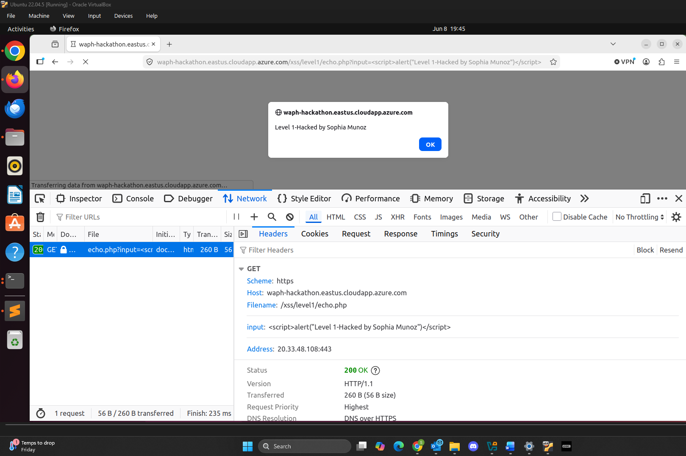
*Level 1 Injected XSS and Payload Attack*

https://github.com/user-attachments/assets/36318a2e-18ef-449e-965b-a72136adb9a6

#### c. Level 2

Below is the XSS code injected into the console:

```html
var f = document.createElement('form');
f.method = 'POST';
f.action = '';
var i = document.createElement('input');
i.name = 'input';
i.value = '<script>alert("Level 2-Hacked by Sophia Munoz")</script>';
f.appendChild(i);
document.body.appendChild(f);
f.submit();
```

Assuming the method used was the `POST` method. The vulnerability is exploited in the `echo.php` web application on this line of code: `echo $_POST['input']`

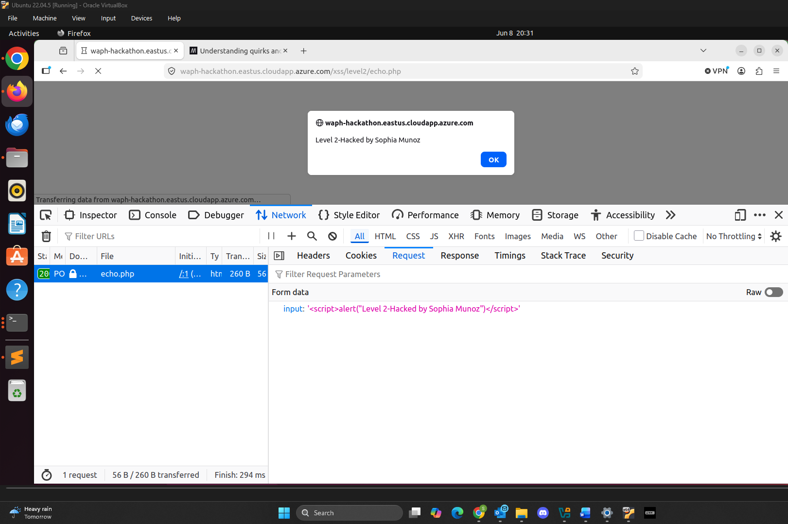
*Level 2 Injected XSS and Payload Attack*

https://github.com/user-attachments/assets/ad5a7dbb-6152-412d-ba32-880e80183b61

#### d. Level 3

Below is the XSS code injected into the URL:

`https://waph-hackathon.eastus.cloudapp.azure.com/xss/level3/echo.php?input=`

Assuming the method used was the `GET` method. The vulnerability is exploited in the fact that only `<script>` and `</script>` were filtered out, but other event handlers like the one used to inject in the URL \(`onerror`) weren't handled at all.

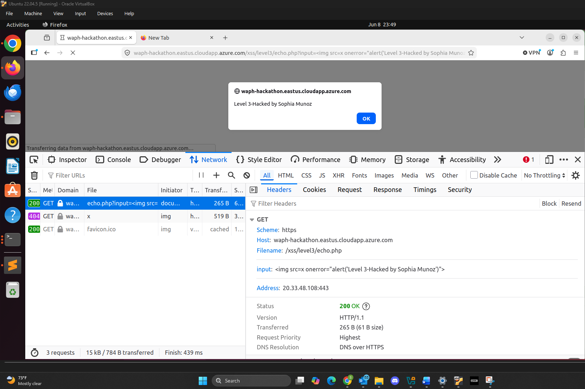
*Level 3 Injected XSS and Payload Attack*

https://github.com/user-attachments/assets/8c3a660d-5fe3-4a42-bf43-5306893b76ae

#### e. Level 4

Below is the XXS code injected into the URL:

`https://waph-hackathon.eastus.cloudapp.azure.com/xss/level4/echo.php?input=<a href="java%26%23115%3Bcript:alert('Level 4-Hacked by Sophia Munoz')">Click Me</a>`

I URL encoded the `&` in `&#115;`. The ampersand essentially acts as URL parameter separator. Assuming the method used was the `GET` method. The vulnerability is exploited by a line like `echo $input`. Even `script` wasn't detected as it wasn't a literal letter-for-letter string.

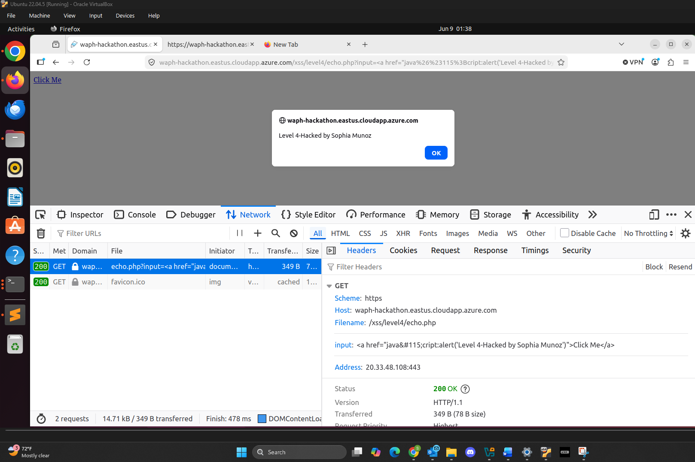
*Level 4 Injected XSS and Payload Attack*

https://github.com/user-attachments/assets/ceeb87ad-0e6a-4c94-95b3-208d77820ac4

#### f. Level 5

Below is the XXS code injected into the URL:

`https://waph-hackathon.eastus.cloudapp.azure.com/xss/level5/echo.php?input=`

I used `fromCharCode` to encode `alert` as to not have it be detected. Assuming the method used was the `GET` method. The vulnerability is like the previous level, `echo $input`, but it now also includes `alert` instead of just `script`.

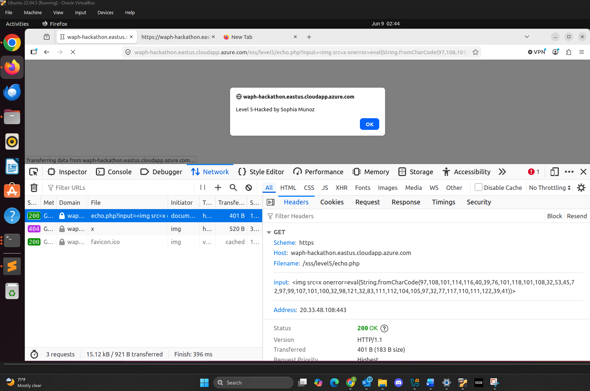
*Level 5 Injected XSS and Payload Attack*

https://github.com/user-attachments/assets/a00d1d4d-0919-4f6d-bda1-0f735c2664bb

#### g. Level 6

### Task 2: Defenses

This section modifies vulnerable code from Lab 1 and Lab 2 by the using input validation and XSS defense methods.

#### a. Input Validation Implementation

**`echo.php`**

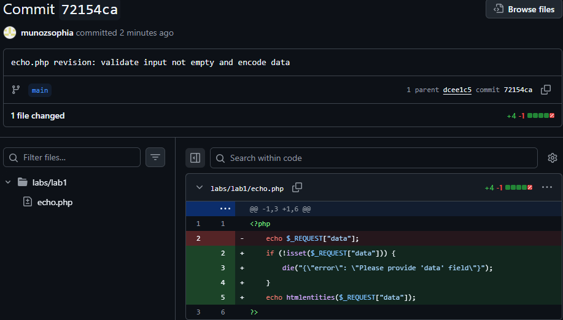
*echo.php Revision*

The code specifically implementing validation is below. It checks to see if the data is not missing.

```PHP
if (!isset($_REQUEST['data'])) {
   die("{\"error\": \"Please provide 'data' field\"}");
}
```

**`waph-munozsa.html`**

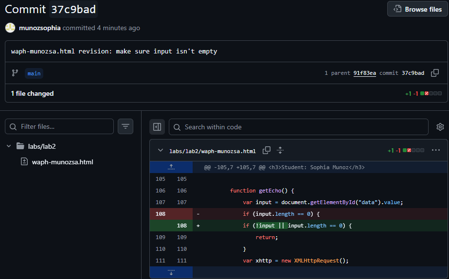
*waph-munozsa.html getEcho() Revision*

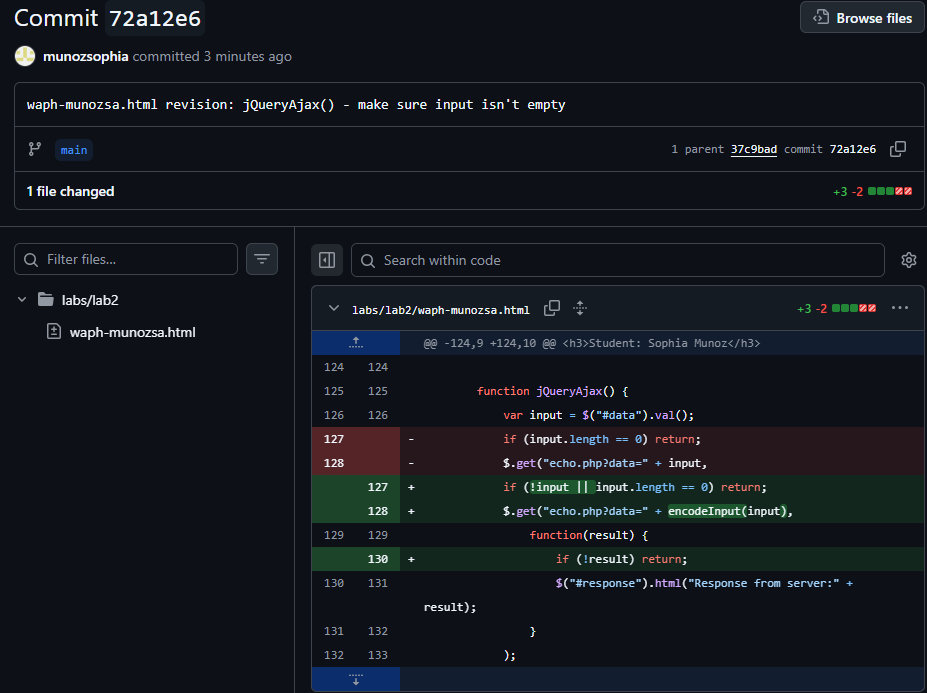
*waph-munozsa.html jQueryAjax() Validation Revision*

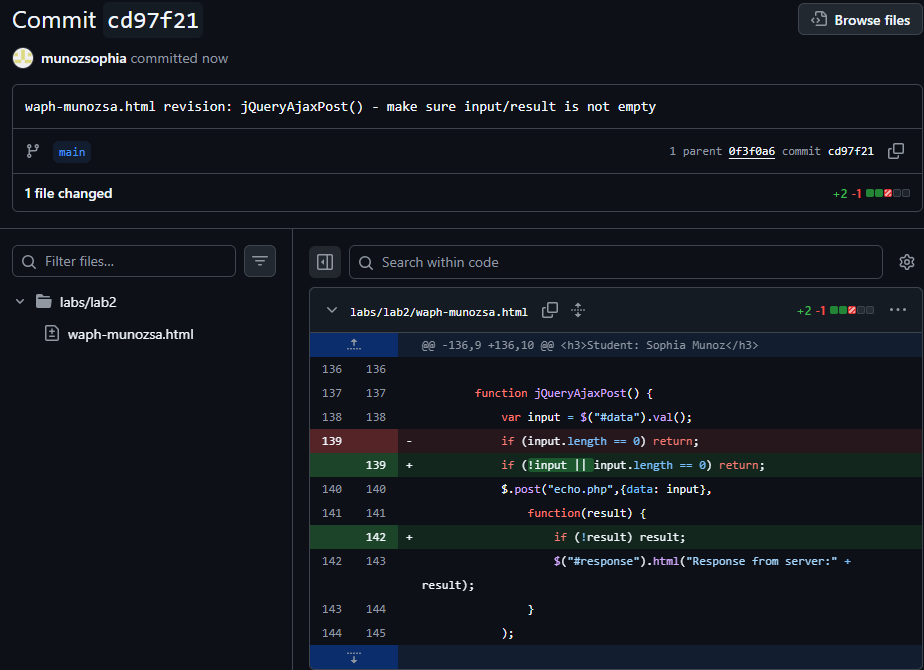
*waph-munozsa.html jQueryAjaxPost() Validation Revision*

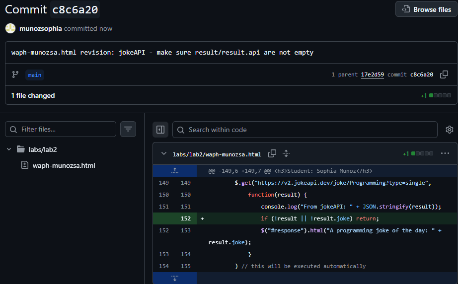
*waph-munozsa.html jokeAPI Validation Revision*

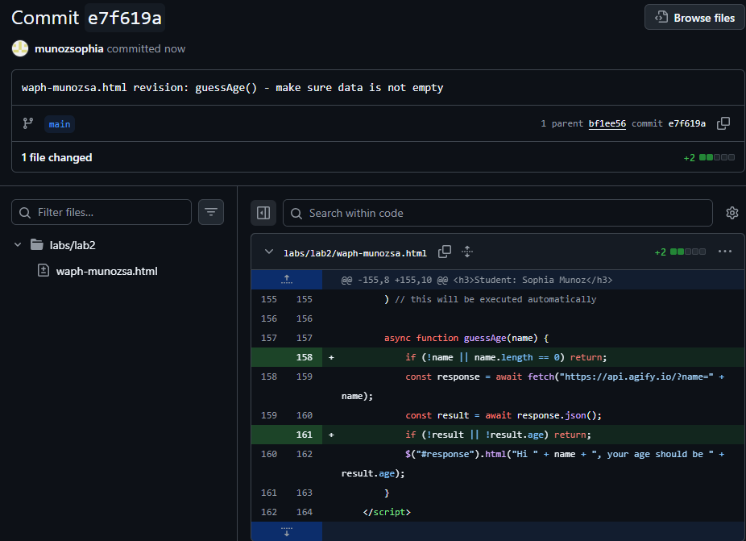
*waph-munozsa.html guessAge() Validation Revision*

**`email.js`**

Looking over the code of email.js, there doesn't seem to be any external input from the user. The email is hardcoded into the code, so I don't see a need for input validation.

#### b. XSS Defenses

**`echo.php`**

The code specifically implementing XSS defense is below. It encodes the data output. The image from the previous section shows the image with the `echo.php` revision.

```PHP
echo htmlentities($_REQUEST['data']);
```

**`waph-munozsa.html`**

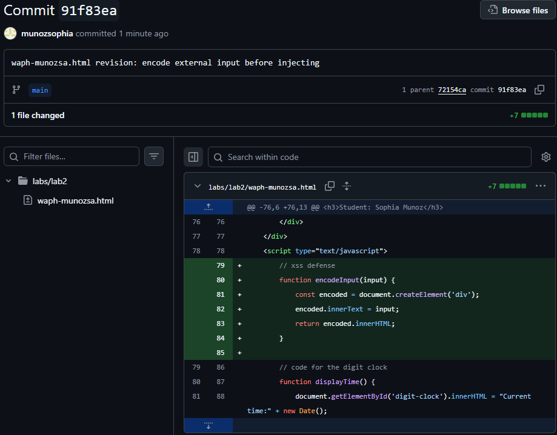
*waph-munozsa.html Encode Input Function*

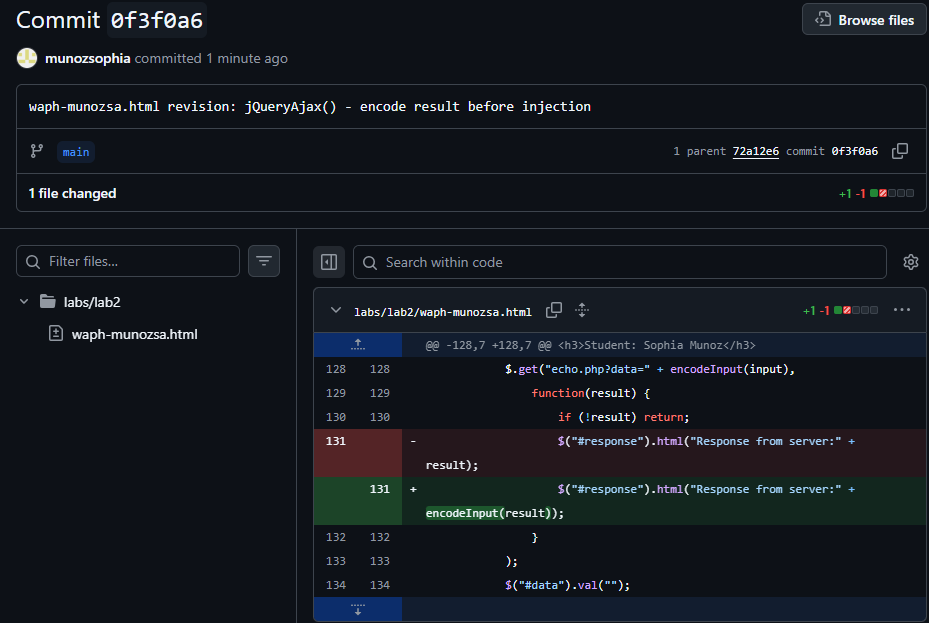
*waph-munozsa.html jQueryAjax() Defense Revision*

I didn't realize until later that I had missed implementing the encodeInput\() function for one piece of data so there are two revisions for jQueryAjaxPost.


*waph-munozsa.html jQueryAjaxPost() Defense Revision*

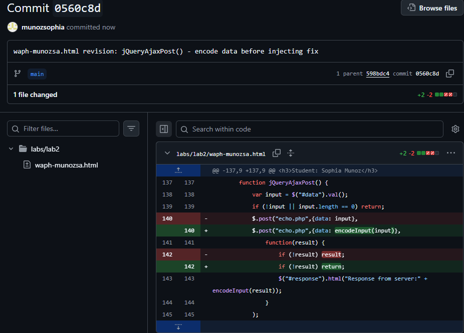
*waph-munozsa.html jQueryAjaxPost() Defense Revision Fix*

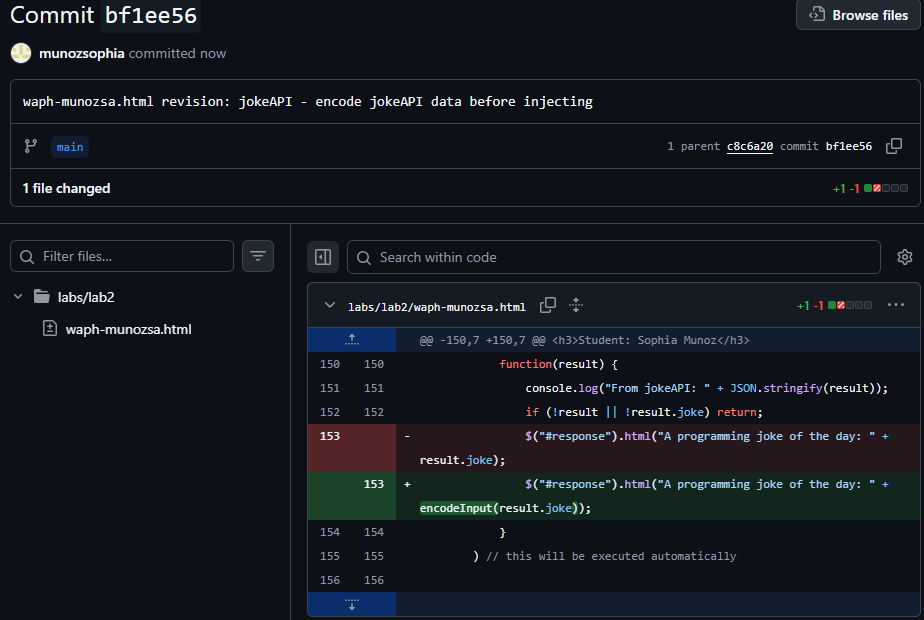
*waph-munozsa.html jokeAPI Defense Revision*

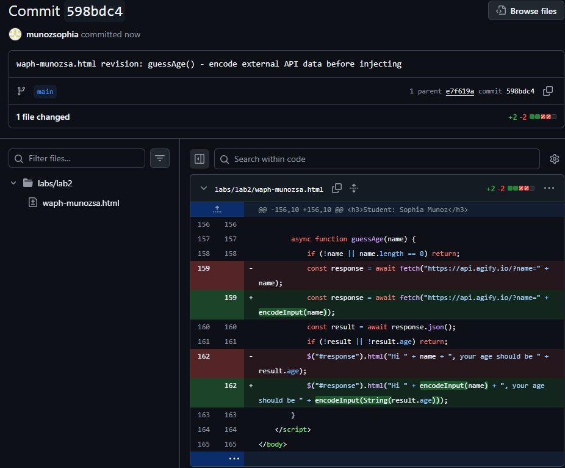
*waph-munozsa.html guessAge() Defense Revision*

**`email.js`**

The use of `innerHTML` provides a way to inject the tag `<a>`, but as previously mentioned above, due to the email being hardcoded in the file, there seems to be no risk of cross-site scripting.
