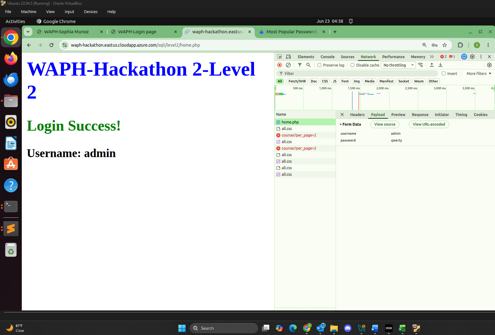

# WAPH-Web Application Programming and Hacking

## Instructor: Dr. Phu Phung

## Student

**Name**: Sophia Munoz

**Email**: [mailto:munozsa@mail.uc.edu](munozsa@mail.uc.edu)


# Hackathon 2 - SQL Injection Attacks

## The Lab's Overview

For Hackathon 2, there are three levels. For Level 0, I injected SQL code with my username to bypass the login check and successfully log in to the system. For Level 1, I guessed the SQL string in the Back-End and injected SQL code with my username to bypass the login check and log in to the system. For Level 2, there are three sub-tasks. In sub-task `a`, I detected SQLi vulnerabilities. In sub-task `b`, I exploited SQLi to access the data contained within the database. In sub-task `c`, I logged in with the stolen credentials.

Outcomes I learned from this hackathon were how a lack of security in web development can lead to potential SQL injection attacks that can exploit these vulnerabilities and access data. Learning about security through ethical hacking has really helped with my understanding of how these vulnerabilities can be exploited and how I, as a programmer, can target these areas to strengthen the security of them.

Hackathon2 Folder: [https://github.com/munozsophia/waph-munozsa/tree/main/hackathons/hackathon2](https://github.com/munozsophia/waph-munozsa/tree/main/hackathons/hackathon2).

### Level 0

For this level, there is no input validation which presents a vulnerability. For this simple login system in PHP/MySQL, I injected SQLi code `munozsa; OR 1=1; #` to bypass the system. Below are the images showing the login page with the SQL injection.


*Level 0 SQLi Injection*

Below is the image of Level 0 login success page.


*Level 0 Login Success*

### Level 1

For this level, I guessed the Back-End SQL string and just like in the previous level, I injected SQLi code `munozsa" OR 1=1 LIMIT 1; #` to bypass the system. Below are the images showing the login page with the SQL injection.

Back-End Code Guess:

```php
$sql = 'SELECT * FROM users WHERE username="' . $username . 
	   '" AND password=md5("' . $password . '")';
```


*Level 1 SQLi Injection*

Below is the image of Level 1 login success page.


*Level 1 Login Success*

### Level 2

For this level, the SQLi vulnerabilities are prevented. This means I had to do a bit a digging to find other vulnerabilities among the PHP pages to exploit and steal the username and password with the SQLi attack and successfully log in to the system.

#### a. Detecting SQLi Vulnerabilities

To find a vulnerability I added a `'` to the `product.php` page for the apple product link [https://waph-hackathon.eastus.cloudapp.azure.com/sqli/level2/product.php?id=1'](https://waph-hackathon.eastus.cloudapp.azure.com/sqli/level2/product.php?id=1'), making it return the fatal error seen in the image below.


*Level 2a Fatal Error*

#### b. Read and Display Data from Database

For this sub-task I guessed the vulnerable SQL query in the Back-End to find the tables and columns that hold the username and password of the system.

##### i. Identify Number of Columns and Display Each Column on the Page

Using SQL UNION, I exploited the Back-End query string vulnerability and guessed the number of columns until the page no longer generated a fatal error. This way I identified the columns used and how each is displayed.

The Back-End SQLi code is potentially:

```php
SELECT * FROM products WHERE id=$id
```

Or potentially:

```php
SELECT col1,col2,col3 FROM products WHERE id=$id
```

From guessing the number of columns, I would get the fatal error below as the number of columns guessed was incorrect.


*Level 2b Fatal Error*

Once the correct number of columns was guessed, **three**, the page loaded correctly. I injected `product.php?id=1 UNION SELECT 1,2,3-- -` to the URL.


*Level 2b Column Guessed*

##### ii. Display Information on the Page

To further understand the vulnerability I found how to display my information nice and cleanly. I set id=0 to suppress the original product results as shown below injecting `product.php?id=0 UNION SELECT "Hacked by munozsa", "Sophia Munoz","WAPH-01"`. Below is the image showing my information displayed within the page.


*Level 2b Info Displayed*

##### iii. Display the Database Schema

To show the all tables and their columns, I injected `product.php?id=0 UNION SELECT table_name,column_name,3 FROM information_schema.columns-- -` to display the database schema below. This allowed me to discover the login table as a potential data holder for username and password.


*Level 2b Database Schema*

##### iv. Display Login Credentials in Database and Reveal in Plaintext

I deduced from the available tables from the previous exploit that the table holding username and password and I injected `product.php?id=0 UNION SELECT table_name,column_name,3 FROM information_schema.columns WHERE table_name="login"-- -` since I identified the **`login`** table. Within the table, there are two columns, **`loginname`** and **`password`**.


*Level 2b Login Credentials*

I used the SQLi code to inject in the URL: `product.php?id=0 UNION SELECT loginname,password,"munozsa" FROM login-- -`. I based this on the potential Back-End SQLi code and injected my University username.


*Level 2b Display Usernames/Passwords*

To reveal the password values, I used the Most Popular Passwords site, I `Ctrl-F` the hashed password for the user `admin`, which was `qwerty`.


*Level 2b Hashed Password*

#### c. Login to the System with the Stolen Credentials

As I finally discovered the username and password of the log in system, I was able to log in with the credentials.


*Level 2c Login Success*