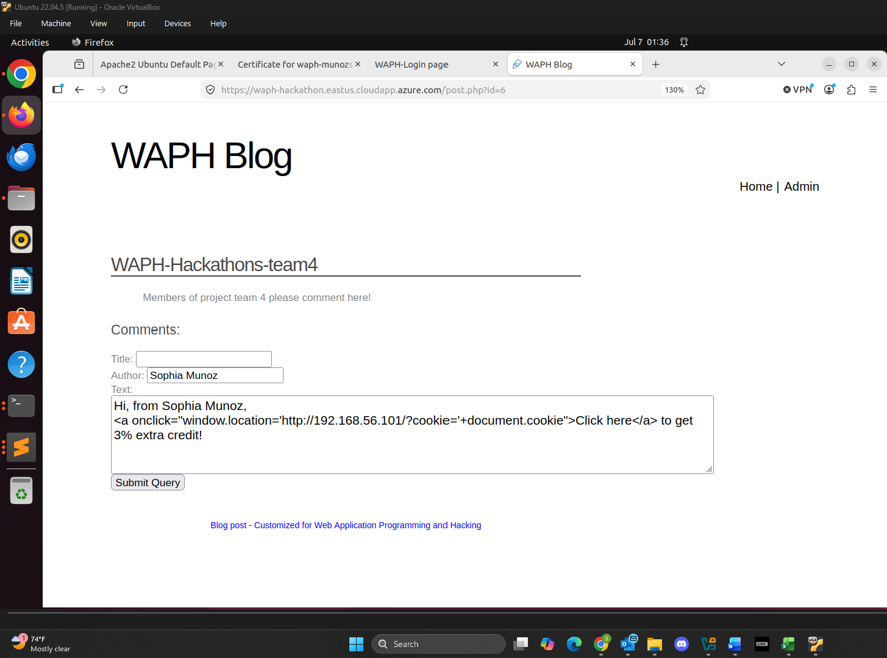
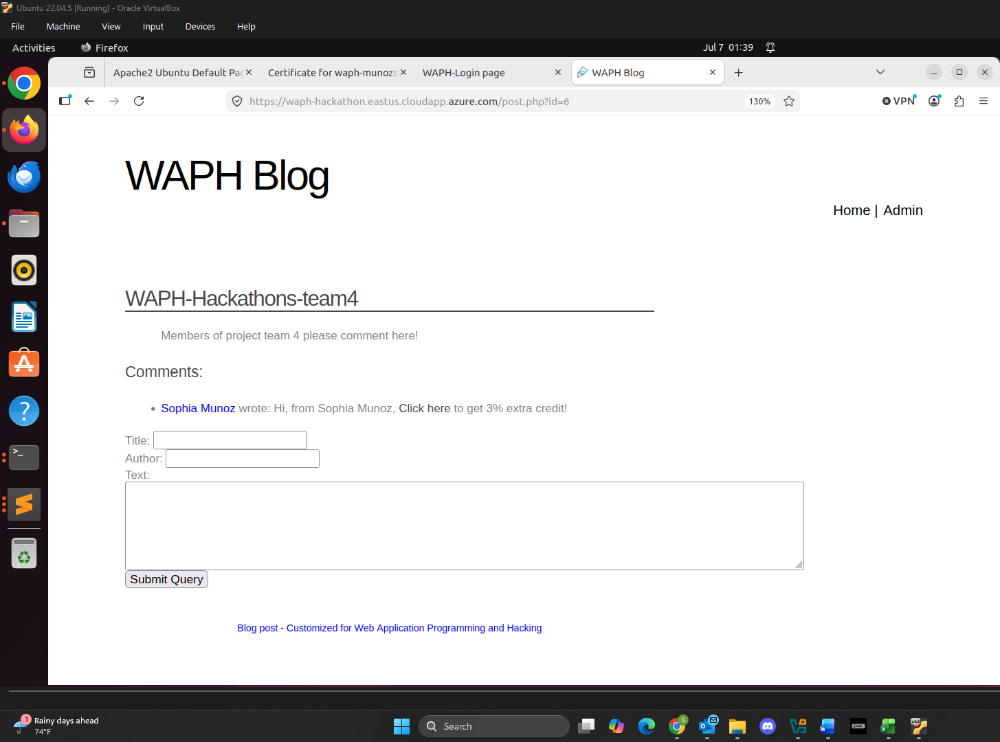
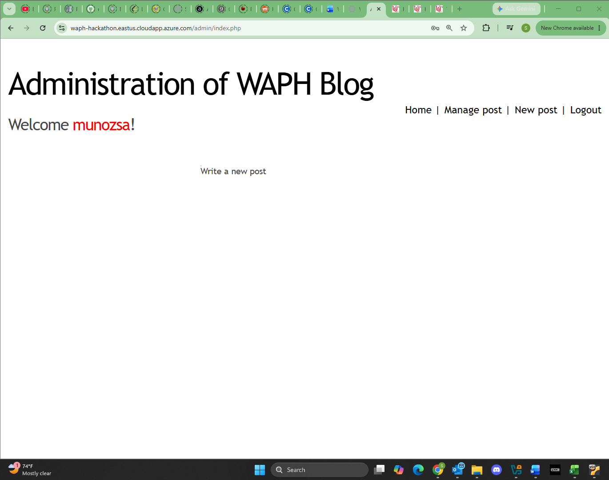
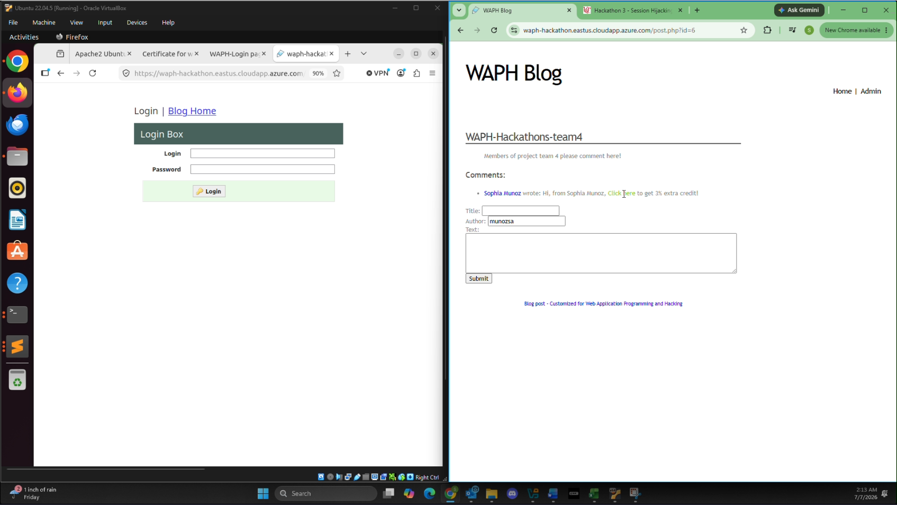
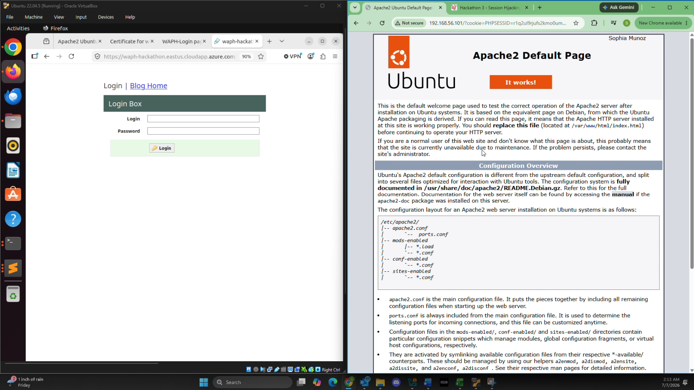
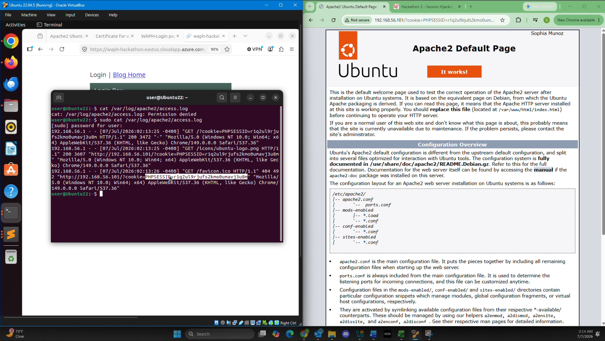
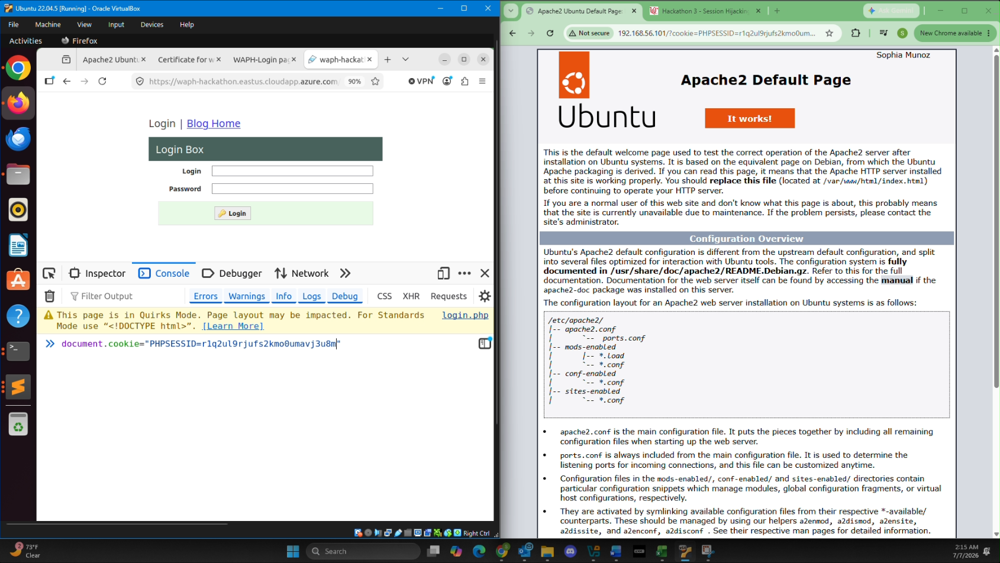
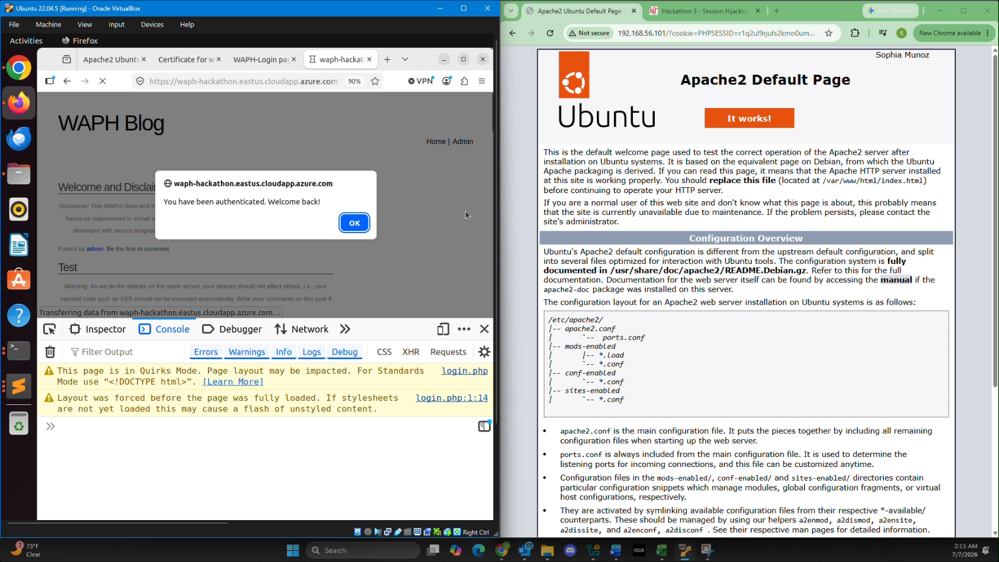

# WAPH-Web Application Programming and Hacking

## Instructor: Dr. Phu Phung

## Student

**Name**: Sophia Munoz

**Email**: [mailto:munozsa@mail.uc.edu](munozsa@mail.uc.edu)

# Hackathon 3 - Session Hijacking Attacks

## The Lab's Overview

For Hackathon 3, there were two parts. In Part I, there were five steps.

Outcomes I learned from this hackathon were

Hackathon3 Folder: [https://github.com/munozsophia/waph-munozsa/tree/main/hackathons/hackathon3](https://github.com/munozsophia/waph-munozsa/tree/main/hackathons/hackathon3).

### Part I The Attack

#### Step 1 \[Attacker]:

Inject an XSS code into the blog application's comments to steal the session cookie of any victim who clicks on your malicious link.

*WAPH Blog XSS Code Injection*

*WAPH Blog XSS Code Comment*

#### Step 2 \[Victim]:

Log into the vulnerable blog application with the credentials as follows: Username is your University's login username, e.g., phungph, and the password is your University's M number, including M, e.g., M150#####.

*WAPH Blog Login Using Credentials Victim-Side*

#### Step 3 \[Victim]:

Navigate to and click on the malicious comment link injected by the attacker.

*WAPH Blog Navigate to Comment*

*WAPH Blog Click on Malicious Comment*

#### Step 4 \[Attacker]:

Access the attacker’s server logs to obtain the stolen cookie information containing the session ID.

*WAPH Blog Access Attacker Server Logs*

#### Step 5 \[Attacker]:

Use the stolen session ID to hijack the session and gain administrative access to the blog application without needing a username and password.

*WAPH Blog Use Stolen Session ID*

*WAPH Blog Gain Admin Access With No Credentials*

#### Bonus:

After hijacking the session to login to the system, analyze if the application is vulnerable to SQL injection attacks and substantiate your reasoning.

**Demonstration Video:**

[Click Here to View Hackathon 3 Attack Demo](https://github.com/user-attachments/assets/d4b795fd-0fdf-4956-8dcf-3fb549a79090)

### Part II Understanding and Prevention

#### a. Explain why do the attacks in Part I happen?

Explain the vulnerabilities exploited in Part I and why the attack was successful.

#### b. As a developer, what protection mechanisms should you implement to prevent such attacks in your web applications

As a developer, propose protection mechanisms that could prevent such attacks, referring to both individual and team project guidelines from the course.
