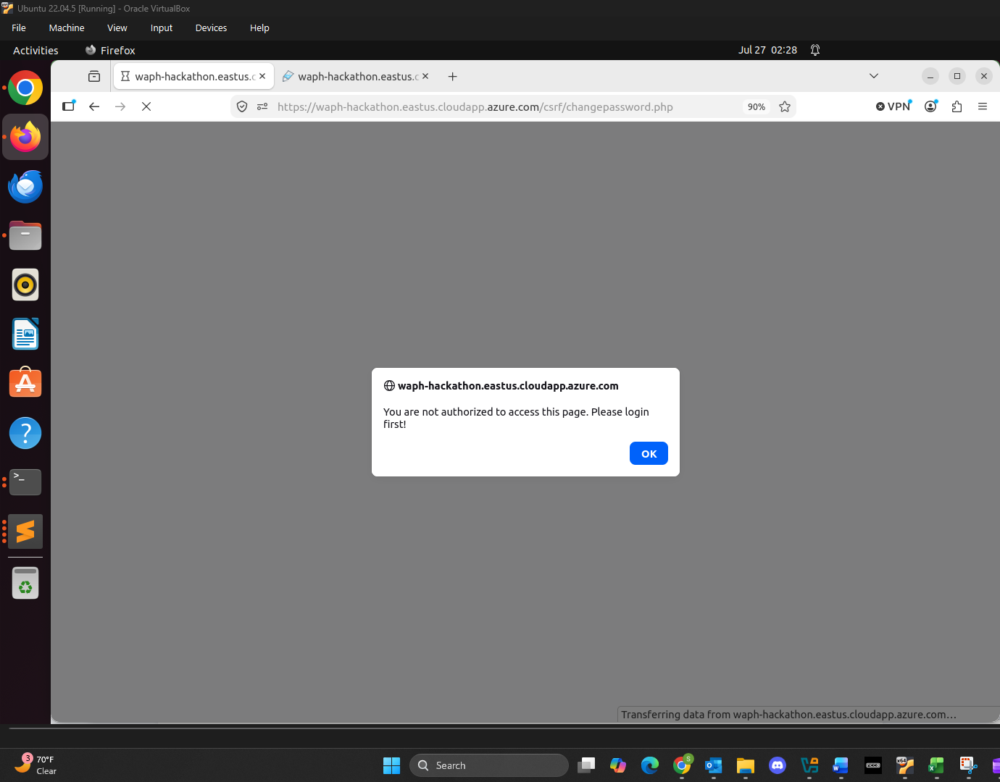

# WAPH-Web Application Programming and Hacking

## Instructor: Dr. Phu Phung

## Student

**Name**: Sophia Munoz

**Email**: [mailto:munozsa@mail.uc.edu](munozsa@mail.uc.edu)


# Hackathon 4 - Cross-Site Request Forgery Attack and Protection

## The Lab's Overview

For Hackathon 4, there were two parts. In Part I . In Part II.

Outcomes I learned from this hackathon were

Hackathon4 Folder: [https://github.com/munozsophia/waph-munozsa/tree/main/hackathons/hackathon4](https://github.com/munozsophia/waph-munozsa/tree/main/hackathons/hackathon4).

### Part I The Attack

#### Step 0 \[Attacker]:

1. What is the action, i.e., the full URL of the CRSF vulnerability?

The action is [https://waph-hackathon.eastus.cloudapp.azure.com/csrf/changepassword.php](https://waph-hackathon.eastus.cloudapp.azure.com/csrf/changepassword.php).

2. What HTTP method is used for the request?

The HTTP method used for the request is **POST**.

3. What field names are used in the request?

The field name used is `newpassword`.

From the `changepassword.php` page source below, I was able to extract the information above.


*changepassword.php Page Source*

#### Step 1 \[Attacker]:

#### a. Construct a CSRF Website

I created the `munozsa-csrf.html` page to send an HTTP request to the vulnerable server and hosted in the attacker's server. Below is the deployed website and the notification alerting the user.


*CSRF Website*

#### b. Create a Comment

Without loggin in, I submitted the comment below to trick the victim in Hackathon 3's Blog application.

```html
<a href="http://192.168.56.101/munozsa-csrf.html">Click here</a> to see your WAPH course grade update!
```


*CSRF Embedded Comment Posted*

##### i. Site Sends HTTP Request to Server

The website now sends an HTTP request to the server to change the victim's password, but since the victim has yet to login and click on the malicious link the attacker not authenticated and the request fails.


*CSRF Request Failed*

#### Step 2 \[Victim]:

For Step 2, as the victim I logged in to the system, opened the comment and clicked on the link that the attacker sent. The attack then happens automatically and the victim, once logged out, cannot log back in as its password has been changed.

**Demonstration Video:**

The demo below showcases the attack's successful execution by having the victim click on the malicious link. At the beginning you can see that the attack is unsuccessful because the victim has yet to login and click on the CSRF website. Once the attack occurs, the attacker is able to login with the victim's user and the changed password defined in the `munozsa-csrf.html` website.

```html
<input type='hidden' name='newpassword' value='munozsahacker' />
```

[Click Here to View Hackathon 4 Attack Demo](https://github.com/user-attachments/assets/9df1a2b9-30b9-48c3-97c5-cdade3fe3c43)

### Part II Understanding the CSRF Vulnerability and Protection Mechanism

#### a. Why do the attacks in Part I happen?

The vulnerabilities exploited in Part I include the server not being able to differentiate between the request referrer and its lack of reauthentication methods for the client for a new request action. The attack was successful because the lack of authentication in changes involving the database should have had the server re-authenticate.

#### b. Describe Protection Mechanisms to Prevent Attacks

Potential ways to prevent attacks is to implement a **Secret Validation Token** like `<input type=hidden value=23a3af01b>`, a **Referrer Validation** like `Referrer: http://www.facebook.com/home.php`, or a **Custom Header** like `X-Requested-By: XMLHttpRequest`.

The main implementation of the secret validation token is as follows:

A random token is generated and stored in the session.

```php
$rand = bin2hex(openssl_random_pseudo_bytes(16));
$_SESSION["nocsrftoken"] = $rand;
```

The token is placed in a hidden input within a PHP form page to send to the browser. The token itself belongs solely to an authenticated user.

```php
<input type="hidden" name="nocsrftoken" value="<?php echo $rand; ?>"/>
```
In the PHP action page, the token is retrieved from the PHP form page and is validated. Due to these security measures, the attacker does not have the secret valid token.

```php
$token = $_POST["nocsrftoken"];
if (!isset($token) or ($token != $_SESSION["nocsrftoken"])) {
	echo "CSRF Attack is detected";
	die();
}
```