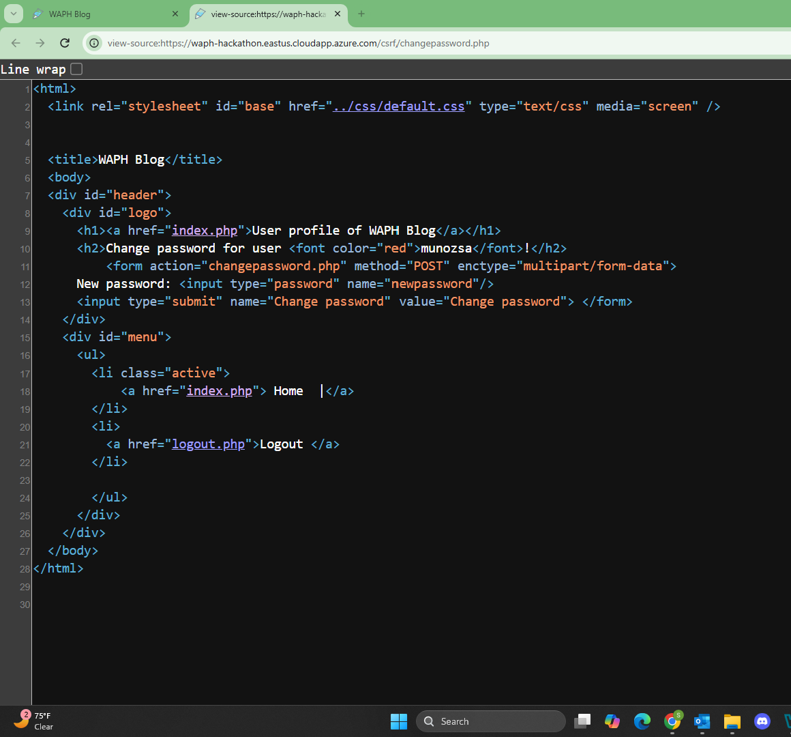
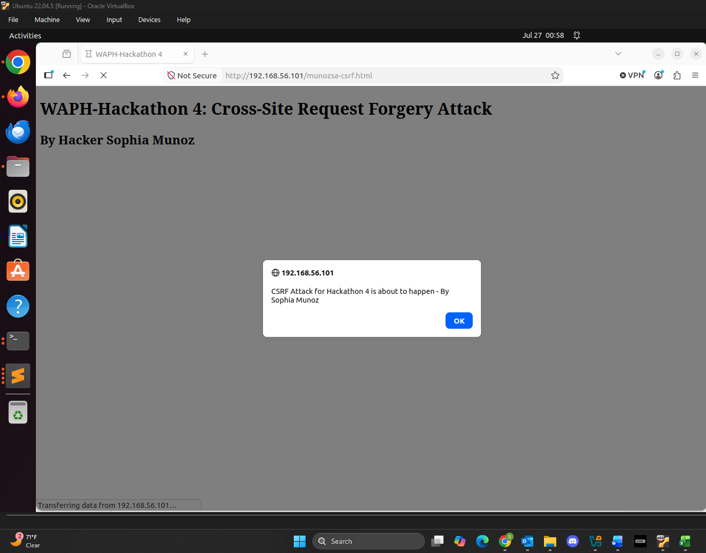
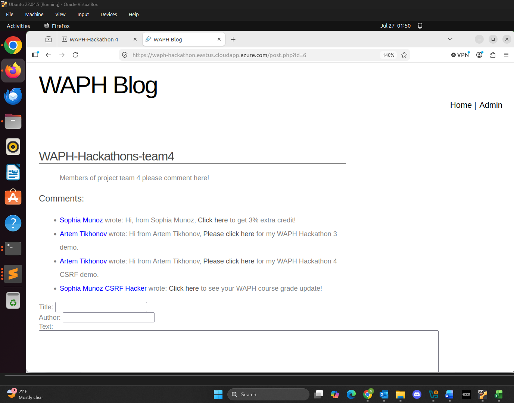

# WAPH-Web Application Programming and Hacking

## Instructor: Dr. Phu Phung

## Student

**Name**: Sophia Munoz

**Email**: [mailto:munozsa@mail.uc.edu](munozsa@mail.uc.edu)


# Hackathon 4 - Cross-Site Request Forgery Attack and Protection

## The Lab's Overview

For Hackathon 4, there were two parts. In Part I

Outcomes I learned from this hackathon were

Hackathon4 Folder: [https://github.com/munozsophia/waph-munozsa/tree/main/hackathons/hackathon4](https://github.com/munozsophia/waph-munozsa/tree/main/hackathons/hackathon4).

### Part I The Attack

#### Step 0 \[Attacker]:

1. What is the action, i.e., the full URL of the CRSF vulnerability?

The action is [https://waph-hackathon.eastus.cloudapp.azure.com/csrf/changepassword.php](https://waph-hackathon.eastus.cloudapp.azure.com/csrf/changepassword.php).

2. What HTTP method is used for the request?

The HTTP method used for the request is **POST**.

3. What field names are used in the request?

The field name used is `newpassword`.

From the `changepassword.php` page source below, I was able to extract the information above.


*changepassword.php Page Source*

#### Step 1 \[Attacker]:

#### a. Construct a CSRF website (hosted on the attacker server) to send an HTTP request to the vulnerable server to change the victim's password.

I created the `munozsa-csrf.html` page to send an HTTP request to the vulnerable server. Below is the deployed website and the notification alerting the user.


*CSRF Website*

#### b. Create a comment (using Hackathon 3's Blog application) or send a phishing email with the link to trick the victim.

Without loggin in, I submitted the comment below to trick the victim in Hackathon 3's Blog application.

```html
<a href="http://192.168.56.101/munozsa-csrf.html">Click here</a> to see your WAPH course grade update!
```


*CSRF Embedded Comment Posted*

##### i. The site will send an HTTP request to the server to change the victim's password. As the attacker has not authenticated, the request fails.

#### Step 2 \[Victim]:

Login to the system (use the same username/password as in Hackathon 3, i.e., username is your University's login username, e.g., phungph, and the password is your University's M number, including M, e.g., M150#####), and open the comment/email from Step 1.b, and click on the link that the attacker sent. The attack will happen automatically

**Demonstration Video:**

Record a 1.5-minute video demonstrating Steps 1.b.i-5 to showcase the attack's successful execution and illustrate that the attack failed on the attacker's side.

[Click Here to View Hackathon 4 Attack Demo](https://github.com/user-attachments/assets/9ae48e92-f0ea-4699-a15f-eb75ab9092d0)

### Part II Understanding the CSRF Vulnerability and Protection Mechanism

#### a. Why do the attacks in Part I happen?

Explain the vulnerabilities exploited in Part I and why the attack was successful

#### b.

As a developer, describe protection mechanisms that could prevent such attacks, referring to the guidelines presented in the lecture 18.
