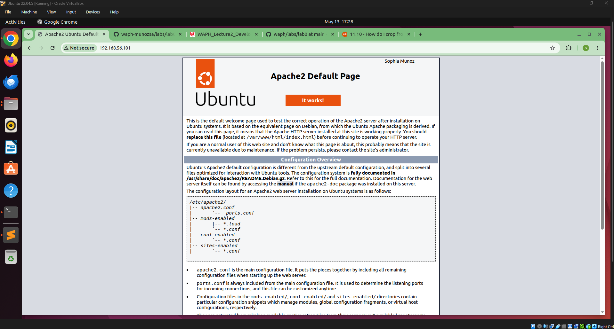
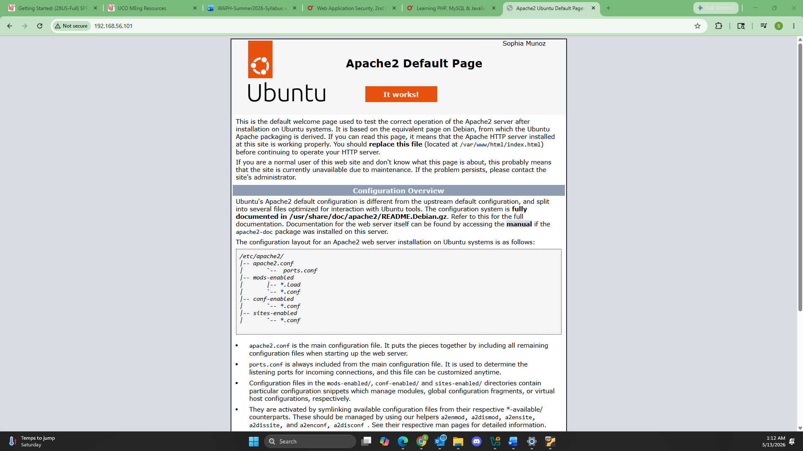
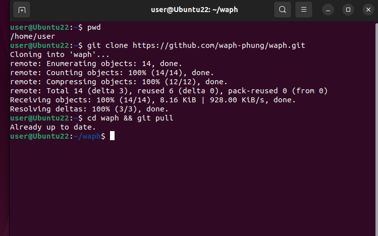
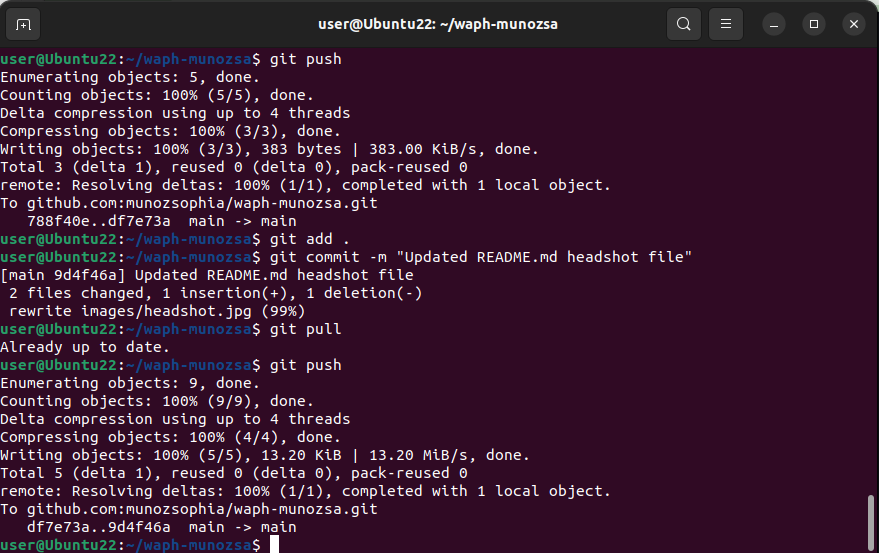

# waph-munozsa

## Instructor: Dr. Phu Phung

## Student

**Name**: Sophia Munoz

**Email**: [mailto:munozsa@mail.uc.edu](munozsa@mail.uc.edu)

**Short-bio**: Sophia Munoz has interests in Computer Graphics and Web Application development.

# Lab 0 - Development Environment Setup 

## Overview 

This lab is covered in Lecture 2, with preparation homework in Lecture 1. In Part I, you need to set up an Ubuntu 22.04 Virtual Machine on VirtualBox and install software and applications. In Part II, you will clone the course repository and your private repository and complete the `git` exercises to write the report.

## Report 

You need to create a sub-folder `labs/lab0` with a README.md file to write the report in Markdown format and generate the report to PDF using the `pandoc` application. Your report should follow the template provided in Lecture 2 ([https://github.com/waph-phung/waph/blob/main/README-template.md](https://github.com/waph-phung/waph/blob/main/README-template.md)), which should include the course name and instructor, your name and email, together with your headshot (150x150 pixels), and then the following sub-sections:

## The lab's overview

Write an overview of the lab.

Also, include a direct clickable link to the lab folder on GitHub.com so that it can be viewed when grading, for example,  [https://github.com/munozsophia/waph-munozsa/blob/main/labs/lab0](https://github.com/munozsophia/waph-munozsa/blob/main/labs/lab0).

## Part I - Ubuntu Virtual Machine & Software Installation

A summary of the steps you have performed to set up the Ubuntu 22.04 virtual machine and install the required software and applications.

> #### Ubuntu 22.04 Virtual Machine Setup
>
> Follow the instructions on [Ubuntu VM Tutorial](https://ubuntu.com/tutorials/how-to-run-ubuntu-desktop-on-a-virtual-machine-using-virtualbox#1-overview)
>
> - Install and configure VirtualBox
> - Import an Ubuntu image
> - Run a virtual instance of Ubuntu Desktop
> - Setup NAT and Host-only Adapters

> #### net-tools Intallation
>
> Now that the VM has an IP address accessible within the virtual network
> 
> At the command prompt, type `sudo apt install net-tools`,
> type `ifconfig` to view IP address
>
> #### Apache Web Server Intallation
>
> At the command prompt, type `$ sudo apt install apache2`
>
> #### git Installation
>
> At the command prompt, type `$ sudo apt install git`
>
> #### Sublime Test Editor Installation
>
> At the command prompt, type `$ sudo snap install sublime-text --classic`

> #### pandoc Installation
>
> At the command prompt, type `$ sudo apt install pandoc`
>
> #### pdflatex Installation
>
> Since `pandoc` requires `pdflatex` and its fronts to render files, type in the following:
>
> - `$ sudo apt-get install texlive-latex-base`
> - `$ sudo apt-get install texlive-fonts-recommended`
> - `$ sudo apt-get install texlive-latex-extra`
> - `$ sudo apt-get install texlive-fonts-extra`

> #### Google Chrome Installation
>
> - Download Google Chrome \(.deb package)
> 	- Open Firefox
> 	- Visit the [Google Chrome download](https://www.google.com/chrome/?platform=linux) page
> 	- Select **64-bit.deb** \(For Debian/Ubuntu)
> 	- Click **Accept and Install**
> - Open the Downloaded File
> 	- Go to **Downloads**
> 	- Double-click `google-chrome-stable_current_amd64.deb`
> 	- It will open in **Ubuntu Software Center**
> - Install Google Chrome
> 	- Click Install
>	- Enter your system password when prompted

### Apache Web Server Testing

*Apache Web Server in Ubuntu VM*

*Apache Web Server in Laptop*

## Part II - git Repositories and Exercises

### The course repository

*Cloned Course Repository*

### Private Repository

To create my private repository on [GitHub.com](https://github.com)

> - Click the green `Create repository` button
> - Name the repository with the following naming convention `waph-your-uc-username` \(`waph-munozsa`)
> - Check off Private configuration
> - Select `Add a README file`
> - Choose license `Apache License 2.0`

To share the repository with `phung-waph`

> From the repository, click on:
>
> - settings -> collaborators -> add people
> - type the username `phung-waph` and click the corresponding button

This repository's full URL, [https://github.com/munozsophia/waph-munozsa.git](https://github.com/munozsophia/waph-munozsa.git).

> #### Generating and Setting up SSH Keys
>
> - From the terminal: `$ ssh-keygen`
> - Press Enter to accept the default location
> - Enter and re-enter a passphrase when prompted \(this can be left blank)
> - The key files are stored in `/.ssh` folder. To view the files: `$ ls ~/.ssh`
> - To view and copy the key: `$ cat ~/.ssh/id_rsa.pub`
> - Then select and copy
>
> To add the public key to GitHub account:
>
> - click on the account icon
> - click settings -> SSH and GPG keys -> new ssh key
> - name the key in Title, paste the copied key to Key
> - click `Add SSH key`

> #### Clone Private Repo to VM using SSH Key
>
> In home directory \(~), `$ git clone <url>` \(git@github.com:munozsophia/waph-munozsa.git)
>
> Get URL from the repo overview, click Code -> SSH

*Committed changes to Private Repository*

## Submission

Use the `pandoc` tool to generate the PDF report for submission from the `README.md` file, and ensure the report and contents are rendered properly.

**Note**: If you face the issue that figures are not rendered in preferred positions, use option `-f markdown-implicit_figures -t pdf` to disable the default `implicit_figures` option in pandoc

The PDF file should be named `your-username-waph-lab0.pdf`, e.g., `phungph-waph-lab0.pdf` 
