# WAPH-Web Application Programming and Hacking

## Instructor: Dr. Phu Phung

## Student

**Name**: Sophia Munoz

**Email**: [mailto:munozsa@mail.uc.edu](munozsa@mail.uc.edu)


# Lab 2 - Front-end Web Development

## The Lab's Overview

For Lab1 there were two parts. Part I has two tasks. The first is getting familiar with Wireshark and the use of the HTTP protocol within this tool. For this task I downloaded Wireshark through the terminal and started capturing packets. For task 2, I sent a minimal HTTP Request with telnet and captured packets with Wireshark to inspect the Request and Reponse parameters of HTTP. Part II had three tasks. The first task involved developing and deploying CGI Web applications in C with the deployment itself being through the browser. For task 2, I developed and deployed PHP pages by using a simple string and global variable to display my name. For task 3, I used Wireshark to inspect HTTP GET and HTTP POST Requests and Responses. With those packets I could see major differences between the two.

Outcomes I learned from this lab are the many different way to develop and deploy web applications to an apache web server. From telnet, CGI and PHP, know how they interact with the web server helped me have a much deeper understanding of web application development and potential security risks in their implementation.

Lab2 Folder: [https://github.com/munozsophia/waph-munozsa/tree/main/labs/lab2](https://github.com/munozsophia/waph-munozsa/tree/main/labs/lab2).


## Part I - HTML and Webpage Development with Basic HTML Tags

### Task 1. Familiar with the Wireshark tool and HTTP protocol

I used the Wireshark tool to capture packets. When I typed in the website [http://example.com/index.html](http://example.com/index.html), Wireshark captured the HTTP Request and Response of the Browser and Server interacting.

I was able to successfully run the tool once, before I exited out of the tool and screenshotted the HTTP results. I made sure to follow the lecture instructions of deleting cache and browser history. Unfortunately, this did not work. Wireshark wasn't able to capture http protocol packets again. Based on my research, this was due to the fact that when I put the link in my browser, the server at example.com automatically redirects the **http://** request to **https://**.

My solution to this issue was to capture the packets by running `curl http://example.com/index.html` in the terminal. This way prevents any redirection from happening. In this case it was a successful attempt and I was able to filter the HTTP protocol packets. Given this in context, my HTTP results are a little different.

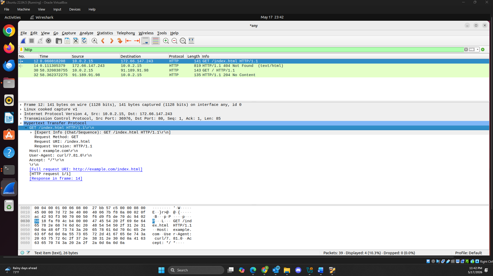
*HTTP Request Message in Wireshark*

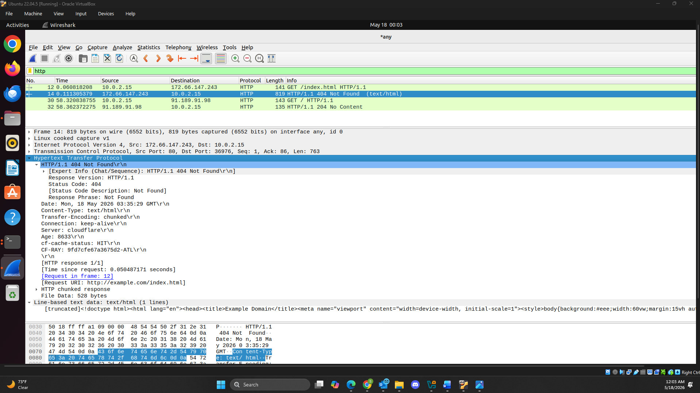
*HTTP Response Message in Wireshark*

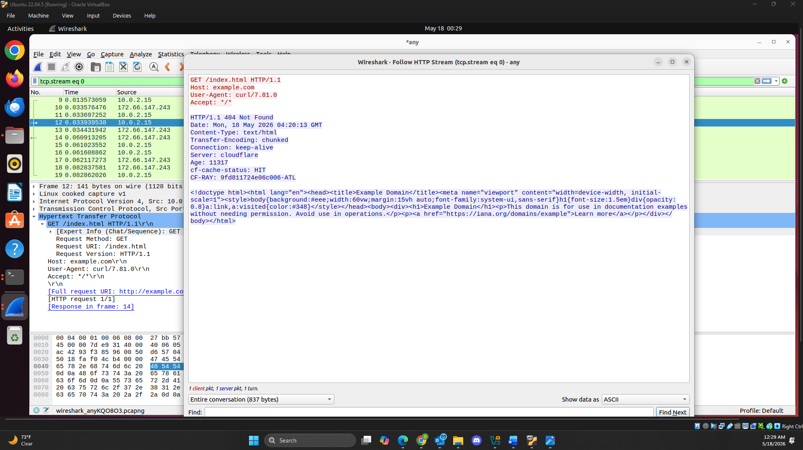
*HTTP Stream in Wireshark*

### Task 2. Understanding HTTP using telnet and Wireshark

I used the telnet program to send a minimal HTTP Request through the terminal while capturing packets in Wireshark. The HTTP Request and Response was different compared to Task 1 as the amount of data taken was much less, especially for the HTTP Request.

  1. By typing in `telnet example.com 80`, I connected to the server through port 80. Then by typing in the minimal HTTP Request as below, I received the HTTP Response.

  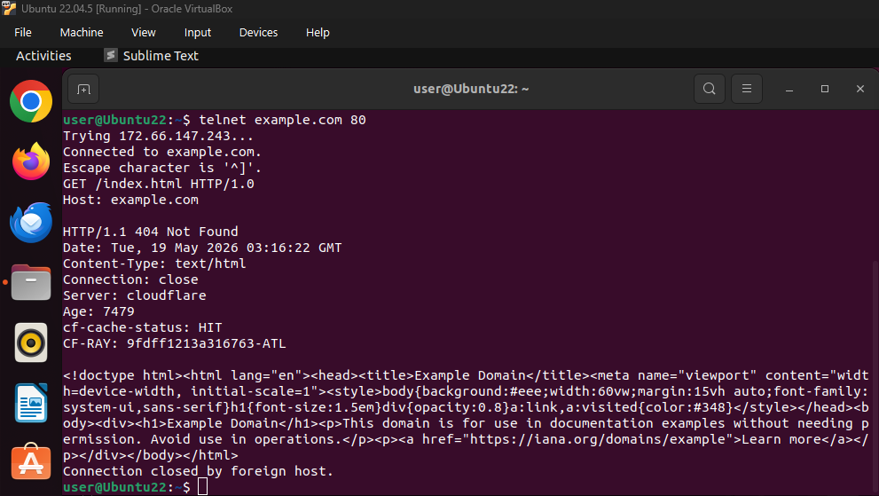
  *HTTP telnet Terminal Request and Response*

  2. There is a difference between this HTTP Request message and the one sent by the browser in Task 1. The fields missing in this request are all except `GET /index.html HTTP/1.1` and `Host: example.com`.

  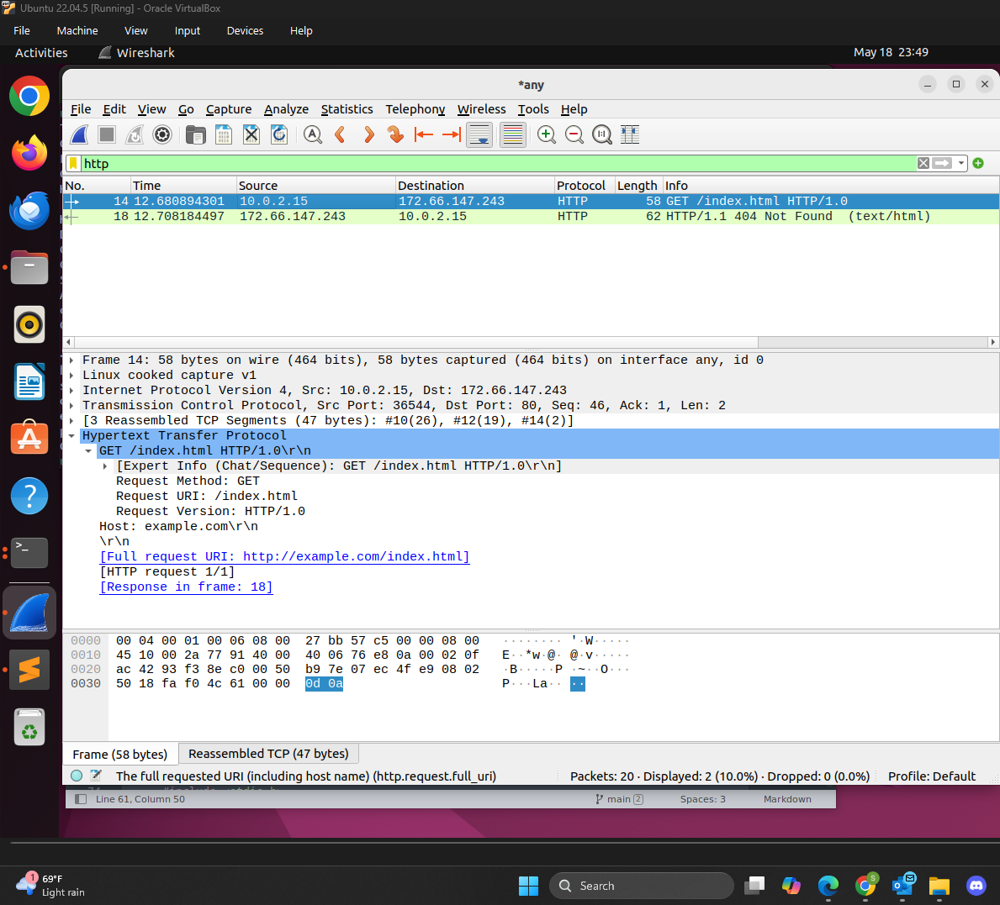
  *HTTP telnet Wireshark Request*

  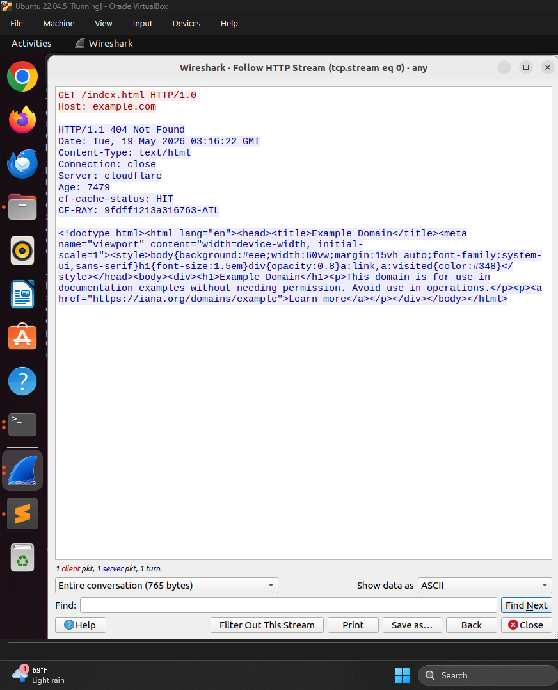
  *HTTP telnet Wireshark Stream*

  3. There isn't as much difference between the telnet HTTP Response message and the browser HTTP Response message from Task 1. But the Task 1 message hold more information on cache-control, last-modified, content-encoding, and more.

  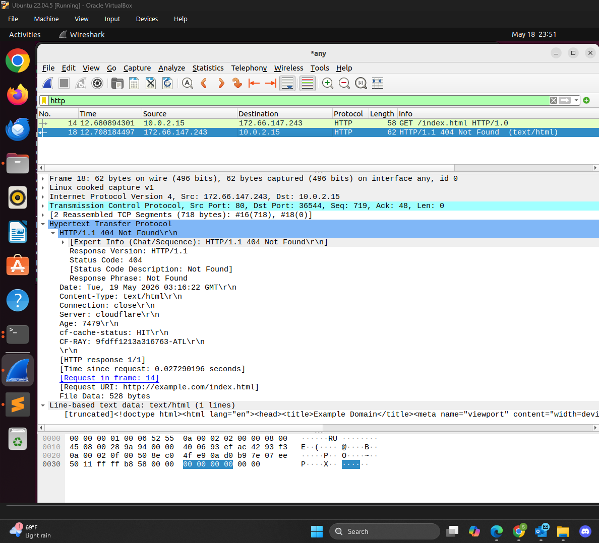
  *HTTP telnet Wireshark Response*

## Part II - Front-end Web Development with Basic JavaScript

###   Task 1. CGI Web applications in C

   a. I developed a Hello World CGI program in C by first creating a helloworld.c file and programming the code to output `Hello World CGI! From Sophia Munoz, WAPH`. This also meant having to code print out the Content-Type, which was text/plain. From there I compiled the program by typing in `$ gcc helloworld.c -o helloworld.cgi` and running the program, `$ ./helloworld.cgi`.

   To deploy the program to the Apache Web Server, I first enabled the CGI daemon \(`$ sudo a2enmod cgid`) and restarted the server \(`$ sudo systemctl restart apache2`). Once I completed that step, I copied the `helloworld.cgi` file to the corresponding `/usr/lib/cgi-bin` folder and was able to deploy the CGI program to the webserver.

   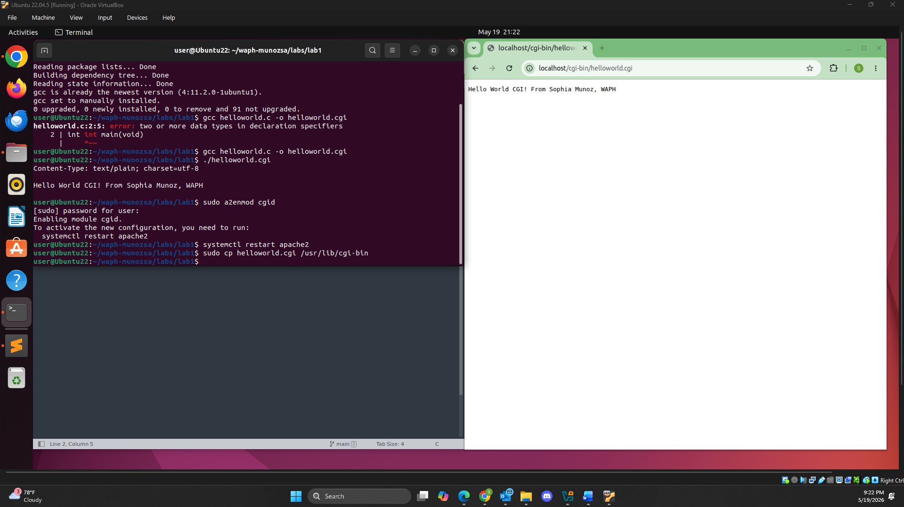
   *CGI Program in Plain Text*
   
   b. I developed the index CGI program in C by creating an index.c file. All steps to compiling, deploying, and running the program are the same as the previous CGI program mentioned above, except the code for the program is in HTML. I had to make sure that the Content-Type was text/html so that the program was properly displayed and that I properly formatted each lined of HTML.
   
Included file `index.c`:
```C
   #include <stdio.h>
   int main(void)
   {
      printf("Content-Type: text/html; charset=utf-8\n\n");
      printf("<!DOCTYPE html\n");
      printf("<html>\n");
      printf("<head>\n");
      printf("<title>WAPH - Sophia Munoz</title>\n");
      printf("</head>\n");
      printf("<body>\n");
      printf("<h1>Web Application Programming and Hacking</h1>\n");
      printf("<p>This is a CGI application made by Sophia Munoz.</p>\n");
      printf("</body>\n");
      printf("</html>\n");
      return 0;
   }
   ```

   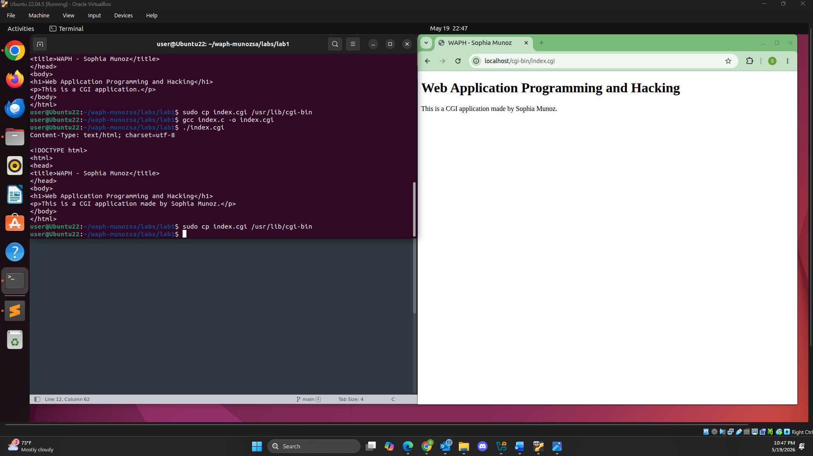
   *CGI Program in HTML Text*

###  Task 2. A simple PHP Web Application with user input.

a. To develop a `helloworld.php` PHP page, I created the file and coded in the string `Hello World, this is the first PHP by Sophia Munoz, WAPH` to echo and the `phpinfo()` for testing purposes. This code was encased by `<?php ?>`. To deploy the program to the webserver root directory, I typed in the terminal `$ sudo cp helloworld.php /var/www/html`.

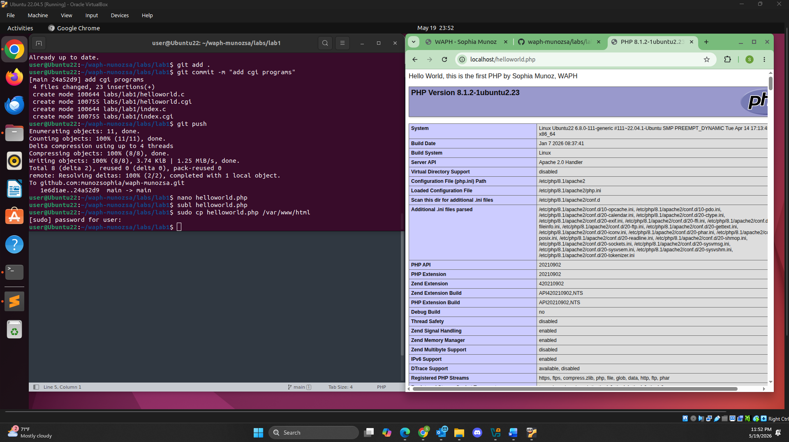
*PHP helloworld Program*

b. To develop the `echo.php` PHP page, I created the file and instead of the string, I used the global variable `$_REQUEST[..]`. This is able to get input from an HTTP Request. This means there is vulnerabilities for attackers to exploit since the global variable handles both HTTP GET and POST. It poses a security risk due to its convenient model. To deploy the program, I copied the program to the webserver root directory `/var/www/html` and I typed `localhost/echo.php?data=Sophia Munoz`.

Included file `echo.php`:
```PHP
   <?php
      echo $_REQUEST["data"];
   ?>
```

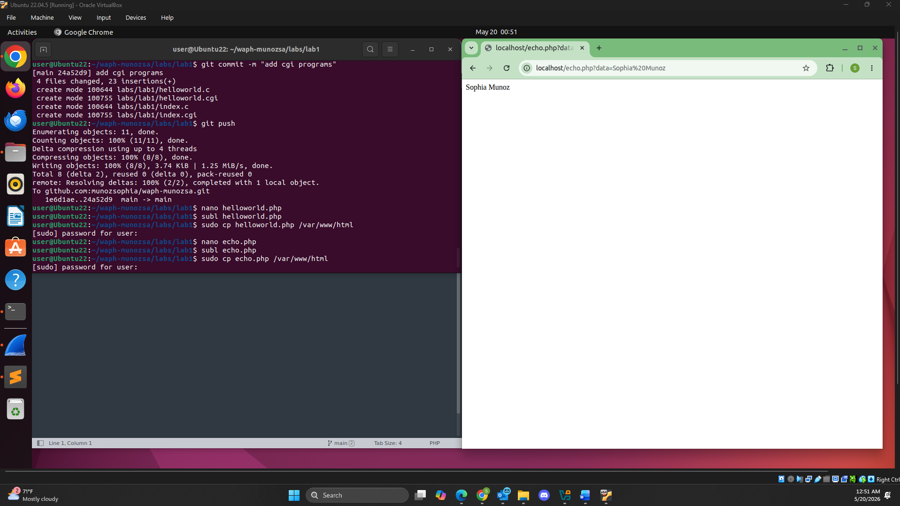
*PHP echo Program*

### Task 3. Understanding HTTP GET and POST requests.

a. Using Wireshark I was able to inspect the HTTP GET Request and Response packets captured for the `echo.php` page by simply running Wireshark and in my browser typing and deploying `localhost/echo.php?data=Sophia Munoz` and then stopping the packet capturing. From Wireshark I filtered `http` to see the HTTP GET Request and Response.

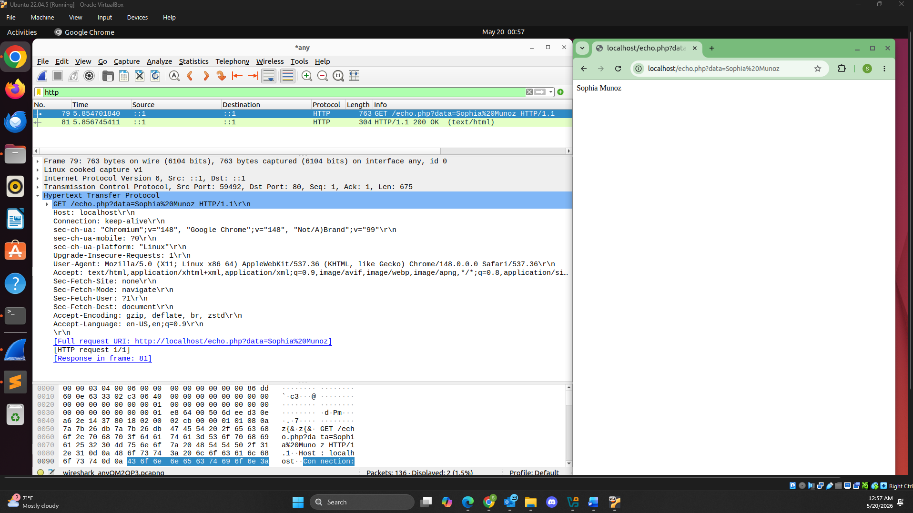
*HTTP GET Request echo Program*

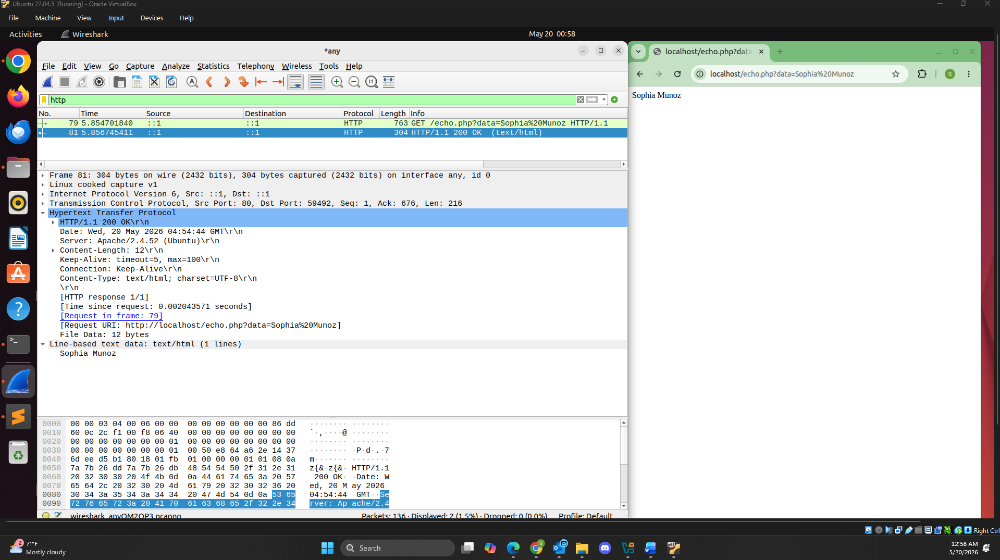
*HTTP GET Response echo Program*

b. To use `curl`, I first had to install it by typing in the terminal `$ sudo snap install curl`. Once it is installed, I started capturing packets in Wireshark and in the terminal I typed `curl -X POST http://localhost/echo.php -d "data=Sophia Munoz"` to create an HTTP POST request. The terminal then outputted my name and I stopped capturing packets to inspect the HTTP POST request.

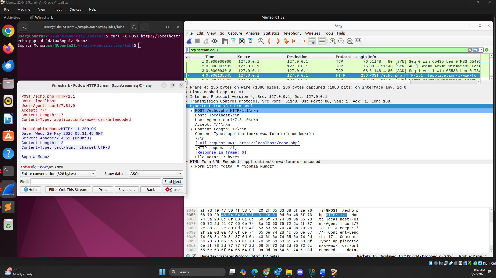
*HTTP POST Request & Stream echo Program*

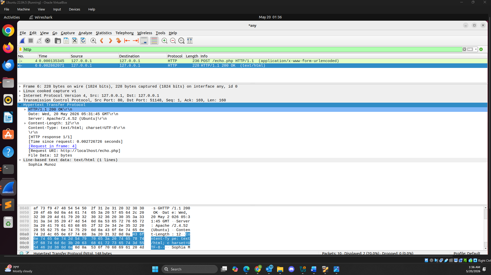
*HTTP POST Response echo Program*

c. Between the HTTP POST Request and the HTTP GET Request, GET has more visible parameters than POST. That being said, POST does have the Full request URI and HTML Form item visible \(`"data" = "Sophia Munoz"`), while GET has only the the Full request URI visible. User-Agents between the two are different too. Between the HTTP POST Response and HTTP GET Response, POST has less visible parameters than GET.