# WAPH-Web Application Programming and Hacking

## Instructor: Dr. Phu Phung

## Student

**Name**: Sophia Munoz

**Email**: [mailto:munozsa@mail.uc.edu](munozsa@mail.uc.edu)


# Lab 2 - Front-end Web Development

## The Lab's Overview

For Lab2 there were two tasks. Task 1 has two parts. Part `a` was creating webpages with the basic HTML tags. The webpage implemented used basic HTML tags with forms and an adjusted image. For Part `b`, I used simple JavaScript code within the HTML file to 

Outcomes I learned from this lab were

Lab2 Folder: [https://github.com/munozsophia/waph-munozsa/tree/main/labs/lab2](https://github.com/munozsophia/waph-munozsa/tree/main/labs/lab2).

### Task 1: Basic HTML with forms, and JavaScript 

####  a. HTML
  
I developed the `waph-munozsa.html` file with basic tags, my headshot, and two forms for user input. For this lab I created a new images folder within the Lab 2 folder so that the webpage can access my `headshot.jpg` file.

To format the headshot within the webpage to 50 pixels, I entered ``.

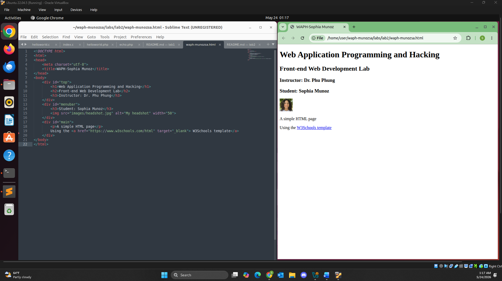
*HTML Page with Headshot Image*

To add the user input forms to the webpage, I used the \<form> tag and \<input> element with the code below to handle and display the user input to the `echo.php` web application.

```html
<b>Interaction with forms</b>
<div>
   <i>Form with an HTTP GET Request</i>
   <form action="/echo.php" method="GET">
      Your input: <input name="data">
      <input type="submit" name="Submit">
   </form>
</div>
<div>
   <i>Form with an HTTP POST Request</i>
   <form action="/echo.php" method="POST">
      Your input: <input name="data">
      <input type="submit" name="Submit">
   </form>
</div>
```

Below is an input from the user \(using the GET method)

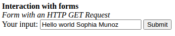

*HTTP GET Request Input*

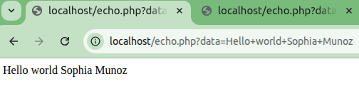

*HTTP GET Request Output*

Below is an input from the user \(using the POST method)

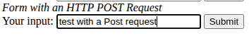

*HTTP POST Request Input*

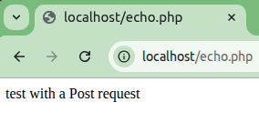

*HTTP POST Request Output*

As you can see from the images above, the data can be seen in the URL for the HTTP GET Request unlike the HTTP POST Request where the data is in the HTTP Headers.

To view this webpage I ran:

- `$ sudo cp waph-munozsa.html /var/www/html` to deploy HTML page to web server root
- `$ sudo cp -R images/ /var/www/html` to deploy image to web server root

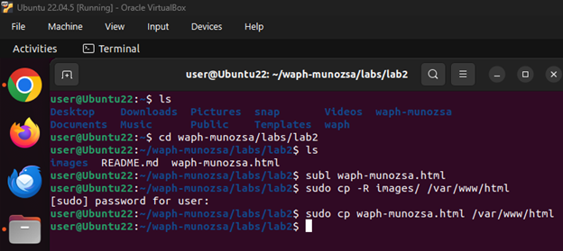

*HTML Deployment Commands in Terminal*

I then entered `localhost/waph-munozsa.html` in the browser. With the webpage rendered this what it looks like with my headshot and the form.

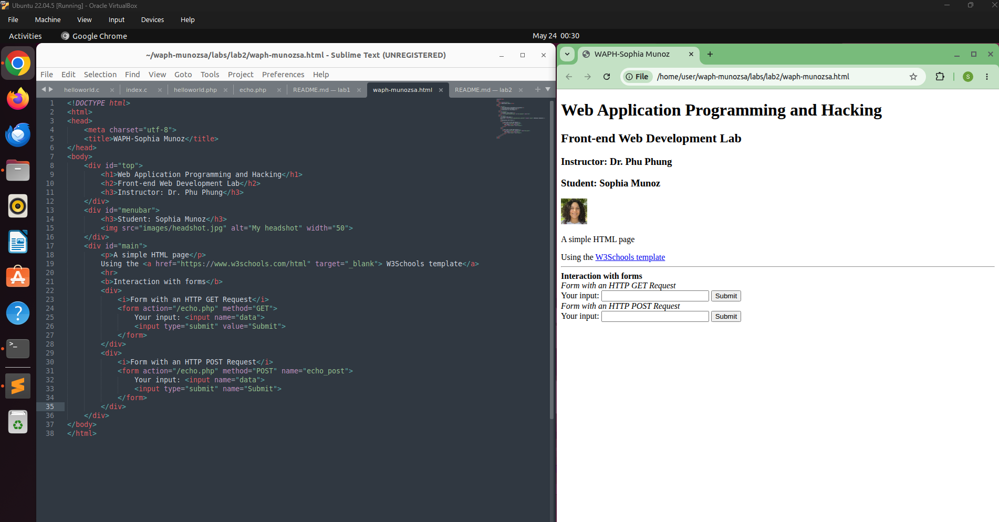

*HTML Headshot and Form Webpage*
  
####  b. Simple JavaScript

Write the JavaScript code in your HTML page: 

 - The following is the inline JavaScript code for displaying time and keypress.

 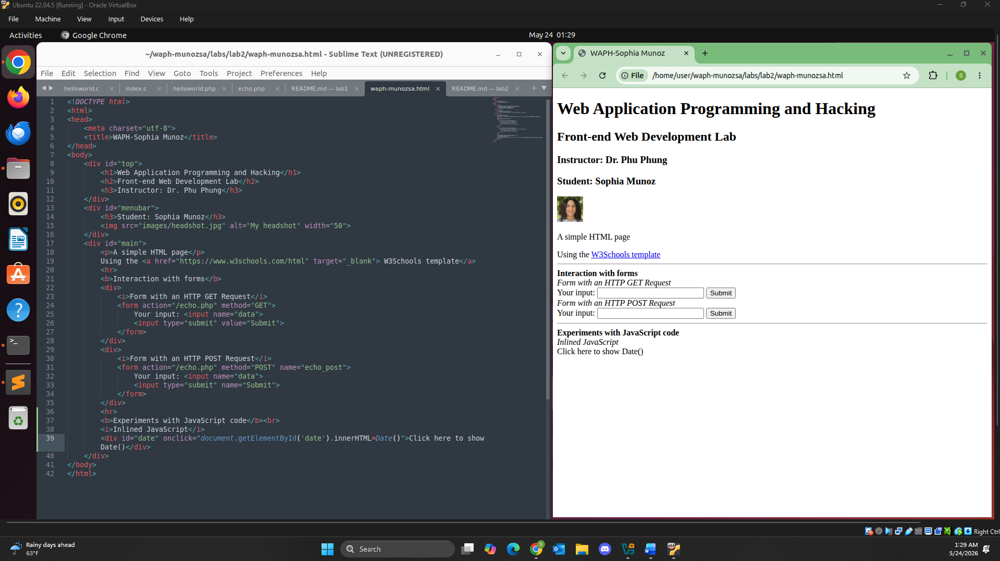
 *HTML JavaScript Inline Code Displaying Time*

Below is the inline JavaScript code that displays the time and date when it is clicked by the user.

```html
<b>Experiments with JavaScript code</b><br>
<i>Inlined JavaScript</i>
<div id="date" onclick="document.getElementById('date').innerHTML=Date()">Click here to show Date()</div>
```

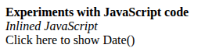

*HTML JavaScript Before Click*

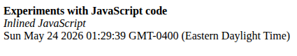

*HTML JavaScript After Click*

Below is the inline JavaScript code to log when a key is pressed in the POST method.

```html
<form action="/echo.php" method="POST" name="echo_post">
   Your input: <input name="data" onkeypress="console.log('You have pressed a key')">
   <input type="submit" name="Submit">
</form>
```

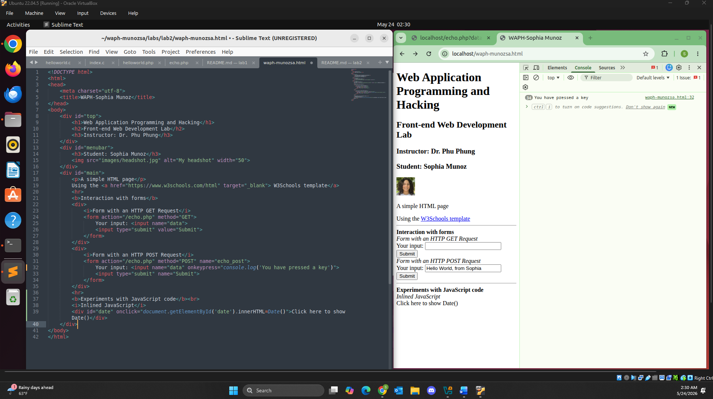
*HTML JavaScript on keypress*

 - Below I used the \<script> tag to display the digit clock below my headshot.

```html
<div id="digit-clock"></div>
<script type="text/javascript">
   function displayTime() {
      document.getElementById('digit-clock').innerHTML = "Current time:" + new Date();
   }
   setInterval(displayTime, 500);
</script>
```

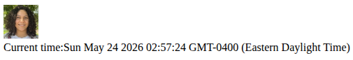

*HTML JavaScript Digit Clock a Closer Look*

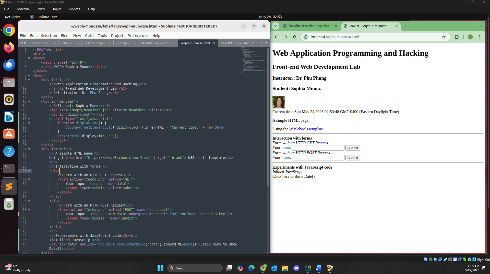
*HTML JavaScript Digit Clock*

 - Below I used the code I used to implement the email and it appearing once clicked by the user.

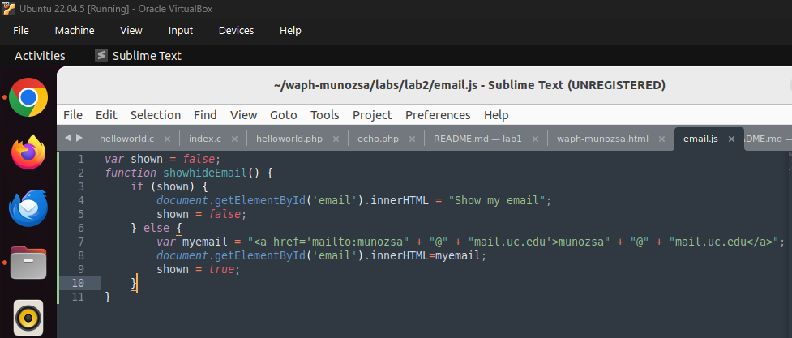
*HTML JavaScript email.js Code*

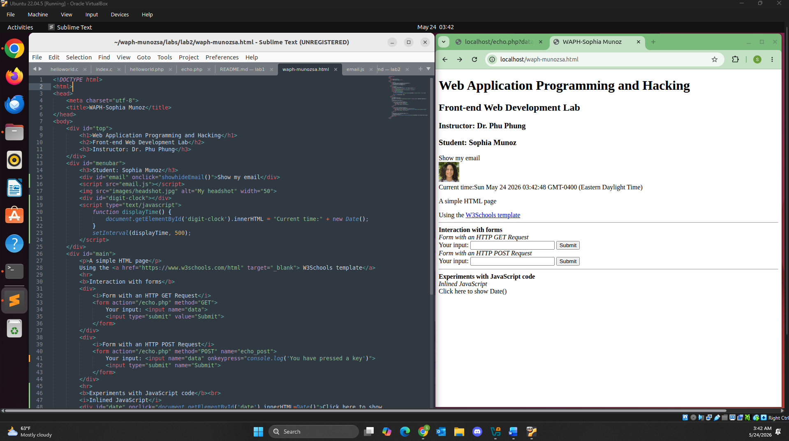
*HTML JavaScript Email Webpage*

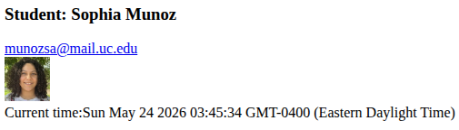

*HTML JavaScript Email Clicked*

 - Below I implemented the code below from an external source of JavaScript code to display an analog clock.

 ```html
 <canvas id="analog-clock" width="150" height="150" style="background-color:#999"></canvas>
 <script src="https://waph-phung.github.io/clock.js"></script>
 <script>
    var canvas = document.getElementById("analog-clock");
    var ctx = canvas.getContext("2d");
    var radius = canvas.height / 2;
    ctx.translate(radius, radius);
    radius = radius * 0.90;
    setInterval(drawClock, 1000);

    function drawClock() {
      drawFace(ctx, radius);
      drawNumbers(ctx, radius);
      drawTime(ctx, radius);
    }
 </script>
 ```

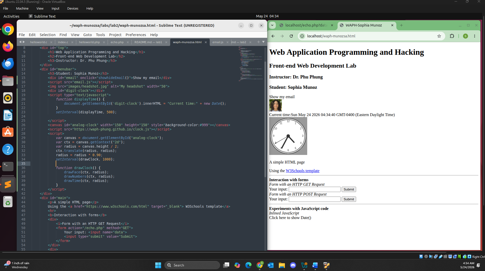
*HTML JavaScript Analog Clock* 

### Task 2: Ajax, CSS, jQuery, and Web API integration

####  a. Ajax

I implemented the JavaScript code below for the Ajax GET request. This allows for the user input to be seen as a key is pressed. And as you can see from the final image for the HTTP requests/responses, that Request URL contains the data input by the user \(`http://localhost/echo.php?data=Another%20test%20data`) and that the status is `200 OK`. Implementing Ajax asynchronously allows for data handling to be dealt with better performance.

```html
<script>
   function getEcho() {
         var input = document.getElementById("data").value;
         if (input.length == 0) {
            return;
         }
         var xhttp = new XMLHttpRequest();
         xhttp.onreadystatechange = function() {
            if (this.readyState == 4 && this.status == 200) {
               console.log("Received data=" + xhttp.responseText);
               document.getElementById("response").innerText= "Response from server:" + xhttp.responseText;
               // code to show the data
            }
         }
         xhttp.open("GET", "echo.php?data=" + input, true);
         // code to create an Ajax request
         xhttp.send(); // code to send the request
         document.getElementById("data").value="";
      }
</script>
```

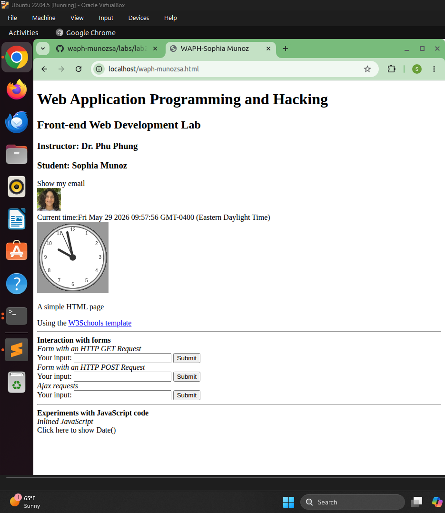
*Ajax JavaScript GET Request Button Implemented*

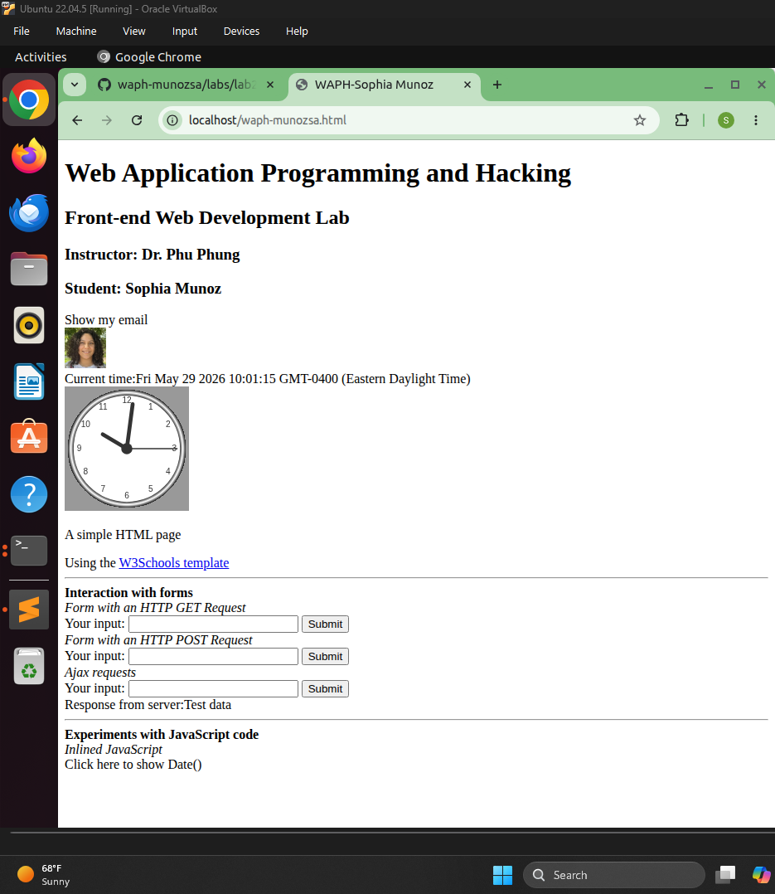

*Ajax JavaScript Server Response*

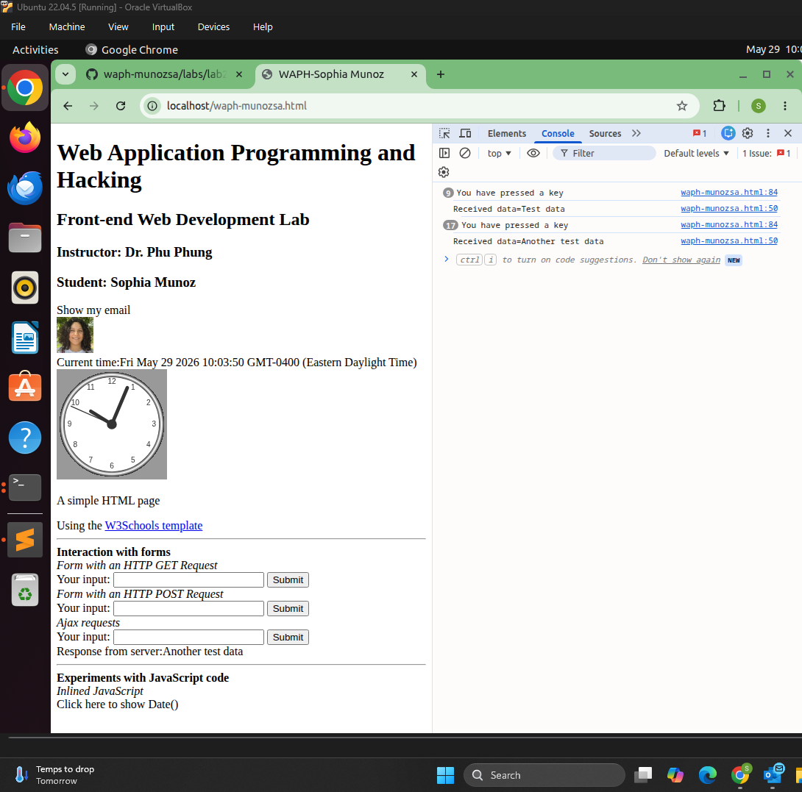
*Ajax JavaScript Keypress*

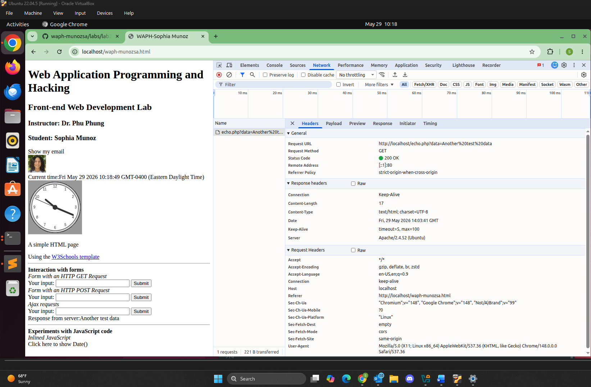
*Ajax JavaScript Network Outcome*

#### b. CSS

Add CSS to your page with inline, internal, and external (one of the provided remote CSS) ones.

#### c. jQuery

Add the jQuery library to your page, and implement HTML and JavaScript code in jQuery to:

  **i.** When the corresponding button is clicked, send an Ajax GET request to the `echo.php` web application and display the response content

  **ii.** Similarly, when the corresponding button is clicked, send an Ajax GET request to the `echo.php` web application and display the response content 


#### d. Web API integration

**i.** Using Ajax on [https://v2.jokeapi.dev/joke/Programming?type=single](https://v2.jokeapi.dev/joke/Programming?type=single) 

Write JavaScript code using jQuery Ajax to send a request and handle the response to display a random joke from the above API when the page is loaded. Inspect the network in the browser to examine the request and response accordingly.

**ii.** Using the `fetch` API  on [https://api.agify.io/?name=input](https://api.agify.io/?name=input)

Add HTML and JavaScript code to use the `fetch()` method to call the above API with user input, and display the response results. Inspect the network in the browser to examine the request and response accordingly.