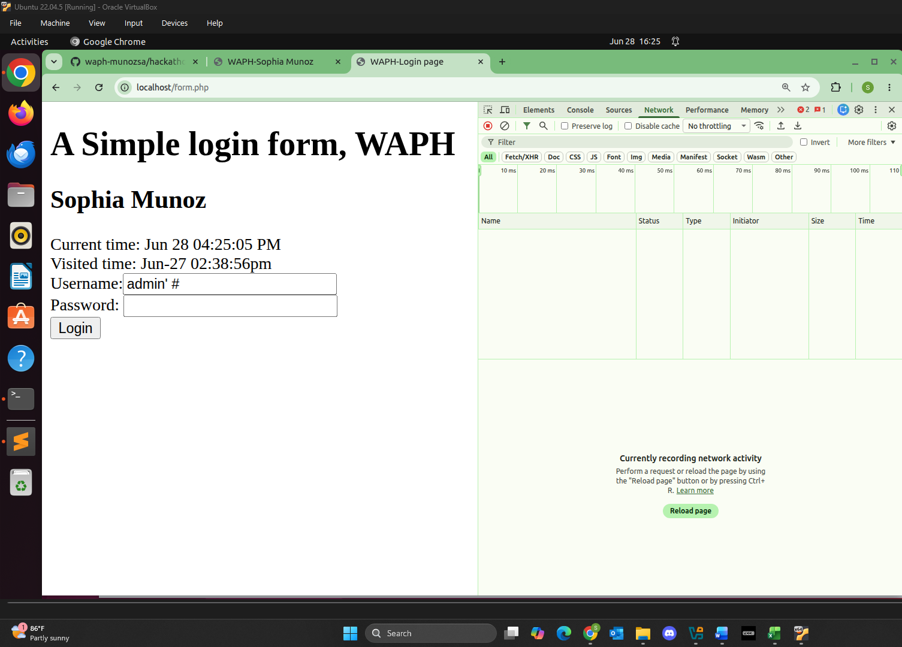
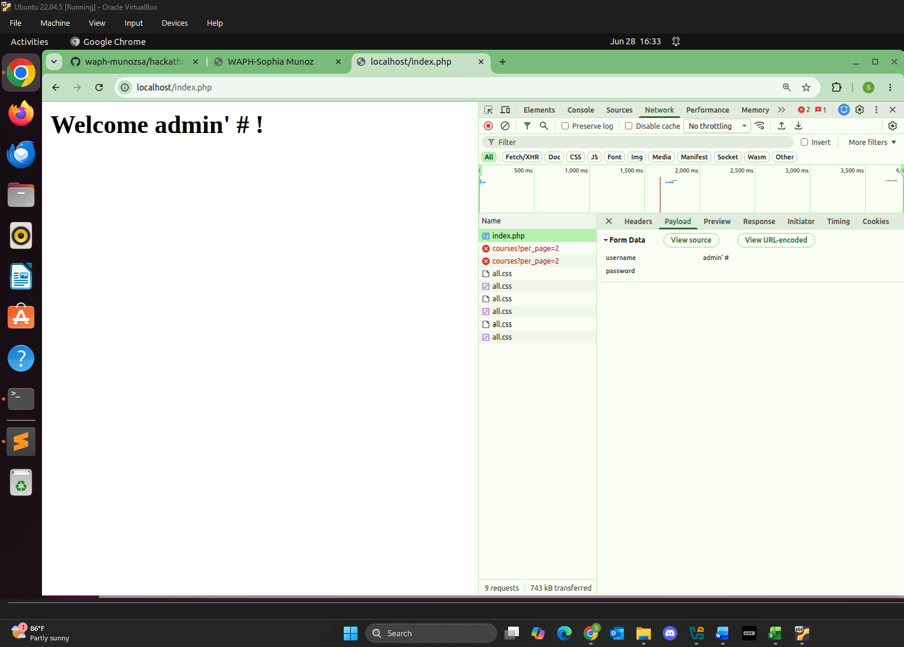
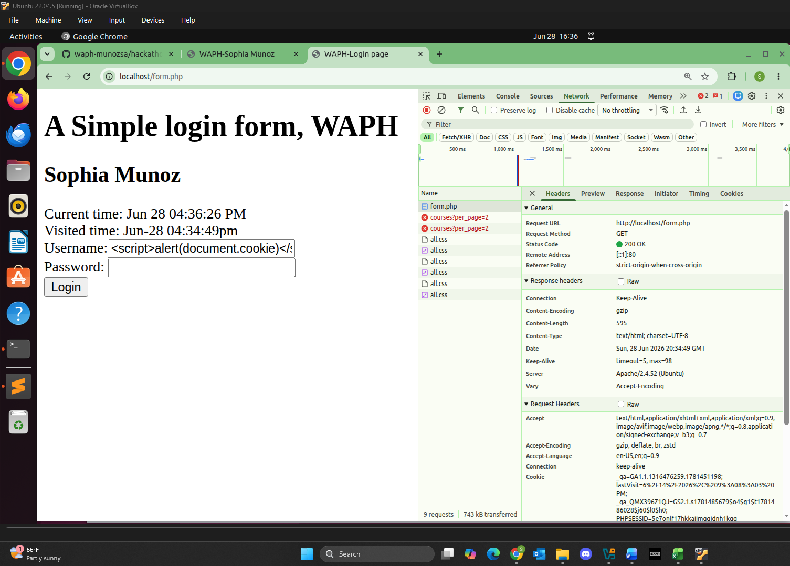
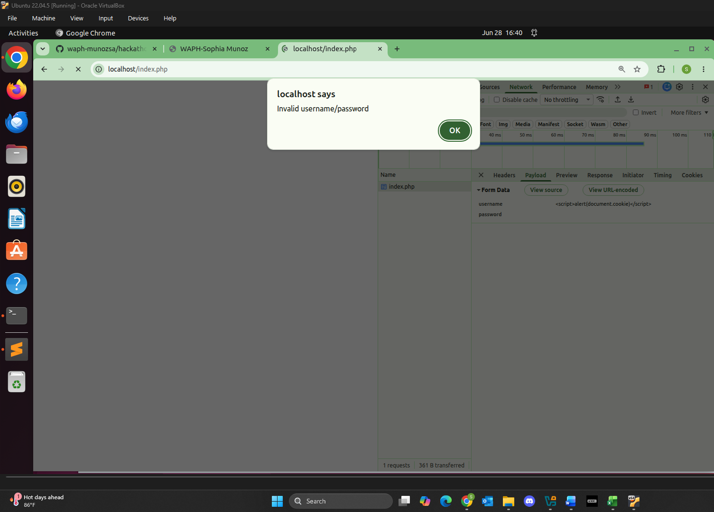
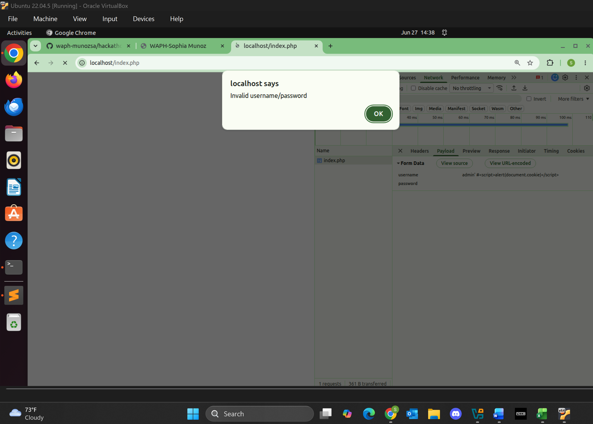
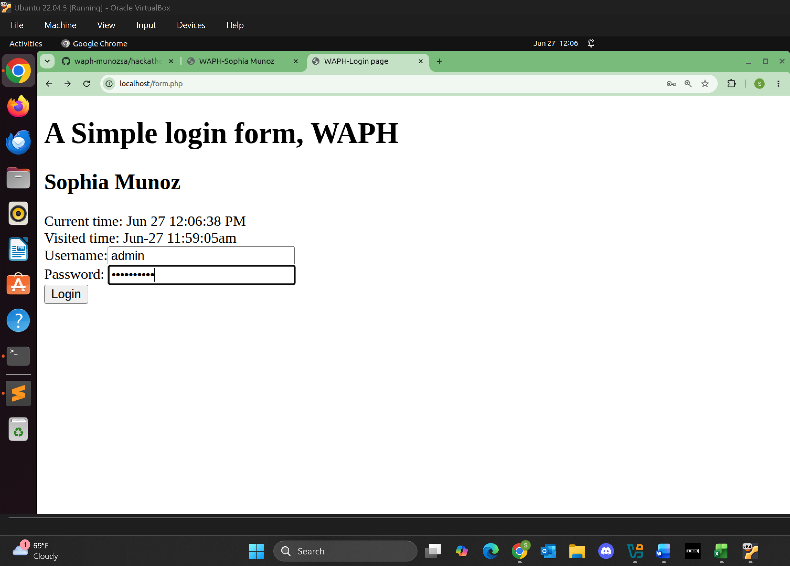
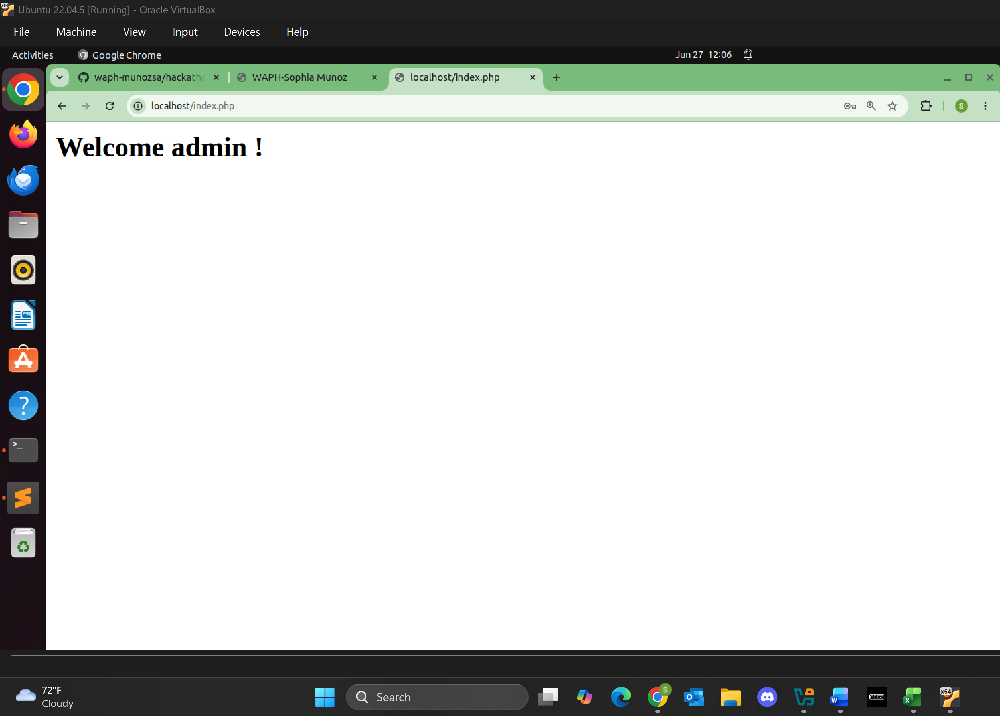

# WAPH-Web Application Programming and Hacking

## Instructor: Dr. Phu Phung

## Student

**Name**: Sophia Munoz

**Email**: [mailto:munozsa@mail.uc.edu](munozsa@mail.uc.edu)


# Lab 3 - Secure Web Application Development in PHP/MySQL

## The Lab's Overview

For Lab3 there were 4 parts. In Part `a`, I created a new database and imported SQL commands. In Part `b`, I created a login system in PHP/MySQL. In Part `c`, I made XSS and SQL injections attacks to the system. In Part `d`, I implemented Prepared Statements and output satitization to prevent the attacks previously mentioned.

Outcomes I learned from this lab were how to set up and manange a MySQL database. The implementation of the login system also allowed me to see the vulnerabilities of the system so that the prevention of cyberattacks can be implemented with secure methods.

Lab3 Folder: [https://github.com/munozsophia/waph-munozsa/tree/main/labs/lab3](https://github.com/munozsophia/waph-munozsa/tree/main/labs/lab3).

### a. Database Setup and Management

For Part `a`, I created a new database `waph` and a database account by importing SQL commands from the file `database-account.sql`. The commands implemented are below.

```sql
create database waph;
CREATE USER 'munozsa'@'localhost' IDENTIFIED BY 'Sophia13_m';
GRANT ALL ON waph.* TO 'munozsa'@'localhost';
```


*Database Setup and Account Creation*

I also created a users table by importing SQL commands from the file `database-data.sql`. The commands implemented are below.

```sql
drop table if exists users;
create table users(
   username varchar(50) PRIMARY KEY,
   password varchar(100) NOT NULL
);
INSERT INTO users(username, password) VALUES ('admin', md5('MyPa$$w0rd'));
```


*Database Table Setup*

### b. A Simple (Insecure) Login System with PHP/MySQL

For Part `b`, I developed a login system with PHP/MySQL. To achieve this I connected to the database, created a query string for username/password user inputs, executed and handled the query result.

The main code the handled this implementation was in the `index.php` file.

```php
function checklogin_mysql($username, $password) {
      $mysqli = new mysqli('localhost',
                           'munozsa' /*Database username*/,
                           'Sophia13_m' /*Database password*/,
                           'waph' /*Database name*/);
      if ($mysqli->connect_errno) {
         printf("Database connection failed: %s\n", $mysqli->connect_error);
         exit();
      }
      $sql = "SELECT * FROM users WHERE username='" . $username . "' ";
      $sql = $sql . " AND password = md5('" . $password . "')";
      //echo "DEBUG>sql= $sql"; return TRUE;
      $result = $mysqli->query($sql);
      if ($result->num_rows == 1)
         return TRUE;
      return FALSE;
}
```

I used `echo "DEBUG>sql= $sql"; return TRUE;` to check within the MySQL server if the user input existed within the `waph` database table `users`.


*Login Debug*


*Login Table Users Filter*

After testing, I logged in successfully with the fully implemented login system.


*Login Page*


*Login Success*

### c. Performing XSS and SQL Injection Attacks

#### SQL Injection Attacks

Using the SQL injection attack `admin' #`, the `#` comments the rest of the query and hacks into the system.


*SQL Injection Login*


*SQL Injection Valid*

#### Cross-Site Scripting (XSS)

Using just the Cross-Site Scripting attack `<script>alert(document.cookie)</script>`, the XSS doesn't execute successfully because the user input is displayed after the login. Either way, the vulnerability is `$_POST['username']` as it is echoed without any sanitization.


*XSS Attack Login*


*XSS Attack Invalid*

Overall for Part `c`, I performed a XSS/SQL Injection Attack on the login system using this injection script, `admin' #<script>alert(document.cookie)</script>`.

This code is a mix of SQL and JavaScript that is able to attack the vulnerable system. Below is an image of the login page with the code injection and below that is the alert, showing that the hacking was successful.


*SQL/XSS Login Attack Page*


*SQL/XSS Login Attack Successful*

### d. Prepared Statement Implementation

For Part `d`, I implemented a Prepared Statement which essentially provides a level of security against SQL injection attacks. The code implementation is below. This ensures that these attacks are prevented.

```php
function checklogin_mysql($username, $password) {
      $mysqli = new mysqli('localhost',
                           'munozsa' /*Database username*/,
                           'Sophia13_m' /*Database password*/,
                           'waph' /*Database name*/);
      if ($mysqli->connect_errno) {
         printf("Database connection failed: %s\n", $mysqli->connect_error);
         exit();
      }
      $sql = "SELECT * FROM users WHERE username=? AND password = md5(?)";
      //echo "DEBUG>sql= $sql"; return TRUE;
      $stmt = $mysqli->prepare($sql);
      $stmt->bind_param("ss", $username, $password);
      $stmt->execute();
      $result = $stmt->get_result();
      if ($result->num_rows == 1)
         return TRUE;
      return FALSE;
}
```

Below is an image of a login attempt with the SQL Injection attack. The attempt was unsuccessful and you can see the notification showing the invalid username and password.


*Prepared Statement XSS Login*


*Prepared Statement XSS Login Invalid*

Below is an image a login attempt with the actual credentials. The attempt was successful as there is violation of the prepared statement.


*Prepared Statement Credentials Login*


*Prepared Statement Credentials Login Valid*

#### Security Analysis

Prepared Statements can prevent SQL injection attacks by separating SQL code and user input. The values are also treated as string input and not SQL values and so the SQL injection has no effect on the query structure and fails to "hack" into the system.

To mitigate XSS risks I implemented code sanitizing user input using `htmlspecialchars()`. This allows for special characters to be converted to html entities and prevents JavaScript code from executing. Instead as the function is used, plain text is what executes.

```php
<h2> Welcome <?php echo htmlspecialchars($_POST['username'], ENT_QUOTES, 'UTF-8'); ?> !</h2>
```

The current code vulnerabilities as stands are as follows:

If the username/password are empty, an invalid notification pops up. There is no check for empty inputs before the query is run in:

```php
if (checklogin_mysql($_POST["username"],$_POST["password"]))
```

If there are any database errors and `prepare()` fails, the fatal error output by `bind_param()` could expose info to attackers.

```php
$stmt = $mysqli->prepare($sql);
$stmt->bind_param("ss", $username, $password);
```

If the provided username is not exactly the same as the username from the database, there is no issue logging in. The username is not at all case-sensitive. This is an issue as an attacker can enter `ADMIN` or `Admin` as the username even if it isn't technically correct.