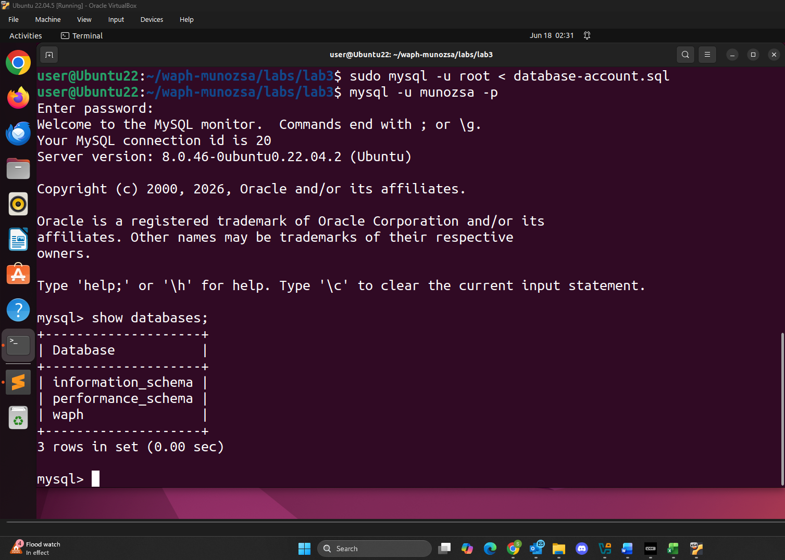
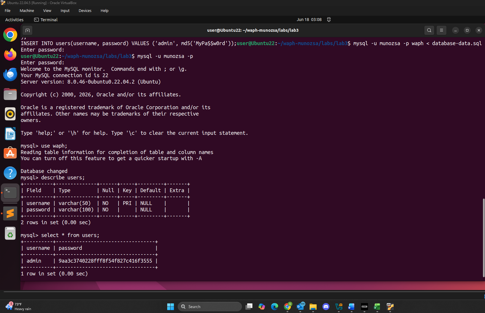
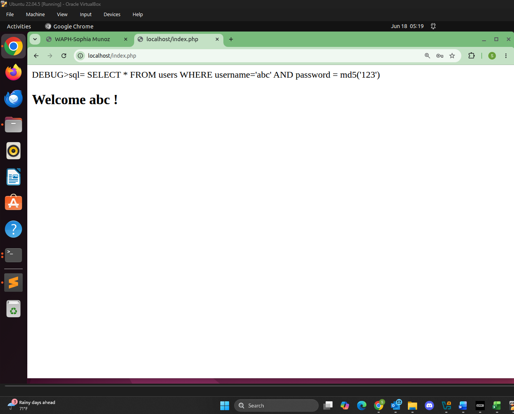
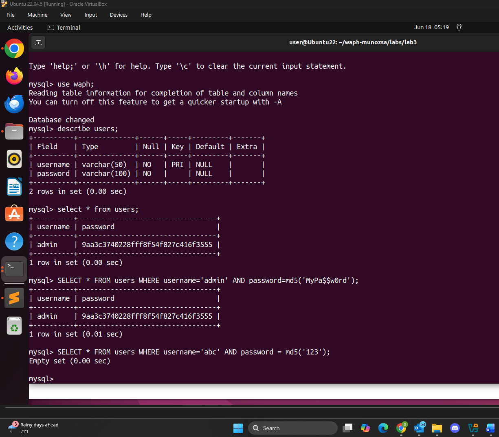
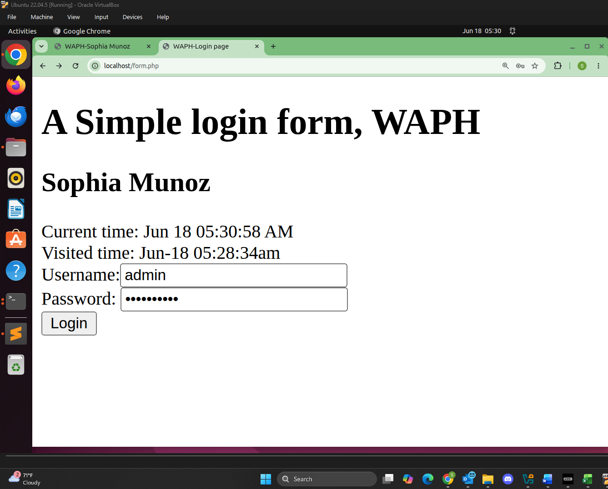
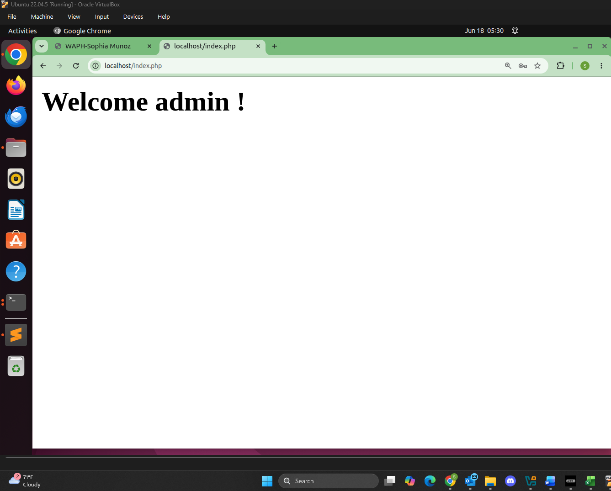
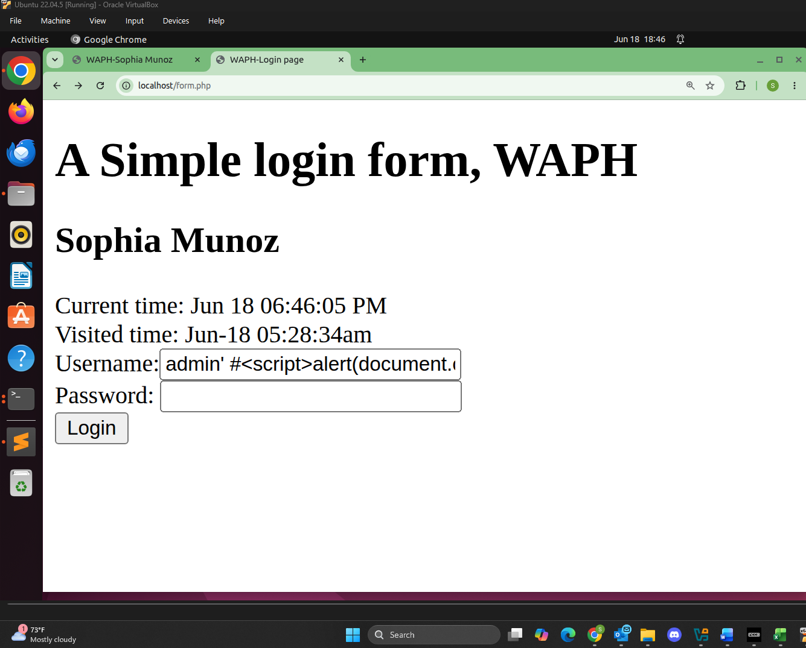
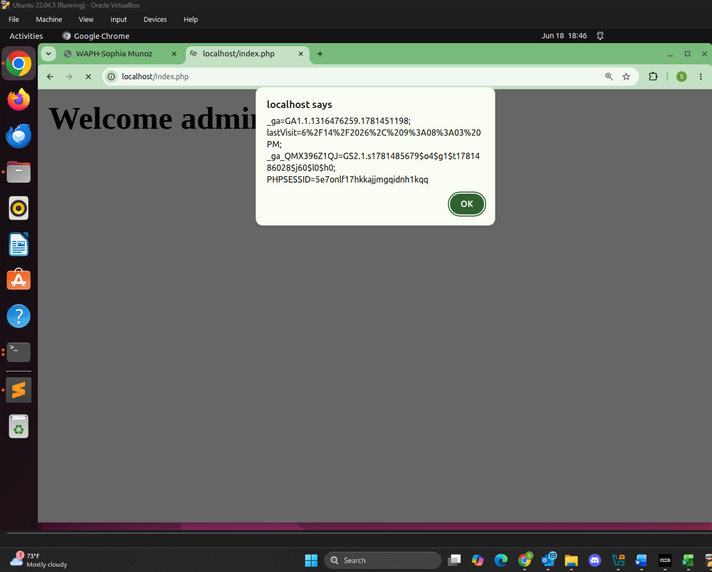
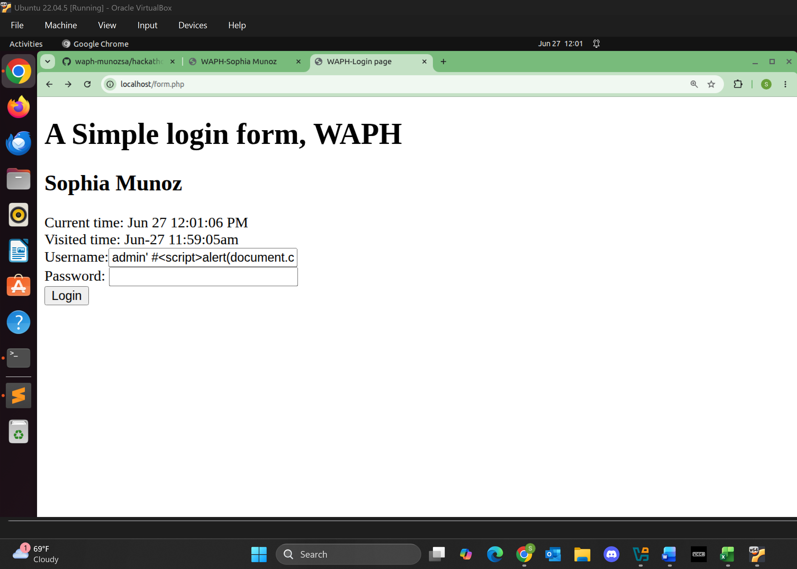

# WAPH-Web Application Programming and Hacking

## Instructor: Dr. Phu Phung

## Student

**Name**: Sophia Munoz

**Email**: [mailto:munozsa@mail.uc.edu](munozsa@mail.uc.edu)


# Lab 3 - Secure Web Application Development in PHP/MySQL

## The Lab's Overview

In this lab, students will learn the fundamentals of creating, managing, and securing web applications using PHP and MySQL. The lab exercises are designed to illustrate the vulnerabilities inherent in web applications and the best practices to mitigate these risks. Students will develop a simple login system that is intentionally vulnerable to common web attacks, starting with basic database setup and management. Through hands-on hacking exercises, students will exploit these vulnerabilities, gaining an understanding of SQL Injection and XSS attacks. The lab concludes with implementing security measures, specifically using prepared statements and output sanitization, to defend against these attacks.

The hands-on exercises in this lab consist of multiple sub-tasks with grade distribution as follows. Please note that these sub-tasks and their instructions have been covered in Lectures 10-13; students should watch the lecture videos and slides and follow the in-lecture hands-on exercises. These hands-on steps are combined in the attached slides for your convenience.

For Lab3 there were 4 parts.

Outcomes I learned from this lab were

Lab3 Folder: [https://github.com/munozsophia/waph-munozsa/tree/main/labs/lab3](https://github.com/munozsophia/waph-munozsa/tree/main/labs/lab3).

### a. Database Setup and Management

This sub-task was covered in Lecture 10; students should refer to the slides for detailed instructions. Below is the summary of steps with grades:

MySQL Installation (0 pts)
Installation: Execute sudo apt-get install mysql-server -y to install MySQL server.
Testing: Verify installation by executing mysql -V.
Connecting: Use sudo mysql -u root -p to connect to the MySQL server, pressing enter when prompted for a password.
Create a New Database, Database User and Permission (2.5 pts)
Report the outcome: a brief summary of the step; include the content of the database-account.sql file, and ensure that the file is in your repository.

Create a new table Users and insert data into the table (7.5 pts)
Report the outcome and grades: a brief summary of the step; include the content of the database-data.sql file, and ensure that the file is in your repository (2.5pts); the passwords are hashed (2.5pts); a screenshot demonstrating that you logged in a non-root data account to MySQL server and displayed the content of the table users (2.5 pts).

For Part `a`, I created a new database `waph` and a database account by importing SQL commands from the file `database-account.sql`. The commands implemented are below.

```sql
create database waph;
CREATE USER 'munozsa'@'localhost' IDENTIFIED BY 'Sophia13_m';
GRANT ALL ON waph.* TO 'munozsa'@'localhost';
```


*Database Setup and Account Creation*

I also created a users table by importing SQL commands from the file `database-data.sql`. The commands implemented are below.

```sql
drop table if exists users;
create table users(
   username varchar(50) PRIMARY KEY,
   password varchar(100) NOT NULL
);
INSERT INTO users(username, password) VALUES ('admin', md5('MyPa$$w0rd'));
```


*Database Table Setup*

### b. A Simple (Insecure) Login System with PHP/MySQL

This sub-task was covered in Lecture 10; students should refer to the slides for detailed instructions. Below is the summary of steps with grades:

Driver Installation: Make sure that you've installed PHP MySQLi extension with sudo apt-get install php-mysqli, and restart Apache using sudo service apache2 restart.
Modify index.php: add a checklogin_mysql function in index.php for database programming authentication following the instructions in the lecture.
Deployment and Testing: Deploy form.php and the modified index.php, then test the login functionality.
Report the outcome and grades: a brief summary of the step; include the content of the new code, and ensure that the PHP files are in your repository (10pts); a screenshot demonstrating that a valid username/password can log in to the system (5 pts).

For Part `b`, I developed a login system with PHP/MySQL. To achieve this I connected to the database, created a query string for username/password user inputs, executed and handled the query result.

The main code the handled this implementation was in the `index.php` file.

```php
function checklogin_mysql($username, $password) {
      $mysqli = new mysqli('localhost',
                           'munozsa' /*Database username*/,
                           'Sophia13_m' /*Database password*/,
                           'waph' /*Database name*/);
      if ($mysqli->connect_errno) {
         printf("Database connection failed: %s\n", $mysqli->connect_error);
         exit();
      }
      $sql = "SELECT * FROM users WHERE username='" . $username . "' ";
      $sql = $sql . " AND password = md5('" . $password . "')";
      //echo "DEBUG>sql= $sql"; return TRUE;
      $result = $mysqli->query($sql);
      if ($result->num_rows == 1)
         return TRUE;
      return FALSE;
}
```

I used `echo "DEBUG>sql= $sql"; return TRUE;` to check within the MySQL server if the user input existed within the `waph` database table `users`.


*Login Debug*


*Login Table Users Filter*

After testing, I logged in successfully with the fully implemented login system.


*Login Page*


*Login Success*

### c. Performing XSS and SQL Injection Attacks

This sub-task was covered in Lecture 11, and Lecture 12 (Hackathon 2); students should refer to the slides and lecture video for detailed instructions. Below is the summary of steps with grades:

SQL Injection Attacks (7.5 pts)
Execute Attack: Use SQL injection in the username field to bypass authentication. Document the attack with a screenshot with the payload in the browser (5 pts) and explain why such attacks happen (2.5pts).
Cross-site Scripting (XSS)
Execute Attack: Perform an XSS attack by injecting JavaScript into the user input field. Take a screenshot of the successful attack and discuss the vulnerability in your report (2.5 pts).

For Part `c`, I performed a XSS/SQL Injection Attack on the login system using this injection script, `admin' #<script>alert(document.cookie)</script>`.

This code is a mix of SQL and JavaScript that is able to attack the vulnerable system. Below is an image of the login page with the code injection and below that is the alert, showing that the hacking was successful.


*XSS Login Attack Page*


*XSS Login Attack Successful*

### d. Prepared Statement Implementation

For Part `d`, I implemented a Prepared Statement which essentially provides a level of security against SQL injection attacks.



*Prepared Statement XSS Login*

[Prepared Statement XSS Login Invalid](../../images/prepared-statement-xss-invalid.png)
*Prepared Statement XSS Login Invalid*

```php
function checklogin_mysql($username, $password) {
      $mysqli = new mysqli('localhost',
                           'munozsa' /*Database username*/,
                           'Sophia13_m' /*Database password*/,
                           'waph' /*Database name*/);
      if ($mysqli->connect_errno) {
         printf("Database connection failed: %s\n", $mysqli->connect_error);
         exit();
      }
      $sql = "SELECT * FROM users WHERE username=? AND password = md5(?)";
      //echo "DEBUG>sql= $sql"; return TRUE;
      $stmt = $mysqli->prepare($sql);
      $stmt->bind_param("ss", $username, $password);
      $stmt->execute();
      $result = $stmt->get_result();
      if ($result->num_rows == 1)
         return TRUE;
      return FALSE;
}
```

[Prepared Statement Credentials Login](../../images/prepared-statement-credentials-login.png)
*Prepared Statement Credentials Login*

[Prepared Statement Credentials Login Valid](../../images/prepared-statement-credentials-valid.png)
*Prepared Statement Credentials Login Valid*

Report the outcome and grades: a brief summary of the step; include the content/snippet of the new code, and ensure that the new PHP file is in your repository (5pts); a screenshot with the payload in the browser demonstrating that the same SQL Injection attack in (c) is failed with this new implementation (2.5 pts).

Security Analysis (7.5 pts)
Prepared Statement Explanation: Discuss why prepared statements can prevent SQL injection attacks (2.5 pts)

Implement Sanitization: Enhance the code to sanitize outputs, mitigating XSS risks. Provide the revised code in the report with an explanation (2 pts)

Discussions (3pts): Are there any programming flaws/vulnerabilities in the current code? For example, what if the username/password are empty?; what if there are any database errors?; what if the provided username is not exactly the same as the username from the database.