# WAPH-Web Application Programming and Hacking

## Instructor: Dr. Phu Phung

## Student

**Name**: Sophia Munoz

**Email**: [mailto:munozsa@mail.uc.edu](munozsa@mail.uc.edu)


# Lab 4 - Secure Authentication System with Sessions

## The Lab's Overview

For Lab4 there were three tasks. Task 1 has three parts. Part `a`, I deploy and tested `sessiontest.php`. Part `b`, I used Wireshark to observe the session-handshaking. Part `c`, I performed a session hijacking attack. Task 2 has two parts. Part `a`, I implemented a login system with session management. Part `b`, I simulated a hijacking attack. Task 3 has three parts. Part `a`, I generated an SSL certificate and configured the web server to HTTPS. Part `b`, I set the `HttpOnly` ans `Secure` flags to `True`. Part `c`, I conducted a hijacking attack where an alert shows the user there was an attempted attack.

Outcomes I learned from this lab were understanding how session management processes functioned and identifying how vulnerabilities pop up in the implementation of web pages and how to counteract these issues. Configuring HTTPS to defend against session hijacking and having additional authentication processes was something new I learned about extra protections to apply to web applications.

Lab4 Folder: [https://github.com/munozsophia/waph-munozsa/tree/main/labs/lab4](https://github.com/munozsophia/waph-munozsa/tree/main/labs/lab4).

### Task 1: Understanding Session Management in a PHP Web Application

#### a. Deploy and Test sessiontest.php

In Part `a`, I pulled, revised, and deployed the `sessiontest.php` code from the course repository.

```php
<?php
session_start();
if(isset($_SESSION['views']))
    $_SESSION['views'] = $_SESSION['views']+ 1;
else{
    $_SESSION['views'] = 1;
}
echo "You have visited this page " . $_SESSION['views'] . " times"; 
?>
```

With the deployed PHP page, I accessed the webpage from two different browsers and reloaded them a number of times.

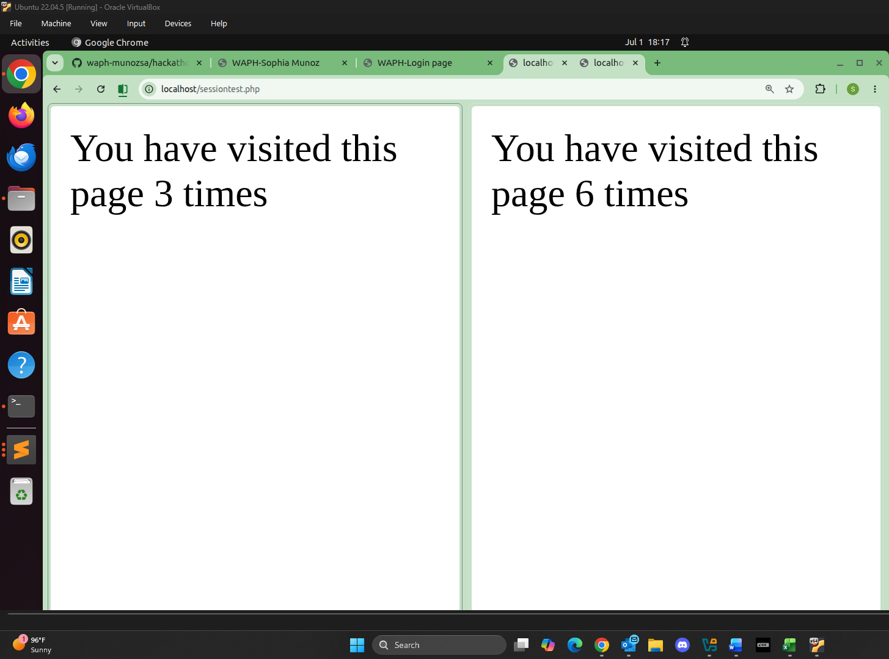
*Different Session Values from Different Browsers*

#### b. Observe the Session-Handshaking Wireshark

In Part `b`, I used Wireshark to capture traffic while accessing `sessiontest.php`. From the images below, when the first HTTP Request/Response occurs, the the cookie is yet to be assigned and is in the server, `Set-Cookie`. After the first HTTP Request/Response is done, the Host has the the cookie assigned in `Cookie`.

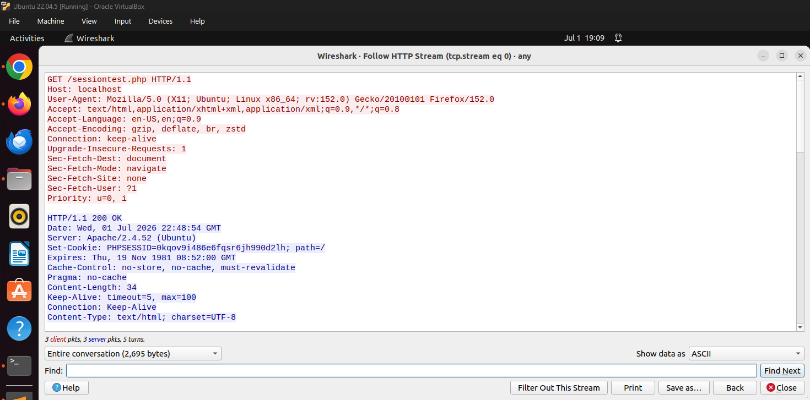
*Wireshark - 1st HTTP Request/Response*

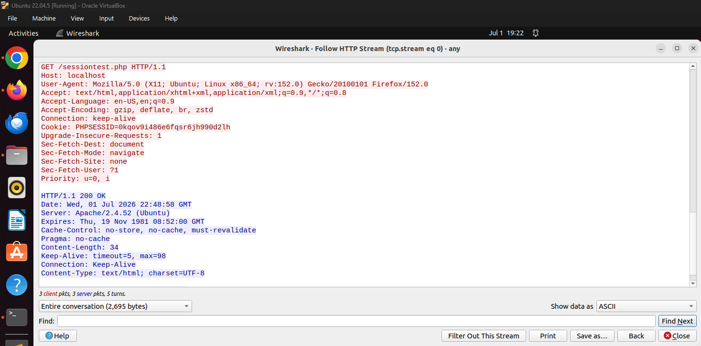
*Wireshark - After 1st HTTP Request/Response*

#### c. Understanding Session Hijacking

In Part `c`, I conducted a session hijacking attack between two different browser sessions. I used `document.cookie` to get the session ID of one browser and assigning it to the other browser. From the second image below, once the session ID is assigned the browser is updated to the number of page visits + 1 of the original browser.

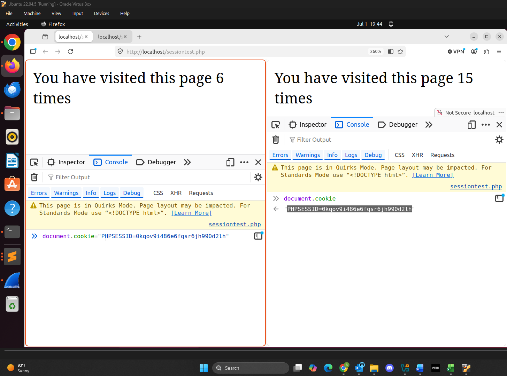
*Before Session Hijacking*

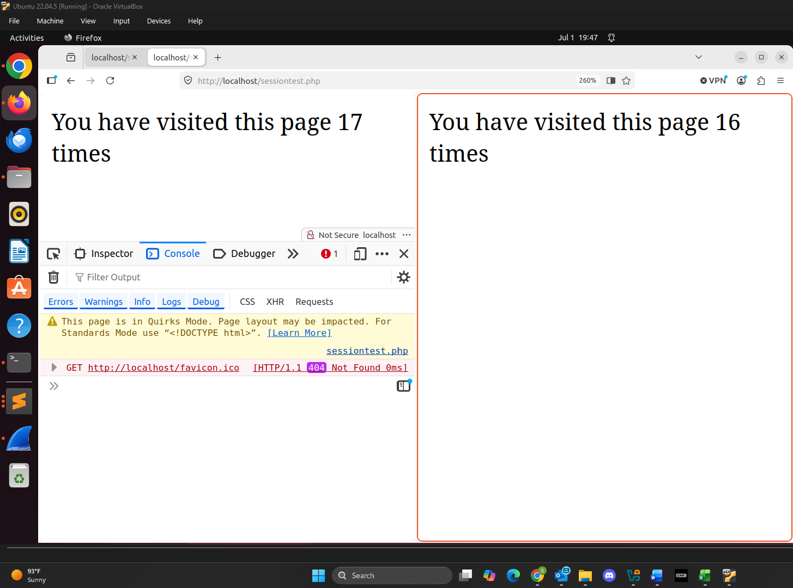
*After Session Hijacking*

### Task 2: Insecure Session Authentication

#### a. Revised Login System with Session Management

In Part `a`, I revised the code in `index.php` and implemented session management for a login system. I also created a `logout.php` page with the code below:

```php
<?php
   session_start();
   session_destroy();
?>
   <h2> You are logged out! </h2>
   <a href="form.php">Login again</a>
```

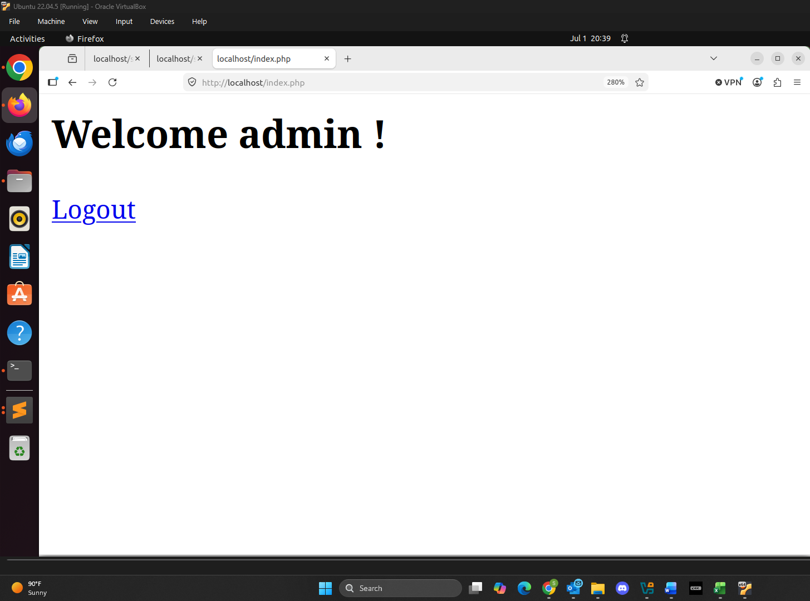
*Authenticated User Logged In*

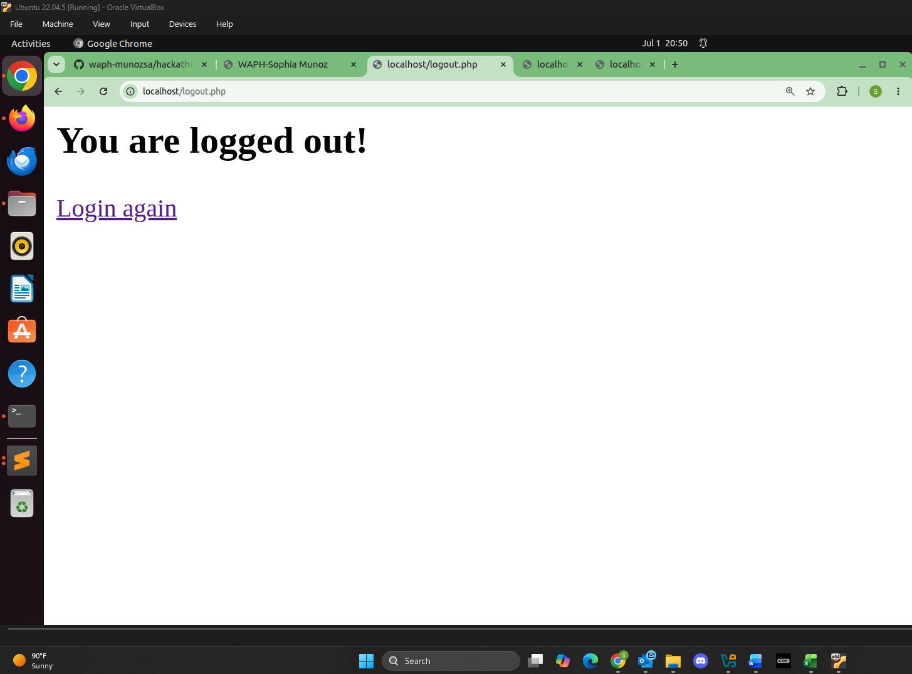
*Authenticated User Logged Out*

If I try to login without a username or password an alert is sent letting the user know they have not logged in.

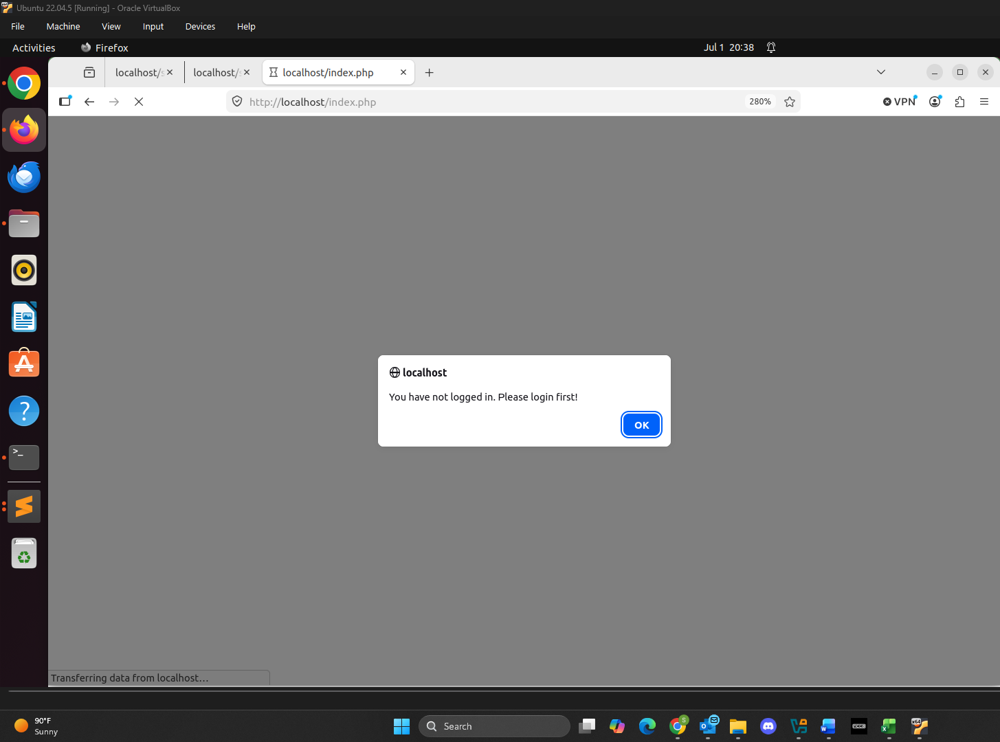
*Unathenticated User Alerted*

#### b. Session Hijacking Attacks

In Part `b`, I simulated a session hijacking attack by again using `document.cookie` and using the session ID from the authorized user browser and assigning it to the unauthorized user browser. This allowed me to login without username or password.

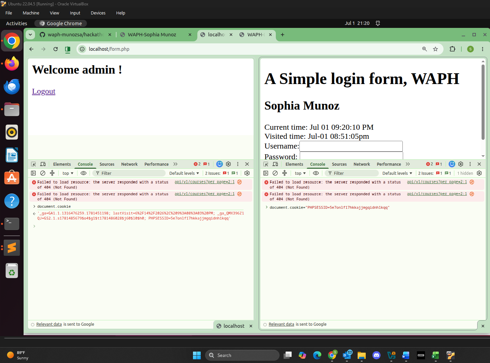
*Before Session Hijacking Attack*

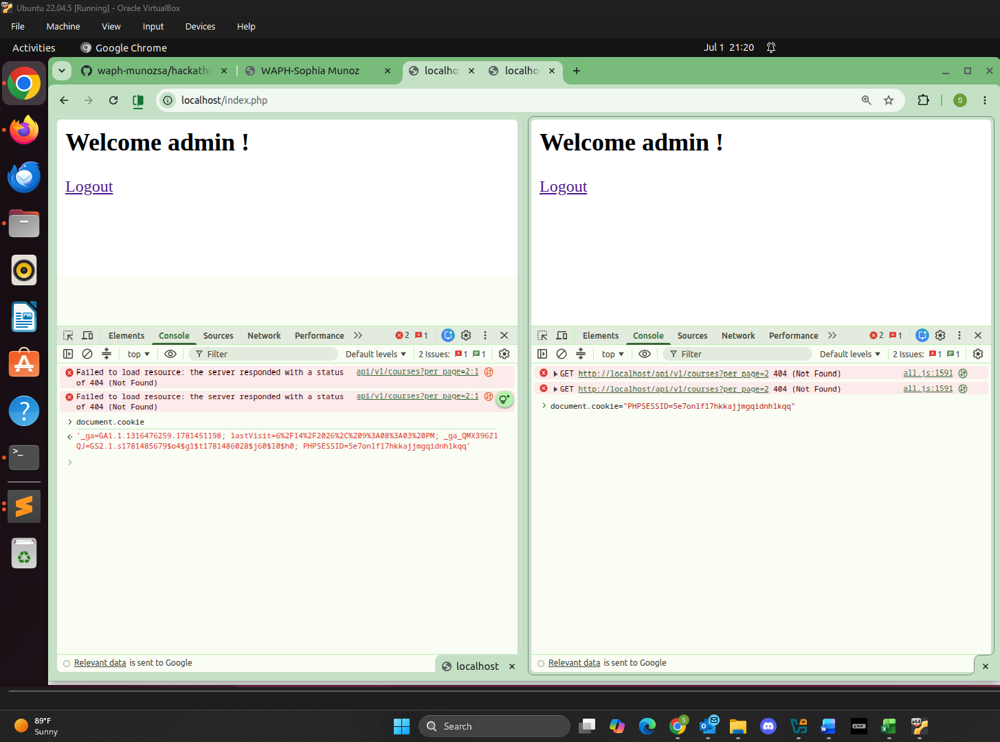
*After Session Hijacking Attack*

### Task 3: Securing Session and Session Authentication

#### a. Data Protection and HTTPS Setup

In Part `a`, I generated an SSL certificate and configured my web server to use HTTPS. I first created SSH Keys using `$ openssl req -x509 -nodes -days 365 -newkey rsa:4096 -keyout waph.key -out waph.cr`, configured HTTPS in Apache2, and enabled the Apache SSL module. From there I could access the HTTPS secure site and the SSL Certificate.

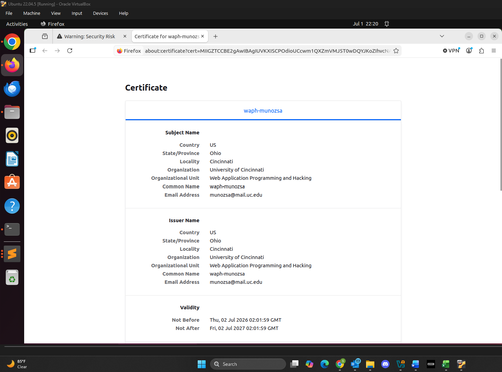
*SSL Certificate*

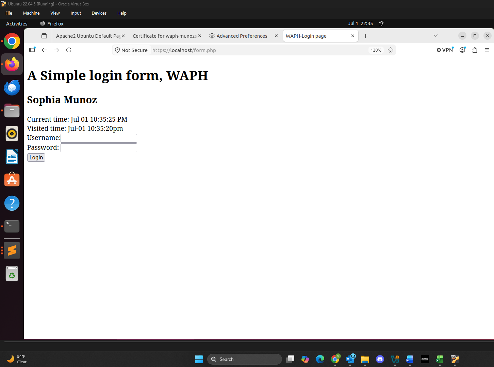
*PHP Page on HTTPS*

#### b. Securing Session Against Session Hijacking Attacks - Setting HttpOnly and Secure Flags for Cookies

In Part `b`, to secure sessions I set `HttpOnly` and `Secure` flags to `True`. To set the session cookie parameters I implemented the code below in `index.php`.

```php
$lifetime = 15 * 60;
$path = "/";
$domain = "munozsa.waph.io";
$secure = TRUE;
$httponly = TRUE;
session_set_cookie_params($lifetime, $path, $domain, $secure, $httponly);
```

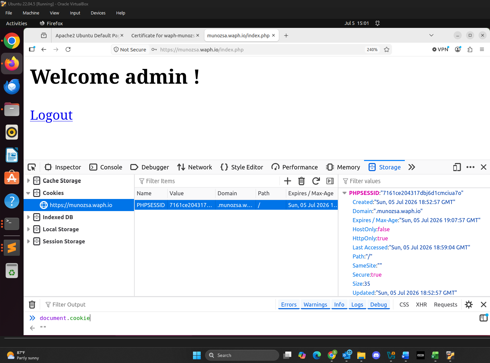
*Secure Session Authentication with HTTPOnly and Secure Flags*

#### c. Securing Session Against Session Hijacking Attacks - Defense In-Depth

In Part `c`, I updated `index.php` to store and check the browser information in the session to see if the user is authenticated or not. The code below is the implementation:

After the authentication process is validated, the code below stores a new session variable with the browser information.

```php
if (checklogin_mysql($_POST["username"],$_POST["password"])) {
   $_SESSION["authenticated"] = TRUE;
   $_SESSION["username"] = $_POST["username"];
   $_SESSION["browser"] = $_SERVER["HTTP_USER_AGENT"];
}
```

The code below checks the information from the browser and session. If the information is different, then the webpage is confirmed as hijacked.

```php
if (!$_SESSION["browser"] != $_SERVER["HTTP_USER_AGENT"]) {
   session_destroy();
   echo "<script>alert('Session hijacking attack is detected!');</script>";
   header("Refresh: 0; url=form.php");
   die();
}
```

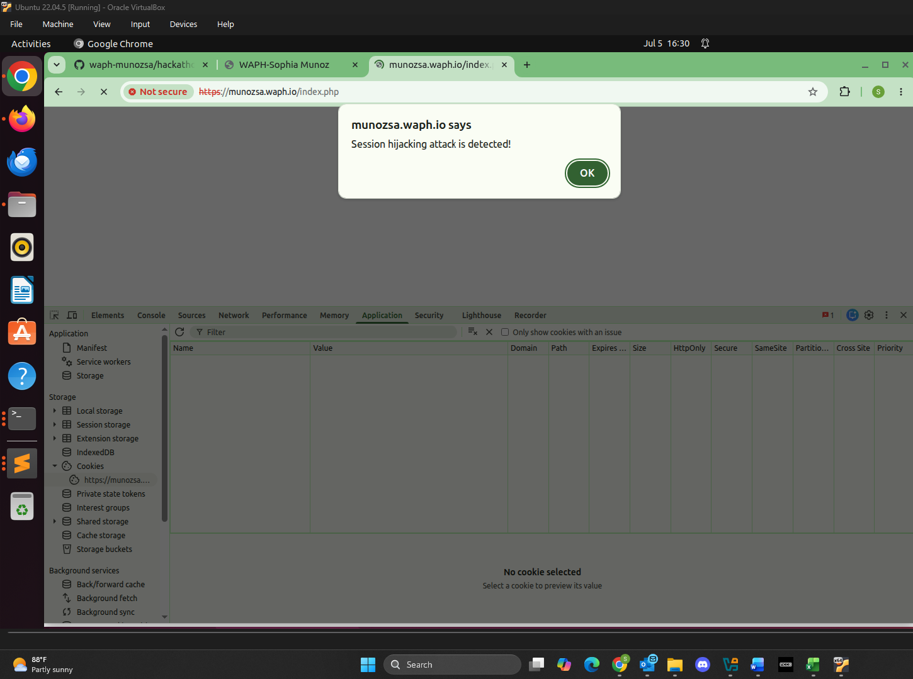
*Secure Session Hijacking Attack Detected*