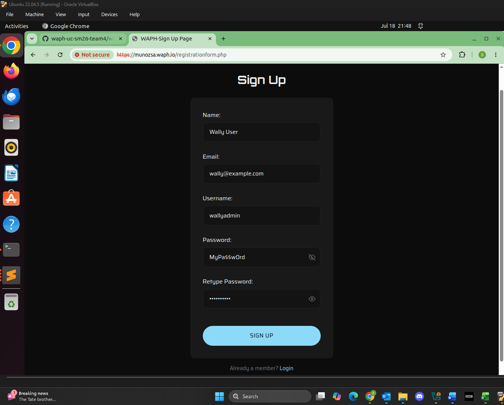
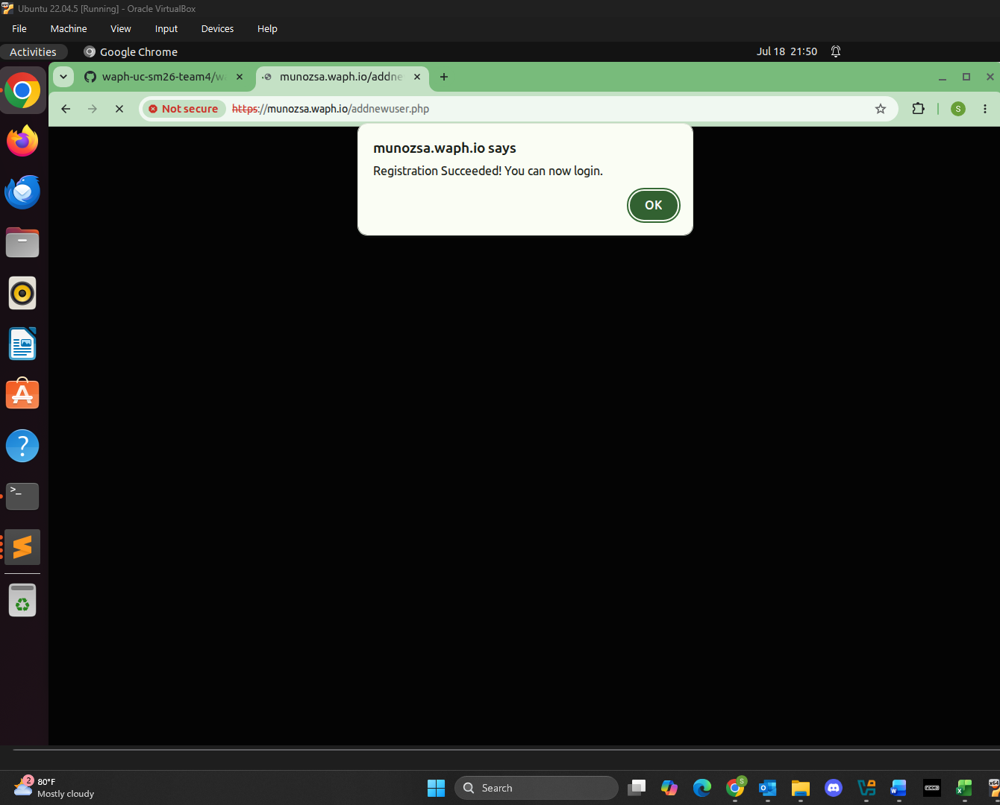
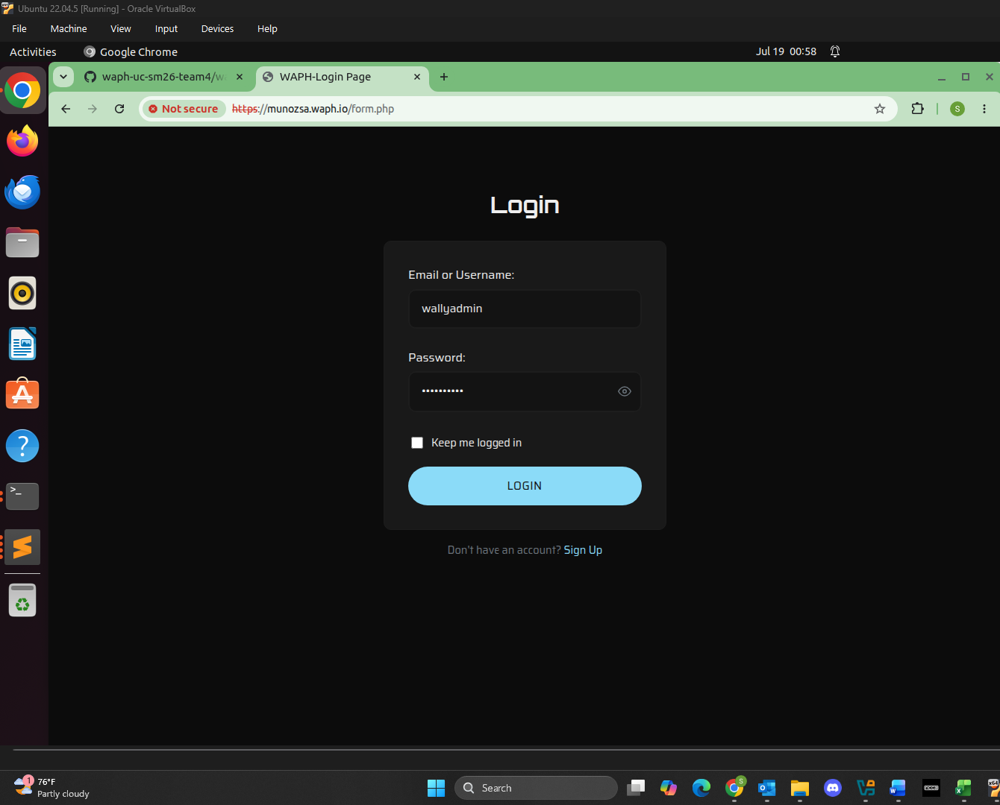
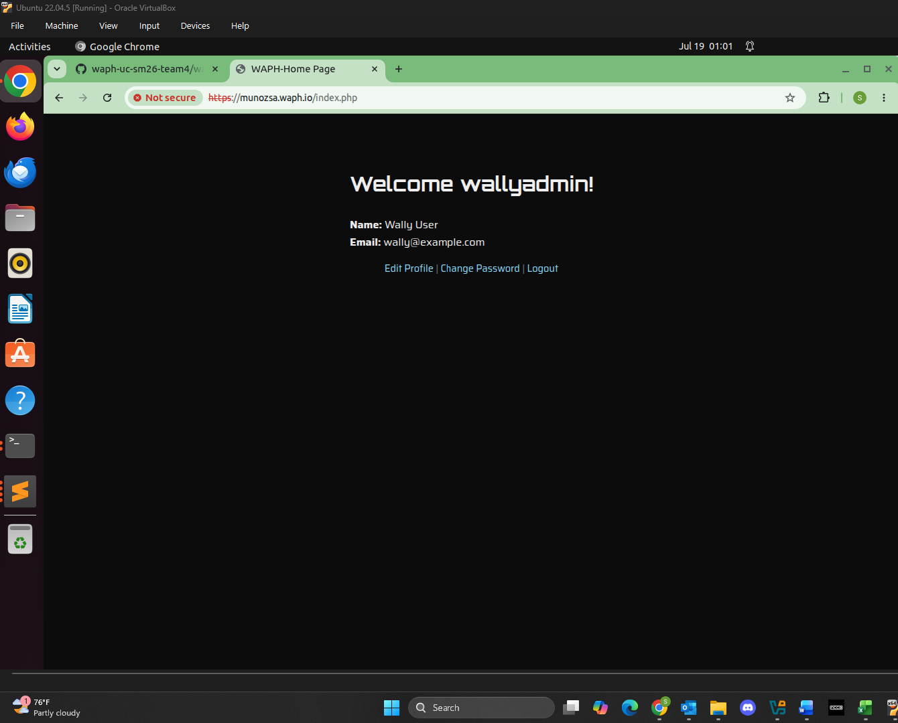
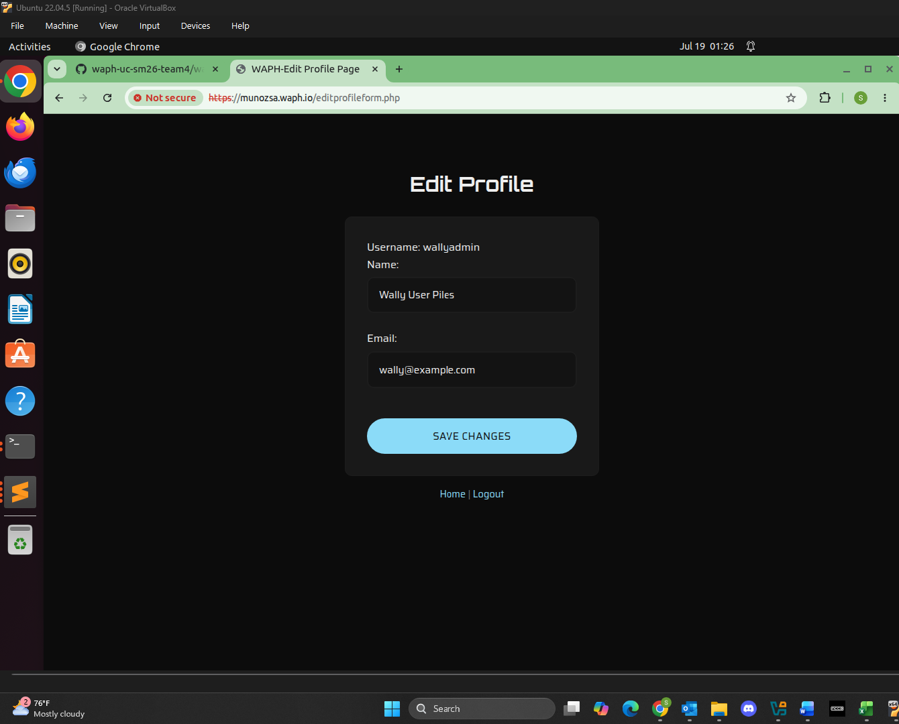
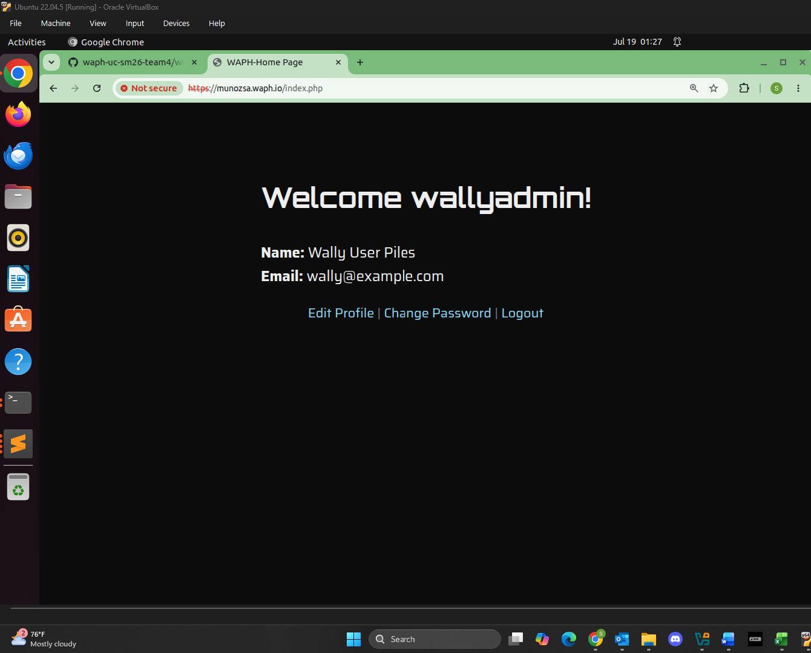
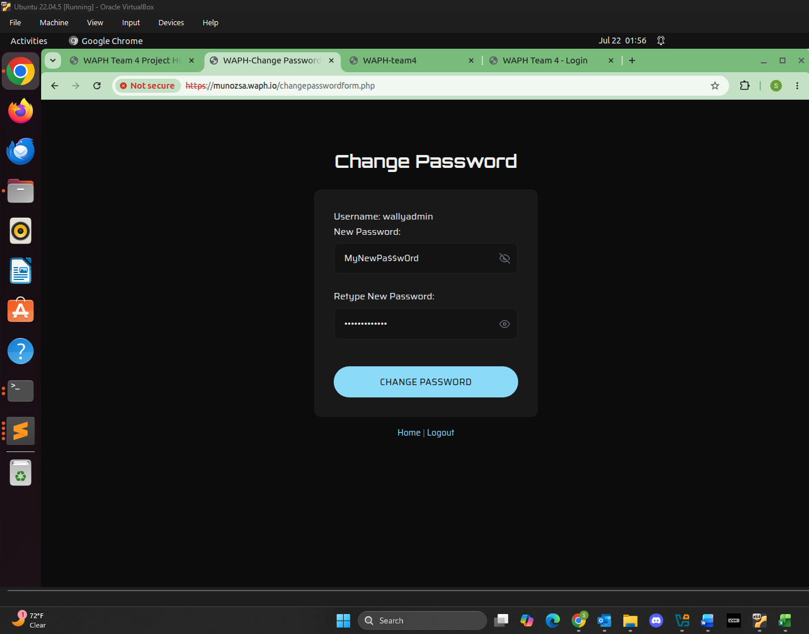
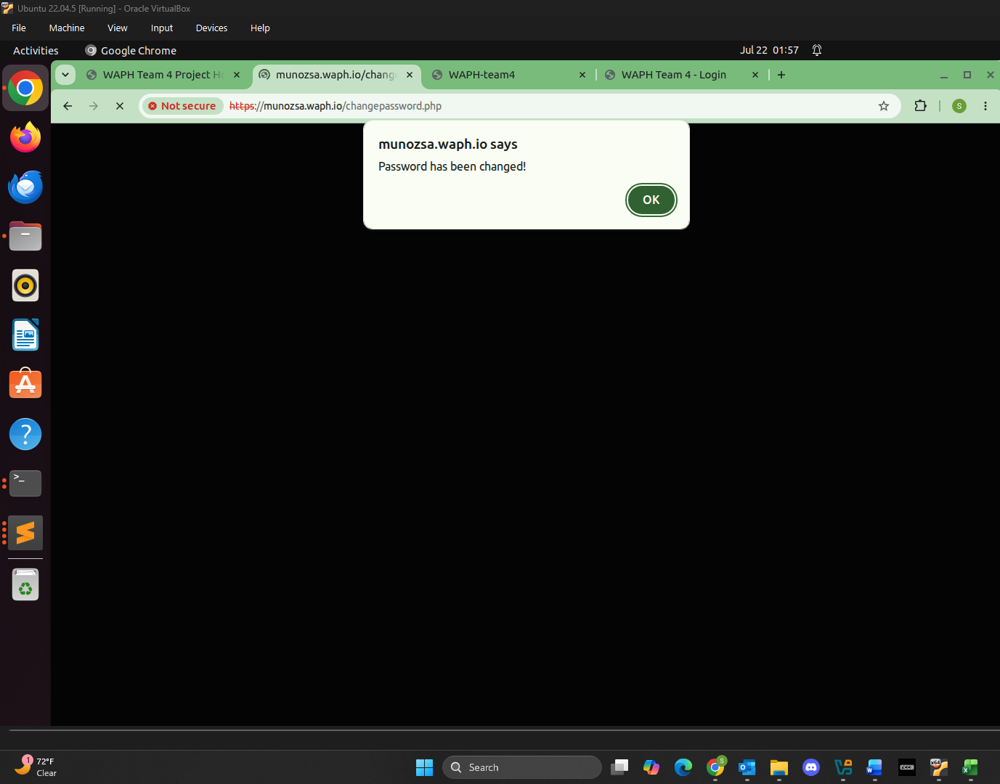

# WAPH-Web Application Programming and Hacking

## Instructor: Dr. Phu Phung

## Student

**Name**: Sophia Munoz

**Email**: [mailto:munozsa@mail.uc.edu](munozsa@mail.uc.edu)


# Individual Project 2 - Full-Stack Web Application

## The Project's Overview

For Individual Project 2 there were two tasks. Task 1 has four parts. In Part `a`, I developed a user registration system with input validation to make sure there was data integrity. In Part `b`, I implemented a login system that maintains the user state across the web application. In Part `c`, I implemented profile management so users can view and edit their profile. In Part `d`, I implemented password change functionality.

Task 2 has six parts. In Part `a`, I ensured the use of certain functions to enforce security throughout the web application like prepared statements. In Part `b`, I implemented preventative measures to avoid potential security risks like Cross-Site Scripting attacks. In Part `c`, I created a MySQL database and implemented secure access points. In Part `d`, I implemented the full-stack web application using HTML, CSS, and JavaScript. I created a `style.css` file to import the same CSS framework I used in Individual Project 1. In Part `e`, I implemented session management through the whole app for user authentication. In Part `f`, I incorporated code focusing on protecting against Cross-Site Request Forgery \(CSRF) attacks.

Outcomes I learned from this project were how to create a database that could handle user creation and account changes. I also learned about how to implement PHP action pages and PHP form pages and how the work together. I also learned how to avoid repeating similar code and modularized it into a single file \(`session_auth.php`). Finally, I learned how to provide security measurements against Cross-Site Request Forgery attacks.

Individual Project 2 Repository: [https://github.com/munozsophia/waph-munozsa/tree/main/projects/project2](https://github.com/munozsophia/waph-munozsa/tree/main/projects/project2)

**Demonstration Video:**

[Click Here to View Project Demo]()

### Task 1. Functional Requirements

#### a. User Registration

I developed a user registration system that a new user can use to create an account by using a username, password, name, and email address. I also used input validation client and server-side to ensure data integrity.

To implement this functionality, I created `registrationform.php` for the front-end and `addnewuser.php` for the back-end. The form collects the name, email, username, password, and the retyped password. I used the `HTML5` `required` and `pattern` attributes, and also implemented regex \(regular expressions) to essentially set parameters for what counts as valid inputs. For example, the regex for a valid email is `^[\w.-]+@[\w-]+(\.[\w-]+)*$`.

As for the server-side implementation, I used `preg_match()` and `sanitize_input()` for input validation and sanitation. For the prepared statements, I checked whether there already existed a username or email and then inserted the new user account. I also made sure to use `md5()` to hash the password.

```php
$check_sql = "SELECT username FROM users WHERE username=? OR email=?";
```

```php
$prepared_sql = "INSERT INTO users (username,password,name,email) VALUES (?, md5(?), ?, ?)";
```


*Sign Up Page*


*Sign Up Successful*

#### b. Login

In this part, I implemented a secure login system authenticating users to allow access to view their profile. I used session management to maintain user state across the application, meaning the user would stay in their profile as they navigate the page.

To implement this functionality, I created `form.php` for the front-end and `index.php` for the back-end. The form accepts an email or username and the password. For the email/username I used `identifier`, and used prepared statements to check whether the profile exists within the database.

```php
$sql = "SELECT username FROM users WHERE (username=? OR email=?) AND password=md5(?)";
```

I also used session management that takes into consideration for `$lifetime`, to check if the `Keep me logged in` box was checked off. The prepared statement below allowed for the user to see their profile once they are logged in.

```php
if (isset($_POST["remember"])) {
        $lifetime = 30 * 24 * 60 * 60; // 30 days
    } else {
        $lifetime = 15 * 60; // 15 mins
    }
    $path = "/";
    $domain = "munozsa.waph.io";
    $secure = TRUE;
    $httponly = TRUE;
    session_set_cookie_params($lifetime, $path, $domain, $secure, $httponly);
    session_start();
```

```php
$prepared_sql = "SELECT name, email FROM users WHERE username=?;";
```


*Login Page*


*Home Page*

#### c. Profile Management

In this part, I enabled users to view and edit their profile information, such as their name and email. I implemented this functionality within `editprofileform.php` for the front-end and `editprofile.php` for the back-end. Users can also view their profile due to `index.php`. Once the user clicks the **Edit Profile** link in the home page, the web application takes the user to the `editprofileform.php` interface. There the user can edit their name or email or both.

The `editprofile.php` file, in this case sanitizes and validates the input. If the email was changed, it checks to see if there is already and existing account with that email in use. If there is, then an alert is sent. To save the changes I used, `UPDATE users SET name = ?, email = ? WHERE username = ?`, to update the database table of the user's changes.

```php
if (editprofile($username, $name, $email)) {
        echo "<script>alert('Profile updated!');window.location='index.php';</script>";
    } else {
        echo "<script>alert('Profile update failed. That email may already be in use.');window.location='editprofileform.php';</script>";
    }
```


*Edit Profile Page*


*Edit Profile Page Change Success*

#### d. Password Update

In this part, I allowed users to change their passwords securely. To implement this functionality, I used `changepasswordform.php` for the front-end and `changepassword.php` for the back-end. I displayed the username using `<?php echo htmlentities($_SESSION["username"]); ?`. The form accepts the new password and newly re-typed password to validate. Both of these user inputs are validated client-side with the regex. As for server-side, the password goes through similar validation processes. I then used `$prepared_sql = "UPDATE users SET password = md5(?) WHERE username = ?;";` in my implementation of the `changepassword()` function to update the database. To prevent other users from changing account details that correspond to other users, I made sure to include `require "session_auth.php";` to add an extra layer of authentication through session rather than user input.


*Change Password Page*


*Change Password Page Success*

### Task 2. Security and Non-Technical Requirements

#### a. Security

For security measures I have the web application deployed over HTTPS. The passwords are hashed using `md5()` before being stored in the database like in SQL line shown below. 

```php
$sql = "SELECT username FROM users WHERE (username=? OR email=?) AND password=md5(?)";
```

To mitigate SQL injection attacks I used prepared statements and I created a database account for this application to avoid using a root MySQL account. Applying these security measures where there is no SQL concatentation essentially prevents injections from happening even if there is user input.

```php
$stmt = $mysqli->prepare($sql);
$stmt->bind_param("sss", $identifier, $identifier, $password);
$stmt->execute();
$stmt->bind_result($found_user);
if ($stmt->fetch()) {
    return $found_user;
}
return FALSE;
```

#### b. Input Validation

I also implemented input validation on both the client and server sides to prevent web application vulnerabilities such as Cross-Site Scripting attacks. For the client-side implementation, I used **HTML5** attributes like `required` and `  pattern` on user inputs like the password. For the server-side implementation, I used `preg_match()` to check regular expression rules, `sanitize_input()` function using `trim()`, `stripslashes()`, `htmlspecialchars()` to sanitize user input, and I used `empty()` if a field is required. Finally, I also used `htmlentities()` to ensure that output has a level of protection from XSS in user data.

#### c. Database Design

I designed and implemented a MySQL database to store user information securely. The `database-data.sql` users table implementation is below:

```sql
create table users(
    username varchar(50) PRIMARY KEY,
    password varchar(100) NOT NULL,
    name varchar(100) NOT NULL,
    email varchar(100) NOT NULL UNIQUE
);
```

I expanded the database to hold name and email. The email is also assigned **UNIQUE** as to not allow users to create an account with the same email. As for using the the database, I made sure to used prepared statements.

#### d. Front-End Development

For the front-end development of the web application I used HTML, CSS , and JavaScript to create a fully rounded user interface. For the formatting and look of the web app, I create a `style.css` file that used the same formatting as my Individual Project 1 webpage. I used the color palette, fonts, and basically the same stylesheet in all my PHP pages so that the look of the web app was uniform. Like mentioned before I used **HTML5** `required pattern` and inline JavaScript handlers like `onchange` for client-side validation. I also implemented a very simple password visibility button so that the user can see their password input.

```php
<script type="text/javascript">
    var EYE_ICON = '<svg>...</svg>';
    var EYE_OFF_ICON = '<svg>...</svg>';
    function toggle_show(id, btn) {
        var el = document.getElementById(id);
        var showing = el.type === 'password';
        el.type = showing ? 'text' : 'password';
        btn.innerHTML = showing ? EYE_OFF_ICON : EYE_ICON;
        btn.setAttribute('aria-label', showing ? 'Hide password' : 'Show password');
    }
</script>
```

#### e. Session Management

I implemented secure session management for user authentication. I used `session_set_cookie_params()` to configure the cookies. I set `secure` to true to send the cookie over HTTPS. I set `httponly` to true to not allow JavaScript to read the session cookies and in turn XSS attacks. A `seesion_auth.php` page contains user authentication to protect pages like `changepasswordform.php` by just using `require "session_auth.php";` at the top.

```php
if (isset($_POST["remember"])) {
    $lifetime = 30 * 24 * 60 * 60; // 30 days
} else {
    $lifetime = 15 * 60; // 15 mins
}
$path = "/";
$domain = "munozsa.waph.io";
$secure = TRUE;
$httponly = TRUE;
session_set_cookie_params($lifetime, $path, $domain, $secure, $httponly);
session_start();
```

#### f. CSRF Protection

To incorporate mechanisms like anti-CSRF tokens to protect against Cross-Site Request Forgery attacks in database modification use cases I applied the Secret Validation Token using `bin2hex()` and storing it in `$_SESSION["nocsrftoken"]`. This embeds the token as a hidden field and checks the token against a session token in an action page. The CSRF protection basically prevents an attacker from forging a valid request due to same-origin policy.

## Appendix: Source Code

### style.css

```css
/*
  style.css
  Theme extracted from Individual Project 1
  Source values pulled from:
  src/styles/themes/_variables-theme-dark.scss,
  src/styles/_constants.scss,
  src/components/buttons/StandardButton.scss,
  src/components/forms/*
*/

/* ---------- Fonts ---------- */
@import url('https://fonts.googleapis.com/css?family=Saira:400,700');
@import url('https://fonts.googleapis.com/css?family=Orbitron:400,700');

/* ---------- Theme tokens ---------- */
:root {
    --color-primary: #8bdbf8;      /* accent color: buttons, focus states, links */
    --color-danger: #fdd2d2;       /* validation error text/borders */
    --color-muted: #6c757d;

    --color-bg: #0c0c0c;           /* page background */
    --color-container-bg: #191919; /* card / form container background */
    --color-empty: #131313;        /* input field background */

    --color-text: #eeeeee;         /* main text color */
    --color-text-inverted: #111111;/* text on top of light/primary backgrounds */

    --color-border: #1d1d1d;

    --font-body: 'Saira', sans-serif;
    --font-heading: 'Orbitron', sans-serif;

    --radius: 10px;
    --radius-pill: 4rem;
}

/* ---------- Base page ---------- */
* {
    box-sizing: border-box;
}

body {
    margin: 0;
    padding: 60px 1rem;
    background-color: var(--color-bg);
    color: var(--color-text);
    font-family: var(--font-body);
    line-height: 1.6;
    display: flex;
    flex-direction: column;
    align-items: center;
}

h1, h2, h3, h4, h5, h6 {
    font-family: var(--font-heading);
    color: var(--color-text);
}

h1 {
    font-size: 1.9rem;
    margin-bottom: 1.5rem;
    text-align: center;
}

a {
    color: var(--color-primary);
}

/* ---------- Sign up / login form card ---------- */
.form.login {
    display: block;
    width: 100%;
    max-width: 380px;
    background-color: var(--color-container-bg);
    border: 1px solid var(--color-border);
    border-radius: var(--radius);
    padding: 2rem;
}

/* Each label + input sits on its own line with breathing room */
.form.login br {
    display: block;
    content: "";
    margin-bottom: 12px;
}

/* ---------- Text/password inputs ---------- */
.text_field {
    display: block;
    width: 100%;
    min-height: 48px;
    margin-top: 6px;
    padding: 0.8rem 1rem;
    background-color: var(--color-empty);
    color: var(--color-text);
    border: 2px solid var(--color-border);
    border-radius: var(--radius);
    outline: none;
    font-family: var(--font-body);
    font-size: 0.95rem;
    transition: border-color 0.15s ease;
}

.text_field:focus {
    border-color: var(--color-primary);
}

.text_field::placeholder {
    color: var(--color-muted);
}

.text_field:invalid:not(:placeholder-shown) {
    border-color: var(--color-danger);
}

/* ---------- Password field with eye-icon show/hide toggle ---------- */
.password-wrapper {
    position: relative;
}

.password-wrapper .text_field {
    padding-right: 44px;
}

.password-toggle-btn {
    position: absolute;
    right: 10px;
    top: 50%;
    transform: translateY(-50%);
    background: none;
    border: none;
    padding: 4px;
    margin: 0;
    line-height: 0;
    color: var(--color-muted);
    cursor: pointer;
}

.password-toggle-btn:hover {
    color: var(--color-text);
}

/* ---------- Checkbox ---------- */
.checkbox-label {
    display: flex;
    align-items: center;
    gap: 8px;
    margin-top: 4px;
    font-size: 0.9rem;
    color: var(--color-text);
    cursor: pointer;
}

.checkbox-label input[type="checkbox"] {
    width: 16px;
    height: 16px;
    accent-color: var(--color-primary);
    cursor: pointer;
}

/* ---------- Submit button ---------- */
.button {
    display: block;
    width: 100%;
    margin-top: 20px;
    border: none;
    border-radius: var(--radius-pill);
    padding: 0.9rem 1.5rem;
    background-color: var(--color-primary);
    color: var(--color-text-inverted);
    font-family: var(--font-body);
    font-size: 0.95rem;
    font-weight: 400;
    text-transform: uppercase;
    letter-spacing: 0.03em;
    cursor: pointer;
    transition: opacity 0.15s ease;
}

.button:hover {
    opacity: 0.85;
}

/* ---------- Footer link below the form ---------- */
.form-footer-link {
    width: 100%;
    max-width: 380px;
    text-align: center;
    margin-top: 1rem;
    font-size: 0.9rem;
    color: var(--color-muted);
}

.form-footer-link a {
    color: var(--color-primary);
    text-decoration: none;
}

.form-footer-link a:hover {
    text-decoration: underline;
}
```

### database-data.sql

```sql
drop table if exists users;
create table users(
    username varchar(50) PRIMARY KEY,
    password varchar(100) NOT NULL,
    name varchar(100) NOT NULL,
    email varchar(100) NOT NULL UNIQUE
);
INSERT INTO users(username, password, name, email)
VALUES ('admin', md5('MyPa$$w0rd'), 'Admin User', 'admin@example.com');
```

### session_auth.php

```php
<?php
    $lifetime = 15 * 60;
    $path = "/";
    $domain = "munozsa.waph.io";
    $secure = TRUE;
    $httponly = TRUE;
    session_set_cookie_params($lifetime,$path,$domain,$secure,$httponly);
    session_start();
    if (!$_SESSION["authenticated"] or $_SESSION["authenticated"] != TRUE) {
        session_destroy();
        echo "<script>alert('You have not logged in. Please login first!');</script>";
        header("Refresh:0; url=form.php");
        die();
    }

    if ($_SESSION["browser"] != $_SERVER["HTTP_USER_AGENT"]) {
        session_destroy();
        echo "<script>alert('Session hijacking attack is detected!');</script>";
        header("Refresh:0; url=form.php");
        die();
    }
?>
```

### form.php

```php
<!DOCTYPE html>
<html lang="en">
<head>
  <meta charset="utf-8">
  <title>WAPH-Login Page</title>
  <link rel="stylesheet" type="text/css" href="style.css">
  <script type="text/javascript">
    var EYE_ICON = '<svg xmlns="http://www.w3.org/2000/svg" width="18" height="18" viewBox="0 0 24 24" fill="none" stroke="currentColor" stroke-width="2" stroke-linecap="round" stroke-linejoin="round"><path d="M1 12s4-8 11-8 11 8 11 8-4 8-11 8-11-8-11-8z"/><circle cx="12" cy="12" r="3"/></svg>';
    var EYE_OFF_ICON = '<svg xmlns="http://www.w3.org/2000/svg" width="18" height="18" viewBox="0 0 24 24" fill="none" stroke="currentColor" stroke-width="2" stroke-linecap="round" stroke-linejoin="round"><path d="M17.94 17.94A10.94 10.94 0 0 1 12 20c-7 0-11-8-11-8a21.8 21.8 0 0 1 5.06-6.94M9.9 4.24A10.94 10.94 0 0 1 12 4c7 0 11 8 11 8a21.8 21.8 0 0 1-2.16 3.19m-6.72-1.07a3 3 0 1 1-4.24-4.24"/><line x1="1" y1="1" x2="23" y2="23"/></svg>';
    function toggle_show(id, btn) {
      var el = document.getElementById(id);
      var showing = el.type === 'password';
      el.type = showing ? 'text' : 'password';
      btn.innerHTML = showing ? EYE_OFF_ICON : EYE_ICON;
      btn.setAttribute('aria-label', showing ? 'Hide password' : 'Show password');
    }
  </script>
</head>
<body>
  <h1>Login</h1>
  <form action="index.php" method="POST" class="form login">
    Email or Username:
    <input type="text" class="text_field" name="identifier"
      required
      placeholder="Your email or username" /> <br>

    Password:
    <div class="password-wrapper">
      <input type="password" class="text_field" id="password" name="password"
        required
        placeholder="Your password" />
      <button type="button" class="password-toggle-btn" aria-label="Show password" onclick="toggle_show('password', this)">
        <svg xmlns="http://www.w3.org/2000/svg" width="18" height="18" viewBox="0 0 24 24" fill="none" stroke="currentColor" stroke-width="2" stroke-linecap="round" stroke-linejoin="round"><path d="M1 12s4-8 11-8 11 8 11 8-4 8-11 8-11-8-11-8z"/><circle cx="12" cy="12" r="3"/></svg>
      </button>
    </div>
    <br>

    <label class="checkbox-label">
      <input type="checkbox" name="remember" value="1"> Keep me logged in
    </label>

    <button class="button" type="submit">Login</button>
  </form>
  <p class="form-footer-link">Don't have an account? <a href="registrationform.php">Sign Up</a></p>
</body>
</html>
```

### index.php

```php
<!DOCTYPE html>
<html lang="en">
<head>
    <meta charset="utf-8">
    <title>WAPH-Home Page</title>
    <link rel="stylesheet" type="text/css" href="style.css">
</head>
<body>
<?php
    /* --- Session management --- */
    if (isset($_POST["remember"])) {
        $lifetime = 30 * 24 * 60 * 60; // 30 days
    } else {
        $lifetime = 15 * 60; // 15 mins
    }
    $path = "/";
    $domain = "munozsa.waph.io";
    $secure = TRUE;
    $httponly = TRUE;
    session_set_cookie_params($lifetime, $path, $domain, $secure, $httponly);
    session_start();

    if (isset($_POST["identifier"]) and isset($_POST["password"])) {
        $logged_in_user = checklogin_mysql($_POST["identifier"], $_POST["password"]);
        if ($logged_in_user !== FALSE) {
            $_SESSION["authenticated"] = TRUE;
            $_SESSION["username"] = $logged_in_user;
            $_SESSION["browser"] = $_SERVER["HTTP_USER_AGENT"];
        } else {
            session_destroy();
            echo "<script>alert('Invalid username/email or password');window.location='form.php';</script>";
            die();
        }
    }

    if (!isset($_SESSION["authenticated"]) or $_SESSION["authenticated"] != TRUE) {
        session_destroy();
        echo "<script>alert('You have not logged in. Please login first!');</script>";
        header("Refresh:0; url=form.php");
        die();
    }

    if ($_SESSION["browser"] != $_SERVER["HTTP_USER_AGENT"]) {
        session_destroy();
        echo "<script>alert('Session hijacking attack is detected!');</script>";
        header("Refresh:0; url=form.php");
        die();
    }

    function checklogin_mysql($identifier, $password) {
        $mysqli = new mysqli('localhost','munozsa' /*Database username*/,'Sophia13_m' /*Database password*/,'waph' /*Database name*/);
        if ($mysqli->connect_errno) {
            printf("Database connection failed: %s\n", $mysqli->connect_error);
            exit();
        }
        $sql = "SELECT username FROM users WHERE (username=? OR email=?) AND password=md5(?)";
        $stmt = $mysqli->prepare($sql);
        $stmt->bind_param("sss", $identifier, $identifier, $password);
        $stmt->execute();
        $stmt->bind_result($found_user);
        if ($stmt->fetch()) {
            return $found_user;
        }
        return FALSE;
    }

    function get_profile($username) {
        $mysqli = new mysqli('localhost','munozsa' /*Database username*/,'Sophia13_m' /*Database password*/,'waph' /*Database name*/);
        if ($mysqli->connect_errno) {
            printf("Database connection failed: %s\n", $mysqli->connect_error);
            exit();
        }
        $prepared_sql = "SELECT name, email FROM users WHERE username=?;";
        if (!$stmt = $mysqli->prepare($prepared_sql)) {
            echo "Prepare failed";
            exit();
        }
        $stmt->bind_param("s", $username);
        if (!$stmt->execute()) {
            echo "Execute failed";
            exit();
        }
        $name = NULL; $email = NULL;
        if (!$stmt->bind_result($name, $email)) echo "Binding failed";
        if ($stmt->fetch()) {
            echo "<p><strong>Name:</strong> " . htmlentities($name) . "<br>";
            echo "<strong>Email:</strong> " . htmlentities($email) . "</br></p>";
        } else {
            echo "<p>Profile information not found.</p>";
        }
    }
?>
    <div class="form-card">
        <h1>Welcome <?php echo htmlentities($_SESSION["username"]); ?>!</h1>
        <?php get_profile($_SESSION["username"]); ?>
        <p class="form-footer-link"><a href="editprofileform.php">Edit Profile</a> | <a href="changepasswordform.php">Change Password</a> | <a href="logout.php">Logout</a></p>
    </div>
</body>
</html>
```

### logout.php

```php
<!DOCTYPE html>
<html lang="en">
<head>
    <meta charset="utf-8">
    <title>WAPH-Logged Out Page</title>
    <link rel="stylesheet" type="text/css" href="style.css">
</head>
<body>
<?php
    session_start();
    session_destroy();
?>
    <div class="form-card">
        <h1>You are logged out!</h1>
        <p class="form-footer-link"><a href="form.php">Login Again</a>
    </div>
</body>
</html>
```

### registrationform.php

```php
<!DOCTYPE html>
<html lang="en">
<head>
  <meta charset="utf-8">
  <title>WAPH-Sign Up Page</title>
  <link rel="stylesheet" type="text/css" href="style.css">
  <script>
    var EYE_ICON = '<svg xmlns="http://www.w3.org/2000/svg" width="18" height="18" viewBox="0 0 24 24" fill="none" stroke="currentColor" stroke-width="2" stroke-linecap="round" stroke-linejoin="round"><path d="M1 12s4-8 11-8 11 8 11 8-4 8-11 8-11-8-11-8z"/><circle cx="12" cy="12" r="3"/></svg>';
    var EYE_OFF_ICON = '<svg xmlns="http://www.w3.org/2000/svg" width="18" height="18" viewBox="0 0 24 24" fill="none" stroke="currentColor" stroke-width="2" stroke-linecap="round" stroke-linejoin="round"><path d="M17.94 17.94A10.94 10.94 0 0 1 12 20c-7 0-11-8-11-8a21.8 21.8 0 0 1 5.06-6.94M9.9 4.24A10.94 10.94 0 0 1 12 4c7 0 11 8 11 8a21.8 21.8 0 0 1-2.16 3.19m-6.72-1.07a3 3 0 1 1-4.24-4.24"/><line x1="1" y1="1" x2="23" y2="23"/></svg>';
    function toggle_show(id, btn) {
      var el = document.getElementById(id);
      var showing = el.type === 'password';
      el.type = showing ? 'text' : 'password';
      btn.innerHTML = showing ? EYE_OFF_ICON : EYE_ICON;
      btn.setAttribute('aria-label', showing ? 'Hide password' : 'Show password');
    }
  </script>
</head>
<body>
  <h1>Sign Up</h1>
  <form action="addnewuser.php" method="POST" class="form login">
    Name:
    <input type="text" class="text_field" name="name"
      required
      placeholder="Your full name" /> <br>

    Email: <input type="text" class="text_field" name="email"
      required pattern="^[\w.-]+@[\w-]+(\.[\w-]+)*$"
      title="Please enter a valid email"
      placeholder="Your email address"
      onchange="this.setCustomValidity(this.validity.patternMismatch ? this.title : '');" /> <br>

    Username:
    <input type="text" class="text_field" name="username"
      required pattern="\w+"
      title="Please enter a valid username"
      placeholder="Your username"
      onchange="this.setCustomValidity(this.validity.patternMismatch ? this.title : '');" /> <br>

    Password:
    <div class="password-wrapper">
      <input type="password" class="text_field" id="password" name="password"
        required pattern="^(?=.*[a-z])(?=.*[A-Z])(?=.*[0-9])(?=.*[!@#$%^&amp;])[\w!@#$%^&amp;]{8,}$"
        title="Password must have at least 8 characters with 1 special symbol !@#$%^&amp;, 1 number, 1 lowercase, and 1 UPPERCASE"
        placeholder="Your password"
        onchange="this.setCustomValidity(this.validity.patternMismatch ? this.title : ''); form.repassword.pattern = this.value.replace(/[.*+?^${}()|[\]\\]/g, '\\$&');" />
      <button type="button" class="password-toggle-btn" aria-label="Show password" onclick="toggle_show('password', this)">
        <svg xmlns="http://www.w3.org/2000/svg" width="18" height="18" viewBox="0 0 24 24" fill="none" stroke="currentColor" stroke-width="2" stroke-linecap="round" stroke-linejoin="round"><path d="M1 12s4-8 11-8 11 8 11 8-4 8-11 8-11-8-11-8z"/><circle cx="12" cy="12" r="3"/></svg>
      </button>
    </div>
    <br>

    Retype Password:
    <div class="password-wrapper">
      <input type="password" class="text_field" id="repassword" name="repassword"
        required
        title="Password does not match"
        placeholder="Retype your password"
        onchange="this.setCustomValidity(this.validity.patternMismatch ? this.title : '');" />
      <button type="button" class="password-toggle-btn" aria-label="Show password" onclick="toggle_show('repassword', this)">
        <svg xmlns="http://www.w3.org/2000/svg" width="18" height="18" viewBox="0 0 24 24" fill="none" stroke="currentColor" stroke-width="2" stroke-linecap="round" stroke-linejoin="round"><path d="M1 12s4-8 11-8 11 8 11 8-4 8-11 8-11-8-11-8z"/><circle cx="12" cy="12" r="3"/></svg>
      </button>
    </div>
    <br>

    <button class="button" type="submit">Sign Up</button>
  </form>
  <p class="form-footer-link">Already a member? <a href="form.php">Login</a></p>
</body>
</html>
```

### addnewuser.php

```php
<?php
    /* --- Server-side sanitation --- */
    function sanitize_input($input) {
        $input = trim($input);
        $input = stripslashes($input);
        $input = htmlspecialchars($input);
        return $input;

    }

    $name = isset($_POST["name"]) ? sanitize_input($_POST["name"]) : "";
    $email = isset($_POST["email"]) ? sanitize_input($_POST["email"]) : "";
    $username = isset($_POST["username"]) ? sanitize_input($_POST["username"]) : "";
    $password = isset($_POST["password"]) ? sanitize_input($_POST["password"]) : "";
    $repassword = isset($_POST["repassword"]) ? sanitize_input($_POST["repassword"]) : "";

    /* --- Required field check --- */
    if (empty($name) or empty($email) or empty($username) or empty($password) or empty($repassword)) {
        echo "<script>alert('All fields are required.');window.location='registrationform.php';</script>";
        die();
    }

    /* --- Validate same server-side rules from registrationform.php --- */
    if (!preg_match("/^[a-zA-Z ]+$/", $name)) {
        echo "<script>alert('Invalid name.');window.location='registrationform.php';</script>";
        die();
    }

    if (!preg_match("/^\w+$/", $username)) {
        echo "<script>alert('Invalid username.');window.location='registrationform.php';</script>";
        die();
    }

    if (!preg_match("/^[\w.-]+@[\w-]+(\.[\w-]+)*$/", $email)) {
        echo "<script>alert('Invalid email address.');window.location='registrationform.php';</script>";
        die();
    }

    if (!preg_match("/^(?=.*[a-z])(?=.*[A-Z])(?=.*[0-9])(?=.*[!@#\$%^&])[\w!@#\$%^&]{8,}$/", $password)) {
        echo "<script>alert('Password must have at least 8 characters with 1 special symbol !@#\$%^&, 1 number, 1 lowercase, and 1 UPPERCASE.');window.location='registrationform.php';</script>";
        die();
    }

    if ($password !== $repassword) {
        echo "<script>alert('Passwords do not match.);window.location='registrationform.php';</script>";
        die();
    }

    if (addnewuser($username, $password, $name, $email)) {
        echo "<script>alert('Registration Succeeded! You can now login.');window.location='form.php';</script>";
    } else {
        echo "<script>alert('Registration Failed! The username or email may already be taken.');window.location='registrationform.php';</script>";
    }

    function addnewuser($username, $password, $name, $email) {
        $mysqli = new mysqli('localhost','munozsa' /*Database username*/,'Sophia13_m' /*Database password*/,'waph' /*Database name*/);
        if ($mysqli->connect_errno) {
            printf("Database connection failed: %s\n", $mysqli->connect_error);
            return FALSE;
        }

        /* --- Check for duplicate user or email --- */
        $check_sql = "SELECT username FROM users WHERE username=? OR email=?";
        $check_stmt = $mysqli->prepare($check_sql);
        $check_stmt->bind_param("ss", $username, $email);
        $check_stmt->execute();
        $check_stmt->store_result();
        if ($check_stmt->num_rows > 0) return FALSE;

        $prepared_sql = "INSERT INTO users (username,password,name,email) VALUES (?, md5(?), ?, ?)";
        //echo "DEBUG>prepared_sql= $prepared_sql"; return TRUE;
        $stmt = $mysqli->prepare($prepared_sql);
        $stmt->bind_param("ssss", $username, $password, $name, $email);
        if ($stmt->execute()) return TRUE;
        return FALSE;
    }
?>
```

### changepasswordform.php

```php
<?php
    require "session_auth.php";
    $rand = bin2hex(openssl_random_pseudo_bytes(16));
    $_SESSION["nocsrftoken"] = $rand;
?>
<!DOCTYPE html>
<html>
<head>
    <meta charset="utf-8">
    <title>WAPH-Change Password Page</title>
    <link rel="stylesheet" type="text/css" href="style.css">
    <script type="text/javascript">
        var EYE_ICON = '<svg xmlns="http://www.w3.org/2000/svg" width="18" height="18" viewBox="0 0 24 24" fill="none" stroke="currentColor" stroke-width="2" stroke-linecap="round" stroke-linejoin="round"><path d="M1 12s4-8 11-8 11 8 11 8-4 8-11 8-11-8-11-8z"/><circle cx="12" cy="12" r="3"/></svg>';
        var EYE_OFF_ICON = '<svg xmlns="http://www.w3.org/2000/svg" width="18" height="18" viewBox="0 0 24 24" fill="none" stroke="currentColor" stroke-width="2" stroke-linecap="round" stroke-linejoin="round"><path d="M17.94 17.94A10.94 10.94 0 0 1 12 20c-7 0-11-8-11-8a21.8 21.8 0 0 1 5.06-6.94M9.9 4.24A10.94 10.94 0 0 1 12 4c7 0 11 8 11 8a21.8 21.8 0 0 1-2.16 3.19m-6.72-1.07a3 3 0 1 1-4.24-4.24"/><line x1="1" y1="1" x2="23" y2="23"/></svg>';
        function toggle_show(id, btn) {
            var el = document.getElementById(id);
            var showing = el.type === 'password';
            el.type = showing ? 'text' : 'password';
            btn.innerHTML = showing ? EYE_OFF_ICON : EYE_ICON;
            btn.setAttribute('aria-label', showing ? 'Hide password' : 'Show password');
        }
    </script>
</head>
<body>
    <h1>Change Password</h1>
    <form action="changepassword.php" method="POST" class="form login">
        Username:<!--input type="text" class="text_field" name="username" /--> <?php echo htmlentities($_SESSION["username"]); ?> <br>
        New Password:
        <div class="password-wrapper">
            <input type="password" class="text_field" id="newpassword" name="newpassword"
                required pattern="^(?=.*[a-z])(?=.*[A-Z])(?=.*[0-9])(?=.*[!@#$%^&amp;])[\w!@#$%^&amp;]{8,}$"
                title="Password must have at least 8 characters with 1 special symbol !@#$%^&amp;, 1 number, 1 lowercase, and 1 UPPERCASE"
                placeholder="Your new password"
                onchange="this.setCustomValidity(this.validity.patternMismatch ? this.title : ''); form.renewpassword.pattern = this.value.replace(/[.*+?^${}()|[\]\\]/g, '\\$&');" />
            <button type="button" class="password-toggle-btn" aria-label="Show password" onclick="toggle_show('newpassword', this)">
                <svg xmlns="http://www.w3.org/2000/svg" width="18" height="18" viewBox="0 0 24 24" fill="none" stroke="currentColor" stroke-width="2" stroke-linecap="round" stroke-linejoin="round"><path d="M1 12s4-8 11-8 11 8 11 8-4 8-11 8-11-8-11-8z"/><circle cx="12" cy="12" r="3"/></svg>
            </button>
        </div>
        <br>

        Retype New Password:
        <div class="password-wrapper">
            <input type="password" class="text_field" id="renewpassword" name="renewpassword"
                required
                title="Password does not match"
                placeholder="Retype your new password"
                onchange="this.setCustomValidity(this.validity.patternMismatch ? this.title : '');" />
            <button type="button" class="password-toggle-btn" aria-label="Show password" onclick="toggle_show('renewpassword', this)">
                <svg xmlns="http://www.w3.org/2000/svg" width="18" height="18" viewBox="0 0 24 24" fill="none" stroke="currentColor" stroke-width="2" stroke-linecap="round" stroke-linejoin="round"><path d="M1 12s4-8 11-8 11 8 11 8-4 8-11 8-11-8-11-8z"/><circle cx="12" cy="12" r="3"/></svg>
            </button>
        </div>
        <br>

        <input type="hidden" name="nocsrftoken" value="<?php echo $rand; ?>" />
        <button class="button" type="submit">Change Password</button>
    </form>
    <p class="form-footer-link"><a href="index.php">Home</a> | <a href="logout.php">Logout</a></p>
</body>
</html>
```

### changepassword.php

```php
<?php
    require "session_auth.php";

    $token = $_POST["nocsrftoken"];
    if (!isset($token) or ($token != $_SESSION["nocsrftoken"])) {
        echo "<script>alert('CSRF Attack is detected');window.location='index.php';</script>";
        die();
    }

    $username = $_SESSION["username"]; //$_REQUEST["username"];
    $newpassword = isset($_POST["newpassword"]) ? $_POST["newpassword"] : "";
    $renewpassword = isset($_POST["renewpassword"]) ? $_POST["renewpassword"] : "";

    if (empty($newpassword) or empty($renewpassword)) {
        echo "<script>alert('No new password provided.');window.location='changepasswordform.php';</script>";
        die();
    }

    if (!preg_match("/^(?=.*[a-z])(?=.*[A-Z])(?=.*[0-9])(?=.*[!@#\$%^&])[\w!@#\$%^&]{8,}$/", $newpassword)) {
        echo "<script>alert('Password must have at least 8 characters with 1 special symbol !@#\$%^&, 1 number, 1 lowercase, and 1 UPPERCASE.');window.location='changepasswordform.php';</script>";
        die();
    }
    if ($newpassword !== $renewpassword) {
        echo "<script>alert('Passwords do not match.');window.location='changepasswordform.php';</script>";
        die();
    }

    if (changepassword($username, $newpassword)) {
        echo "<script>alert('Password has been changed!');window.location='index.php';</script>";
    } else {
        echo "<script>alert('Password change has failed!');window.location='changepasswordform.php';</script>";
    }

    function changepassword($username, $password) {
        $mysqli = new mysqli('localhost','munozsa' /*Database username*/, 'Sophia13_m' /*Database password*/,'waph' /*Database name*/);
        if ($mysqli->connect_errno) {
            printf("Database connection failed: %s\n", $mysqli->connect_error);
            return FALSE;
        }
        $prepared_sql = "UPDATE users SET password = md5(?) WHERE username = ?;";
        $stmt = $mysqli->prepare($prepared_sql);
        $stmt->bind_param("ss", $password, $username);
        if ($stmt->execute()) return TRUE;
        return FALSE;
    }
?>
<p class="form-footer-link"><a href="index.php">Home</a> | <a href="logout.php">Logout</a></p>
```

### editprofileform.php

```php
<?php
    require "session_auth.php";
    $rand = bin2hex(openssl_random_pseudo_bytes(16));
    $_SESSION["nocsrftoken"] = $rand;

    function get_profile_data($username) {
        $mysqli = new mysqli('localhost','munozsa' /*Database username*/, 'Sophia13_m' /*Database password*/,'waph' /*Database name*/);
        if ($mysqli->connect_errno) {
            printf("Database connection failed: %s\n", $mysqli->connect_error);
            exit();
        }
        $prepared_sql = "SELECT name, email FROM users WHERE username=?;";
        if (!$stmt = $mysqli->prepare($prepared_sql)) {
            echo "Prepare failed";
            exit();
        }
        $stmt->bind_param('s', $username);
        if (!$stmt->execute()) {
            echo "Execute failed";
            exit();
        }
        $name = NULL; $email = NULL;
        if (!$stmt->bind_result($name, $email)) echo "Binding failed";
        if ($stmt->fetch()) {
            return array("name" => $name, "email" => $email);
        }
        return NULL;
    }
    $profile = get_profile_data($_SESSION["username"]);
?>
<!DOCTYPE html>
<html lang="en">
<head>
    <meta charset="utf-8">
    <title>WAPH-Edit Profile Page</title>
    <link rel="stylesheet" type="text/css" href="style.css">
</head>
<body>
    <h1>Edit Profile</h1>
    <form action="editprofile.php" method="POST" class="form login">
        Username: <?php echo htmlentities($_SESSION["username"]); ?> <br>
        Name: <input type="text" class="text_field" name="name"
            required
            value="<?php echo htmlentities($profile["name"]); ?>" /> <br>
        Email: <input type="text" class="text_field" name="email"
        required pattern="^[\w.-]+@[\w-]+(\.[\w-]+)*$"
        title="Please enter a valid email"
        value="<?php echo htmlentities($profile["email"]); ?>"
        onchange="this.setCustomValidity(this.validity.patternMismatch ? this.title : '');" /> <br>
    <input type="hidden" name="nocsrftoken" value="<?php echo $rand; ?>"/>
    <button class="button" type="submit">Save Changes</button>
    </form>
    <p class="form-footer-link"><a href="index.php">Home</a> | <a href="logout.php">Logout</a></p>
</body>
</html>
```

### editprofile.php

```php
<?php
    require "session_auth.php";

    $token = $_POST["nocsrftoken"];
    if (!isset($token) or ($token != $_SESSION["nocsrftoken"])) {
        echo "<script>alert('CSRF Attack is detected');window.location='index.php';</script>";
        die();
    }

    function sanitize_input($input) {
        $input = trim($input);
        $input = stripslashes($input);
        $input = htmlspecialchars($input);
        return $input;
    }

    $username = $_SESSION["username"];
    $name  = isset($_POST["name"])  ? sanitize_input($_POST["name"])  : "";
    $email = isset($_POST["email"]) ? sanitize_input($_POST["email"]) : "";

    if (empty($name) or empty($email)) {
        echo "<script>alert('Name and email are required.');window.location='editprofileform.php';</script>";
        die();
    }

    if (!preg_match("/^[\w.-]+@[\w-]+(\.[\w-]+)*$/", $email)) {
        echo "<script>alert('Invalid email address.');window.location='editprofileform.php';</script>";
        die();
    }

    if (editprofile($username, $name, $email)) {
        echo "<script>alert('Profile updated!');window.location='index.php';</script>";
    } else {
        echo "<script>alert('Profile update failed. That email may already be in use.');window.location='editprofileform.php';</script>";
    }

    function editprofile($username, $name, $email) {
        $mysqli = new mysqli('localhost','munozsa' /*Database username*/, 'Sophia13_m' /*Database password*/,'waph' /*Database name*/);
        if ($mysqli->connect_errno) {
            printf("Database connection failed: %s\n", $mysqli->connect_error);
            return FALSE;
        }

        $check_sql = "SELECT username FROM users WHERE email=? AND username<>?";
        $check_stmt = $mysqli->prepare($check_sql);
        $check_stmt->bind_param("ss", $email, $username);
        $check_stmt->execute();
        $check_stmt->store_result();
        if ($check_stmt->num_rows > 0) {
            return FALSE;
        }

        $prepared_sql = "UPDATE users SET name = ?, email = ? WHERE username = ?;";
        $stmt = $mysqli->prepare($prepared_sql);
        $stmt->bind_param("sss", $name, $email, $username);
        if ($stmt->execute()) return TRUE;
        return FALSE;
    }
?>
```